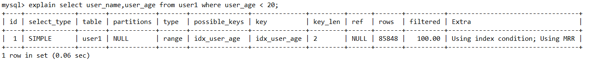
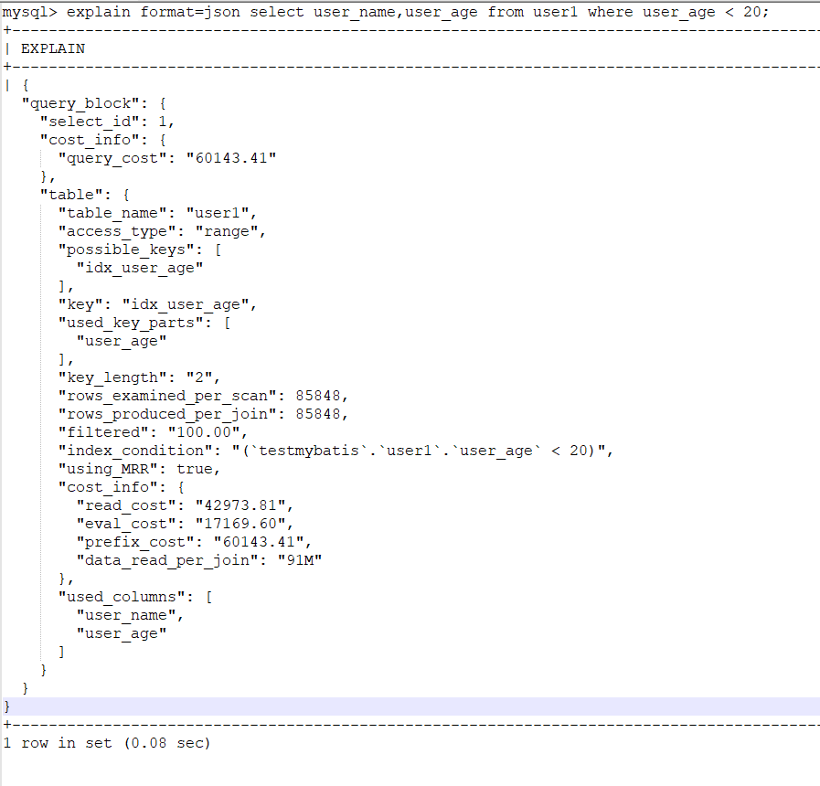

> 提醒：
>
> 1. 本文需要有 explain 执行计划基础
> 2. 需要先理解[什么是成本模型？](https://github.com/asdbex1078/MySQL/blob/master/mysql-optimization/MySQL%E6%9E%B6%E6%9E%84%E2%80%94%E2%80%94%E6%88%90%E6%9C%AC%E6%A8%A1%E5%9E%8B.md#%E4%BC%98%E5%8C%96%E5%99%A8%E6%88%90%E6%9C%AC%E6%A8%A1%E5%9E%8B)

# 成本值的计算与查看

## 一、前期准备：

建表语句及索引情况如下：

```sql
CREATE TABLE `user1` (
  `user_id` int(11) NOT NULL AUTO_INCREMENT COMMENT '主键id',
  `user_name` varchar(100) DEFAULT NULL COMMENT '用户名',
  `user_age` tinyint(3) DEFAULT NULL COMMENT '用户年龄',
  `user_password` varchar(100) DEFAULT NULL COMMENT '用户密码',
  `user_sex` tinyint(1) DEFAULT NULL COMMENT '性别 1-男，0-女',
  `user_province` varchar(32) DEFAULT NULL COMMENT '用户所在省',
  `user_city` varchar(32) DEFAULT NULL COMMENT '用户所在城市',
  `user_area` varchar(32) DEFAULT NULL COMMENT '用户所在区',
  `create_time` datetime DEFAULT CURRENT_TIMESTAMP COMMENT '创建时间',
  `modified_time` datetime DEFAULT CURRENT_TIMESTAMP ON UPDATE CURRENT_TIMESTAMP COMMENT '修改时间',
  `testcolumn` varchar(32) DEFAULT NULL COMMENT '测试字段',
  `testcolumn1` varchar(32) DEFAULT NULL COMMENT '测试字段1',
  PRIMARY KEY (`user_id`),
  KEY `idx_user_name` (`user_name`),
  KEY `idx_user_age` (`user_age`),
  KEY `idx_province_city_area` (`user_province`,`user_city`,`user_area`)
) ENGINE=InnoDB DEFAULT CHARSET=utf8;
```

表中有21W数据量，今天主角是 user_age ，故只展示相关信息

```sql
-- 总数据量
mysql> select count(1) from user1;
+----------+
| count(1) |
+----------+
|   210106 |
+----------+
1 row in set (0.07 sec)

-- 基本上从1岁到100岁，每个年龄都有 2000+ 的数据量
mysql> select count(user_age) from user1 group by user_age;
+-----------------+
| count(user_age) |
+-----------------+
|            2084 |
|            2158 |
|            2096 |
|            2124 |
|            2154 |
|            2140 |
|            2075 |
|            2130 |
|            2222 |
|            2082 |
|            2067 |
|  #省略部分数据#  |
|           2022  |
|           2024  |
+-----------------+
101 rows in set (0.18 sec)
```

主角sql有两个：

```sql
explain select user_name,user_age from user1 where user_age < 20;
```

## 二、成本值的查看

### 1.通过explain查看成本值

MySQL5.7版本及以上，提供了一个扩展语法 `explain format=json`，以json的方式展示一条SQL的执行计划。

```sql
EXPLAIN [explain_type] {explainable_stmt }
explain_type: 
{ EXTENDED | PARTITIONS | FORMAT = format_name}

format_name:
{ TRADITIONAL | JSON}
```

用一个 sql 比较一下普通的explain 和 扩展语法的差异：

普通的执行计划：



扩展语法后的执行计划：



对比可以看到，explain format=json 他以竖版的方式展示出来一些内容，此外比表格方式的普通 explain 多了一些重要数据，下边详细解释一下这个json结果信息

```json
{
  "query_block": {
    "select_id": 1,						// 相当于explain里的 id列
    "cost_info": {						// 扩展内容：成本信息
      "query_cost": "60143.41"			 // 扩展内容：整个查询的预估成本值
    },
    "table": {						    // 相当于explain里的table列
      "table_name": "user1",			 // 查询的具体哪张表
      "access_type": "range",			 // 访问类型：range，相当于explain里的type
      "possible_keys": [				 // 可能用到的索引，与explain一致 
        "idx_user_age"					 // 可能用到 idx_user_age 这个索引
      ],
      "key": "idx_user_age",              // 实际用到的索引，与explain一致
      "used_key_parts": [				 // 用到了索引中的哪一个列，多列索引效果更明显
        "user_age" 					     // 这里明显只用到了age列
      ],
      "key_length": "2",				 // 同explain中 key_len
      "rows_examined_per_scan": 85848,    // 查询一次 user1 表大致需要扫描85848条记录
      "rows_produced_per_join": 85848,    // 关联查询时，user1表会作为驱动表，他的扇出是85848
      "filtered": "100.00",				 // 与explain的filtered一致
      "index_condition": "(`testmybatis`.`user1`.`user_age` < 20)",		    // 使用 ICP，在explain中的Extra下
      "using_MRR": true,				// 使用 MRR，在explain中的Extra下
      "cost_info": {				    // 扩展语法：成本信息
        "read_cost": "42973.81",		 // 执行这个查询需要多少磁盘IO成本
        "eval_cost": "17169.60",         // 执行这个查询需要多少CPU成本：rows × (1 - filter)条记录的成本
        "prefix_cost": "60143.41",       // 单次查询 user1 表总共的成本：即 read_cost + eval_cost
        "data_read_per_join": "91M"      // 读取的数据量所占空间大小
      },
      "used_columns": [					// 需要返回的列，可以看出是否需要回表
        "user_name",
        "user_age"
      ]
    }
  }
} 
```

### 2.通过追踪优化器查看成本值

具体怎么追踪优化器，参考[这里](https://github.com/asdbex1078/MySQL/blob/master/mysql-optimization/MySQL%E4%BC%98%E5%8C%96%E2%80%94%E2%80%94%E5%AF%BC%E5%87%BA%E8%AF%A6%E7%BB%86%E8%BF%BD%E8%B8%AA%E4%BF%A1%E6%81%AF.md)

具体怎么查看追踪信息，参考[这里](http://blog.itpub.net/28218939/viewspace-2658978/)

直接上最终结果：

```json
{
  "steps": [
    {
      "join_preparation": {
        "select#": 1,
        "steps": [
          {
            "expanded_query": "/* select#1 */ select `user1`.`user_name` AS `user_name`,`user1`.`user_age` AS `user_age` from `user1` where (`user1`.`user_age` < 20)"
          }
        ] /* steps */
      } /* join_preparation */
    },
    {
      "join_optimization": {
        "select#": 1,
        "steps": [
          {
            "condition_processing": {
              "condition": "WHERE",
              "original_condition": "(`user1`.`user_age` < 20)",
              "steps": [
                {
                  "transformation": "equality_propagation",
                  "resulting_condition": "(`user1`.`user_age` < 20)"
                },
                {
                  "transformation": "constant_propagation",
                  "resulting_condition": "(`user1`.`user_age` < 20)"
                },
                {
                  "transformation": "trivial_condition_removal",
                  "resulting_condition": "(`user1`.`user_age` < 20)"
                }
              ] /* steps */
            } /* condition_processing */
          },
          {
            "substitute_generated_columns": {
            } /* substitute_generated_columns */
          },
          {
            "table_dependencies": [
              {
                "table": "`user1`",
                "row_may_be_null": false,
                "map_bit": 0,
                "depends_on_map_bits": [
                ] /* depends_on_map_bits */
              }
            ] /* table_dependencies */
          },
          {
            "ref_optimizer_key_uses": [
            ] /* ref_optimizer_key_uses */
          },
          {
            "rows_estimation": [
              {
                "table": "`user1`",
                "range_analysis": {
                  "table_scan": {						// 在这里进行评估全表扫描的代价
                    "rows": 208477,						// 全表扫描的行数
                    "cost": 43460						// 全表扫描的成本
                  } /* table_scan */,
                  "potential_range_indexes": [
                    {
                      "index": "PRIMARY",
                      "usable": false,
                      "cause": "not_applicable"
                    },
                    {
                      "index": "idx_user_name",
                      "usable": false,
                      "cause": "not_applicable"
                    },
                    {
                      "index": "idx_user_age",
                      "usable": true,
                      "key_parts": [
                        "user_age",
                        "user_id"
                      ] /* key_parts */
                    },
                    {
                      "index": "idx_province_city_area",
                      "usable": false,
                      "cause": "not_applicable"
                    },
                    {
                      "index": "idx_sex",
                      "usable": false,
                      "cause": "not_applicable"
                    },
                    {
                      "index": "idx_sex_province_city_area",
                      "usable": false,
                      "cause": "not_applicable"
                    },
                    {
                      "index": "idx_sex_province_city_area_age",
                      "usable": false,
                      "cause": "not_applicable"
                    }
                  ] /* potential_range_indexes */,
                  "setup_range_conditions": [
                  ] /* setup_range_conditions */,
                  "group_index_range": {
                    "chosen": false,
                    "cause": "not_group_by_or_distinct"
                  } /* group_index_range */,
                  "analyzing_range_alternatives": {				// 分析可选方案的代价
   //range_scan_alternatives: range扫描分析,针对所有可用于range扫描的索引进行了代价分析，并根据分析结果确认选择使用的索引
                    "range_scan_alternatives": [				
                      {
                        "index": "idx_user_age",			   // 分析的索引名
                        "ranges": [							  // range扫描的条件句范围
                          "NULL < user_age < 20"
                        ] /* ranges */,
                        "index_dives_for_eq_ranges": true,  	// 是否使用了index dive。(知道即可)
                        "rowid_ordered": false,				   // 该range扫描的结果集是否根据PK值进行排序
                        "using_mrr": true,					   // 是否使用 MRR
                        "index_only": false,				   // 是否是覆盖索引
                        "rows": 85848,						   // 扫描行数
                        "cost": 42974,						   // 使用该索引的成本代价
                        "chosen": true						   // 是否选择使用该索引
                      }
                    ] /* range_scan_alternatives */,
                    "analyzing_roworder_intersect": {
                      "usable": false,
                      "cause": "too_few_roworder_scans"
                    } /* analyzing_roworder_intersect */
                  } /* analyzing_range_alternatives */,
                  "chosen_range_access_summary": {//在前一个步骤中分析了各类索引使用的方法及代价，得出了一定的中间结果之后，在summary阶段汇总前一阶段的中间结果确认最后的方案
                    "range_access_plan": {					   // range扫描最终选择的执行计划。
                      "type": "range_scan",
                      "index": "idx_user_age",
                      "rows": 85848,
                      "ranges": [
                        "NULL < user_age < 20"
                      ] /* ranges */
                    } /* range_access_plan */,
                    "rows_for_plan": 85848,					// 该执行计划的扫描行数
                    "cost_for_plan": 42974,					// 该执行计划的执行代价
                    "chosen": true						   // 是否选择该执行计划
                  } /* chosen_range_access_summary */
                } /* range_analysis */
              }
            ] /* rows_estimation */
          },
          {
            "considered_execution_plans": [				// 对比各可行计划的代价，选择相对最优的执行计划
              {
                "plan_prefix": [
                ] /* plan_prefix */,
                "table": "`user1`",
                "best_access_path": {					// 当前最优的执行顺序信息结果集
                  "considered_access_paths": [
                    {
                      "rows_to_scan": 85848,
                      "access_type": "range",
                      "range_details": {
                        "used_index": "idx_user_age"
                      } /* range_details */,
                      "resulting_rows": 85848,	 		// 使用了range扫描的方式之后得到的最终结果集行数
                      "cost": 60143,				   // 该操作应需要的最终成本代价，索引成本+其他成本
                      "chosen": true
                    }
                  ] /* considered_access_paths */
                } /* best_access_path */,
                "condition_filtering_pct": 100,
                "rows_for_plan": 85848,			// 该执行计划最终的扫描行数，这里的行数其实也是估算值，是由considered_access_paths的resulting_rows相乘之后再乘以condition_filtering_pct获得
                "cost_for_plan": 60143,			// 该执行计划的执行代价，由considered_access_paths的cost相加而得
                "chosen": true				   // 是否选择了该执行计划
              }
            ] /* considered_execution_plans */
          },
          {
            "attaching_conditions_to_tables": {
              "original_condition": "(`user1`.`user_age` < 20)",
              "attached_conditions_computation": [
              ] /* attached_conditions_computation */,
              "attached_conditions_summary": [
                {
                  "table": "`user1`",
                  "attached": "(`user1`.`user_age` < 20)"
                }
              ] /* attached_conditions_summary */
            } /* attaching_conditions_to_tables */
          },
          {
            "refine_plan": [
              {
                "table": "`user1`",
                "pushed_index_condition": "(`user1`.`user_age` < 20)",
                "table_condition_attached": null
              }
            ] /* refine_plan */
          }
        ] /* steps */
      } /* join_optimization */
    },
    {
      "join_execution": {
        "select#": 1,
        "steps": [
        ] /* steps */
      } /* join_execution */
    }
  ] /* steps */
}
```

## 三、成本的计算

成本模型中的两张表，server_cost 和 engine_cost 就是计算成本的基础。

具体怎么计算参考[这里](https://www.cnblogs.com/justfortaste/p/5660568.html)

> 扩展阅读：[EXPLAIN FORMAT=json和EXPLAIN ANALYZE查询计划解读](https://cloud.tencent.com/developer/article/1655411)