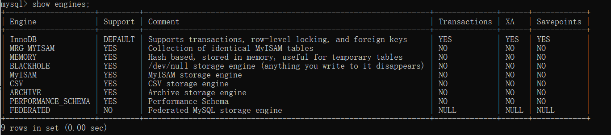
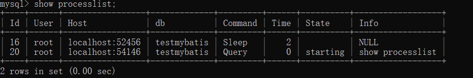

# MySQL架构及组成介绍

## （一）数据库和数据库实例

​	在MySQL的学习研究中，存在两个非常容易混淆的概念，即数据库和数据库实例。在MySQL中，数据库和数据库实例定义如下：

- 数据库：存储数据的集合，他是**文件**；

- 数据库实例：操作数据库的集合，他是**程序**。

   **如上定义很清楚了，数据库是用来存储数据的，数据库实例是用来操作数据的，从操作系统的角度，数据库实例表现为一个进程，对应多个线程。**

在非集群数据库架构中，数据库与数据库实例存在一 一对应关系，在数据库集群中，可能存在多个数据库实例操作一个数据库情况，即多对一关系。

---

## （二） MySQL基架

首先看看MySQL架构图


对于MySQL来说，虽然经历了多个版本迭代（MySQL5.5,MySQL 5.6,MySQL 5.7,MySQL 8）,但每次的迭代，都是基于MySQL

基架的，MySQL基架大致包括如下9大模块组件：

### （1）MySQL向外提供的交互接口（Connectors）

Connectors组件，是MySQL向外提供的交互组件，如java,.net,php等语言可以通过该组件来操作SQL语句，实现与SQL的交互。

### （2）管理服务组件和工具组件(Management Service & Utilities)

提供对MySQL的集成管理，如**备份(Backup)、恢复(Recovery)、安全管理(Security)、复制(Replication)、集群(Cluster)、管理(Administration)、配置(Configuration)、迁移(Migration)、元数据(Metadata)等**

### （3）连接池组件(Connection Pool)

负责监听对客户端向MySQL Server端的各种请求，接收请求，转发请求到目标模块。**每个成功连接MySQL Server的客户请求都会被创建或分配一个线程，该线程负责客户端与MySQL Server端的通信，接收客户端发送的命令，传递服务端的结果信息等。**

功能包含：**身份验证(Authentication)、线程复用(Thread Reuse)、连接数限制(Connection Limits)、内存检查(Check Memory)、缓存(Caches)。**

### （4）SQL接口组件(SQL Interface)

 接收用户SQL命令，如**DML,DDL和存储过程、视图、触发器**等，并将最终结果返回给用户。

### （5）查询分析器组件(Parser)

首先分析SQL命令语法的合法性，并尝试将SQL命令分解成数据结构，若分解失败，则提示SQL语句不合理。**查询翻译(Query Translation)、对象特权(Object Privilege)**

### （6）优化器组件（Optimizer）

对SQL命令按照标准流程进行优化分析。

### （7）缓存主件（Caches & Buffers）

全局缓存、存储引擎特定缓存、缓冲组件。建议关闭缓存，而且默认是关闭的。8.0已被删除

#### 1️⃣. MySQL查询缓存简介

MySQL查询缓存是MySQL中比较独特的一个**缓存区域**，用来缓存特定Query的整个结果集信息，且共享给所有客户端。为了提高完全相同的Query语句的响应速度，MySQL Server会**对查询语句进行Hash计算后，把得到的hash值与Query查询的结果集对应存放在Query Cache中**。当MySQL Server打开Query Cache之后，MySQL Server会对接收到的每一个SELECT 语句通过特定的Hash算法计算该Query的Hash值，然后通过该hash值到Query Cache中去匹配。

如果没有匹配，将这个hash值存放在一个hash链表中，并将Query的结果集存放到cache中，存放hashi值链表的每个hash节点存放了相应Quey结果集在cache中的地址，以及该query所涉及到一些table相关信息；
如果通过hash值匹配到了一样的Query，则直接将cache中相应的Query结果集返回给客户端。
**目前MySQL Query Cache只会cache select语句，其他类似show ，use的语句不会被cache**。MySQL 的每个Query Cache都是以SQL文本作为key来存储的，在应用Query Cache之前，SQL文本不会做任何处理。也就是说，**两个SQL语句，只要相差哪怕一个字符(例如大小写不一样，多一个空格，多注释)，那么这两个SQL将使用不同的Cache地址**。如: 下面三条SQL将会被存储在三个不同的缓存里，虽然他们的结果都是一样的。select * FROM people where name='surfchen'; select * FROM people where /*hey~*/ name='surfchen'; SELECT * FROM people where name='surfchen';

#### 2️⃣MySQL Query Cache优缺点

优点：Query Cache的查询，发生在MySQL接收到客户端的查询请求、查询权限验证之后和查询SQL解析之前。也就是说，当MySQL接收到客户端的查询SQL之后，仅仅只需要对其进行相应的权限验证之后，就会通过Query Cache来查找结果，甚至都不需要经过解析SQL、Optimizer模块进行执行计划的分析优化，更不需要发生任何存储引擎的交互。由于Query Cache是基于内存的，直接从内存中返回相应的查询结果，因此减少了大量的磁盘I/O和CPU计算，导致效率非常高。

缺点：Query Cache的优点很明显，但是也不能忽略它所带来的一些缺点：

1. hash计算影响性能问题。
   查询语句的hash计算和hash查找带来的资源消耗。如果将query_cache_type设置为1（也就是ON），那么MySQL会对每条接收到的SELECT类型的查询进行hash计算，然后查找这个查询的缓存结果是否存在。虽然hash计算和查找的效率已经足够高了，一条查询语句所带来的开销可以忽略，**但一旦涉及到高并发，有成千上万条查询语句时，hash计算和查找所带来的开销就必须重视了。**
2. Query Cache失效问题。**如果表的变更比较频繁，则会造成Query Cache的失效率非常高。表的变更不仅仅指表中的数据发生变化，还包括表结构或者索引的任何变化。**
3. 内存浪费问题。**查询语句不同，但查询结果相同的查询都会被缓存，这样便会造成内存资源的过度消耗**。查询语句的字符大小写、空格或者注释的不同，Query Cache都会认为是不同的查询（因为他们的hash值会不同）。
   相关系统变量设置不合理会造成大量的内存碎片，这样便会导致Query Cache频繁清理内存。

### （8）插件式存储引擎（Pluggable Storage Engines）

1. 什么是MySQL存储引擎

   ​    MySQL属于关系型数据库，而关系型数据库的存储是以表的形式进行的，对于表的创建，数据的存储，检索，更新等都是由MySQL存储引擎完成的，这也是MySQL存储引擎在MySQL中扮演的重要角色。
   

      研究过SQL Server和Oracle的读者可能很清楚，这两种数据库的存储引擎只有一个，而MySQL的存储引擎种类比较多，如MyISAM存储引擎，InnoDB存储引擎和Memory存储引擎等
   

   ​    MySQL之所以有多种存储引擎，是因为MySQL的开源性决定的。MySQL存储引擎，从种类上来说，大致可归结为官方存储引擎和第三方存储引起。MySQL的开源性，允许第三方基于MySQL骨架，开发适合自己业务需求的存储引擎。

2. MySQL存储引擎作用

   ​    MySQL存储引擎在MySQL中扮演重要角色，其作比较重要作用，大致归结为如下两方面：

   - 作用一：管理表创建，数据检索，索引创建等

   - 作用二：满足自定义存储引擎开发。

3. MySQL引擎种类

   ​    不同种类的存储引擎，在存储表时的存储引擎表机制也有所不同，从MySQL存储引擎种类上来说，可以分为官方存储引擎和第三方存储引擎。

   ​    当前，也存在多种MySQL存储引擎，如MyISAM存储引擎，InnoDB存储引擎，NDB存储引擎，Archive存储引擎，Federated存储引擎，Memory存储引擎，Merge存储引擎，Parter存储引擎，Community存储引擎，Custom存储引擎和其他存储引擎。

   ​    其中，比较常用的存储引擎包括**InnoDB存储引擎，MyISAM存储引擎和Momery存储引擎，MySQL8.0中新增TempTable存储引擎，监控MySQL时用的Performance_schema存储引擎，对MYISAM引擎的整合MRG_MYISAM**。

4. 几种典型MySQL存储引擎比较



### （9）物理文件（File System）

实际存储MySQL 数据库文件和一些日志文件等的系统，如Linux，Unix,Windows等。

---

## （三）一条查询sql的大概执行流程


### 1.客户端发送一条查询给服务器
我们在数据库层执行SQL语句时，应用程序会连接到相应的数据库服务器，把SQL语句发送给服务器处理。


**里面有个连接处于 sleep 状态，表示现在系统里面有一个空闲连接**

**数据库里面，长连接是指连接成功后，如果客户端持续有请求，则一直使用同一个连接。短连接则是指每次执行完很少的几次查询就断开连接，下次查询再重新建立一个**


### 2.服务器先检查查询缓存，如果命中了缓存，则立刻返回存储在缓存中的结果。否则进入下一阶段

服务器在解析一个查询语句之前，如果查询缓存是打开的（MySQL5.7默认关闭，8.0已删除，可以使用have_query_cache查看）。

如果缓存是开启状态，在接收到查询请求后，并不会直接去数据库查询，而是在数据库的查询缓存中找是否有相对应的查询数据（某条给定的查询语句在第一次执行时，服务器会缓存这条查询语句和他返回的结果。）

- 如果存在，那么在返回查询结果之前**，**MySQL**会检查一次用户权限**。这仍然**无需解析**查询SQL语句，因为查询缓存中已经存放了当前查询需要访问的表信息。如果权限没有问题，key 是查询的语句，value 是查询的结果。如果你的查询能够直接在这个缓存中找到 key，**那么这个 value 就会被则直接从缓存中拿到结果返回给客户端**。这种情况下，**查询不会被解析，不用生成执行计划**，**不会被执行**。而其中**是否命中缓存**是将此**查询语句和缓存中的查询语句进行比对**，如果完全相同，那就认为它们是相同的，就认为**命中缓存了**。
- **如果语句不在查询缓存中，就会继续后面的执行阶段。执行完成后，执行结果会被存入查询缓存中**


### 3.服务器端进行SQL解析、预处理，再由优化器生成对应的执行计划。

接下来服务器会将一个SQL转换成一个执行计划，而这个阶段包括：**解析SQL、预处理、优化SQL执行计划**，**其中任何一个阶段出错都会导致查询进行不下去**。

- **解析SQL**：Mysql通过将SQL语句进行解析，并生成一棵对应的解析树。MySQL解析器将使用MySQL**语法分析(语法规则验证)**和解析查询，如将**验证**是否使用**错误的关键字**，或者**关键字的顺序**是否正确。

- **预处理**：预处理器根据一些Mysql规则进一步检查解析树是否合法，如**数据表**和**数据列是否存在**，**解析列名**和**别名**，**是否有歧义**。接下来预处理器会**验证用户权限(precheck)。查看用户是否有相应的操作权限**。

- **优化SQL**：优化器是在表里面有**多个索引**的时候，决定使用**哪个索引**；或者在一个语句有*多表关联（join）*的时候，决定各个表的**连接顺序**，将SQL语句转化成执行计划，**一条查询可以有很多种执行方式，最后都返回相同的结果，最后找到其中最好的执行计划（Mysql使用基于成本的优化器，它将尝试预测一个查询使用某种执行计划的成本，选择其中成本最小的一个）。**

**例如** :  `select * from t1 join t2 using(ID) where t1.c=10 and t2.d=20;`

- 既可以先从表 t1 里面取出 c=10 的记录的 ID 值，再根据 ID 值关联到表 t2，再判断 t2 里面 d 的值是否等于 20。

- 也可以先从表 t2 里面取出 d=20 的记录的 ID 值，再根据 ID 值关联到 t1，再判断 t1 里面 c 的值是否等于 10。

**这两种执行方法的逻辑结果是一样的，但是执行的效率会有不同，而优化器的作用就是决定选择使用哪一个方案。**


### 4.MySQL根据优化器生成的执行计划，调用存储引擎的API执行查询

**Mysql根据执行计划给出的指令逐步执行**。在此过程中，**有大量的操作需要通过调用存储引擎实现的接口完成**，这些接口即为“handler API”接口。查询中的每一个表由一个handler的实例表示。（实际上，在优化阶段Mysql就为每一个表创建了一个handelr实例，优化器可以根据这些实例的接口获取表的相关信息，如表的所有列名、索引统计信息等）

**存储引擎接口完成例如：** 　　　　　

```sql
mysql> select * from T where ID=10;
ERROR 1142 (42000): SELECT command denied to user 'b'@'localhost' for table 'T'
```

比如我们这个例子中的表 T 中，ID 字段没有索引，那么执行器的执行流程是这样的：

1. 调用 InnoDB 引擎接口取这个表的第一行，判断 ID 值是不是 10，如果不是则跳过，如果是则将这行存在结果集中；

2. 调用引擎接口取“下一行”，重复相同的判断逻辑，直到取到这个表的最后一行。

3. **执行器将上述遍历过程中所有满足条件的行组成的记录集作为结果集返回给客户端。**

4. 至此，这个语句就执行完成了。

 **对于有索引的表**，执行的逻辑也差不多。第一次调用的是“取满足条件的第一行”这个接口，之后循环取“满足条件的下一行”这个接口，这些接口都是引擎中已经定义好的

数据库的慢查询日志中看到一个 rows_examined 的字段 ，表示这个语句执行程序中扫描了多少行。这个值就是在执行器每次调用引擎获取数据行的时候累加的


### 5.将结果返回给客户端

如果查询可以缓存，Mysql在这个阶段也会将结果放到查询缓存中。

mysql服务器处理完最后一个关联查询后，开始生成第一条数据后，就会向客户端不断地发送数据。所有结果集中的每一条数据都会以一个满足客户端/服务器通信协议的方式进行封包，通过TCP协议进行传输。

---

## （四）一条 UPDATE 语句的执行过程

以一条SQL为例：

```sql
update tb_student A set A.age='19' where A.name=' 张三 ';
```

我们来给张三修改下年龄。其实条语句也基本上会沿着上一个查询的流程走，只不过执行更新的时候要记录日志，这就会引入日志模块。MySQL 自带的日志模块式 binlog（归档日志） ，所有的存储引擎都可以使用，我们常用的 InnoDB 引擎还自带了一个日志模块 redo log（重做日志）和 undo log（回滚日志），我们就以 InnoDB 模式下来探讨这个语句的执行流程。流程如下：

- 先查询到张三这一条数据，如果有缓存，也是会用到缓存。
- 然后拿到查询的语句，把 age 改为 19，然后调用引擎 API 接口，写入这一行数据。InnoDB 引擎把数据保存在内存中，同时记录 redo log，undo log，待事务提交时， redo log 进入 prepare 状态，然后告诉执行器，执行完成了，随时可以提交。
- 执行器收到通知后记录 binlog，然后调用引擎接口，提交 redo log 为提交状态。（二阶段提交）
- 更新完成。

这里肯定有同学会问，为什么要用两个日志模块，用一个日志模块不行吗?

这是因为最开始 MySQL 并没有 InnoDB 引擎( InnoDB 引擎是其他公司以插件形式插入 MySQL 的) ，MySQL 自带的引擎是 MyISAM，但是我们知道 redo log和undo log 是 InnoDB 引擎特有的，其他存储引擎都没有，这就导致会没有 crash-safe 的能力(crash-safe 的能力即使数据库发生异常重启，之前提交的记录都不会丢失)，binlog 日志只能用来归档，主从复制。

并不是说只用一个日志模块不可以，只是 InnoDB 引擎就是通过 redo log和 undo log 来支持事务的，其中redo log 和 bin log高度相似。那么，又会有同学问，我用两个日志模块，但是不要这么复杂行不行，为什么 redo log 要引入 prepare 预提交状态？这里我们用反证法来说明下为什么要这么做？

- 先写 redo log 直接提交，然后写 binlog，假设写完 redo log 后，机器挂了，binlog 日志没有被写入，那么机器重启后，这台机器会通过 redo log 恢复数据，但是这个时候 bin log 并没有记录该数据，后续进行机器备份的时候，就会丢失这一条数据，同时主从同步也会丢失这一条数据。
- 先写 binlog，然后写 redo log，假设写完了 binlog，机器异常重启了，由于没有 redo log，本机是无法恢复这一条记录的，但是 binlog 又有记录，那么和上面同样的道理，就会产生数据不一致的情况。

如果采用 redo log 两阶段提交的方式就不一样了，写完 binglog 后，然后再提交 redo log 就会防止出现上述的问题，从而保证了数据的一致性。那么问题来了，有没有一个极端的情况呢？假设 redo log 处于预提交状态，binglog 也已经写完了，这个时候发生了异常重启会怎么样呢？ 这个就要依赖于 MySQL 的处理机制了，MySQL 的处理过程如下：

- 判断 redo log 是否完整，如果判断是完整的，就立即提交。
- 如果 redo log 只是预提交但不是 commit 状态，这个时候就会去判断 binlog 是否完整，如果完整就提交 redo log, 不完整就回滚事务。

这样就解决了数据一致性的问题。

---

## （五）总结

- MySQL 主要分为 Server 层和引擎层，Server 层主要包括连接器、查询缓存、分析器、优化器、执行器，同时还有一个日志模块（binlog），这个日志模块所有执行引擎都可以共用,redolog 只有 InnoDB 有。
- 引擎层是插件式的，目前主要包括，MyISAM,InnoDB,Memory 等。
- SQL 等执行过程分为两类，一类对于查询等过程如下：权限校验 —> 查询缓存 —> 分析器 —> 优化器 —> 权限校验 —> 执行器—> 引擎
- 对于更新等语句执行流程如下：分析器 ----> 权限校验 ----> 执行器 —> 引擎 —> redo log prepare —> binlog —> redo log commit


> 本文参考自：
>
> 1. [谈谈MySQL架构体系](https://www.cnblogs.com/wangjiming/p/10410904.html)
> 2. 《高性能MySQL第三版》
> 3. [[Mysql 一条sql查询语句是如何执行的](https://www.cnblogs.com/jw-yahui/articles/10769563.html)](https://www.cnblogs.com/jw-yahui/articles/10769563.html)