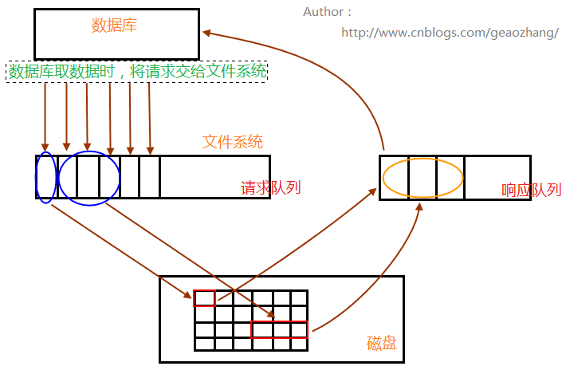

# InnoDB的关键特性

## Insert Buffer - 插入缓冲

> 以下内容引自 [InnoDB的关键特性](https://blog.csdn.net/weixin_35885196/article/details/97140514)

### Insert Buffer的作用

插入缓冲是为了**提高插入数据效率**的，往非聚簇索引中插入数据时，首先会看缓冲池中，是否有要插入的非聚簇索引页。如果有则直接插入，那个页变成脏页。如果没有，就把**多次插入的数据先缓冲到插入缓冲中**，然后**合并多次操作**，即把非聚集索引在一起的数据合并为一次IO（减少IO），再以一定的频率刷新到磁盘(***将Insert Buffer和辅助索引页字节点进行merge操作***)，但是插入缓冲只是针对**非聚集索引没有非唯一约束的索引**的插入有效。

（类似于MRR，随机IO变顺序IO）

### 什么是聚集索引/非聚集索引

InnoDB的数据是按主键的索引的顺序来存放数据的，这种索引被称为聚集索引，一个表有且只有一个聚集索引。但我们可以为一个表创建多个索引，这些索引被称为非聚集索引，或者辅助索引。这些索引是存放在另外的索引页的，跟实际数据的存放是没有关系的。非聚集索引记录的是索引列的数据，不是全部的列。

如果不了解聚集索引，有可能会被绕晕，但是，至少可以得出一个结论，就是聚集索引是按顺序存放的，而非聚集索引是没有必然的顺序的。这就导致一个问题，当插入一条数据时，更新非聚集索引时，必须到处去找非聚集索引所在的页（也称为离散写），这样的插入效率就比较低了。

### 为什么必须是没有唯一约束的

如果该非聚集索引有唯一约束，那么为了保证唯一性，必须每次插入前都去查询是否存在相同的数据，这时就必须到磁盘到处找是否存在该值（也称为离散读），这就导致插入缓冲失效了。

**插入缓冲是为了解决非聚集索引随机写导致的效率低的问题，但是对于有唯一约束的非聚集索引也无能为力。**

### 离散读/写效率真的很慢吗

在机械硬盘里，离散读必须要移动磁头，所以速度真的很慢，但是随着固态硬盘的发展，也许这个就不是问题了。固态硬盘的随机读写能力很强，而且现在固态硬盘的价格也低了不少。不过要让mysql支持固态硬盘，可能还有配置不少参数，直接上固态硬盘似乎效果不明显呢。

> 

### 带来的一个问题

在写密集的情况下，插入缓冲会占用过多的缓冲池内存，默认最大可以占用1/2的缓冲池内存，修正这个问题可以修改默认值对插入缓冲的大小进行控制。

- innodb1.0.x版本：对insert buffer升级为change buffer，**其使用的对象依然是非唯一的辅助索引**，从这个版本开始，innodb存储引擎可以对**DML**(数据操作语言)操作---**insert  delete  update**进行缓冲，分别是**insert  buffer** 、**delete buffer**、**purge buffer**,并提供参数**innodb_change_buffering**用来开启各种buffer的选项，可选值为inserts、deletes、purges、changes(表示启用inserts和deletes)、all(表示启用所有)、none(表示都不启用)，默认为all

  ``` 
  mysql> show variables like 'innodb_change_buffering';
  +-------------------------+-------+
  | Variable_name           | Value |
  +-------------------------+-------+
  | innodb_change_buffering | all   |
  +-------------------------+-------+
  1 row in set, 1 warning (0.00 sec)
  ```

- innodb 1.2.x版本：通过参数innodb_change_buffer_max_size来控制change buffer最大使用内存的数量，默认为25，表示最多使用1/4的缓冲池内存空间，**该参数最大有效值为50**.

  ``` 
  mysql> show variables like 'innodb_change_buffer_max_size';
  +-------------------------------+-------+
  | Variable_name                 | Value |
  +-------------------------------+-------+
  | innodb_change_buffer_max_size | 25    |
  +-------------------------------+-------+
  1 row in set, 1 warning (0.00 sec)
  ```

### Insert Buffer内部实现

insert buffer内部是一颗B+树,mysql4.1之前是每张表有一颗insert buffer B+树，而现在的版本是全局只有一颗B+树，负责对所有的表的辅助索引进行insert buffer, 这颗B+树存放在共享表空间中，即ibdata1中。

Insert Buffer中B+树的非叶子节点中存放的是查询的serarch key（键值），结构如下图所示

```
+-------+--------+--------+
| space | marker | offset |
+-------+--------+--------+
```

search key一共占有9个字节:

- **space**表示待插入记录所在表的表空间id,占用4个字节，每个表有唯一的space id,可通过space id查询是哪张表，
- **marker**占用1字节，用来兼容老版本的insert buffer,
- **offset**表示页所在的偏移量，占用4字节。

当一个辅助索引要插入到页（space，offset）时，如果这个页不在缓冲池中，则按照上述结构构造一个search key，然后查询Insert Buffer的B+树，将这条记录插入到Insert BufferB+树中。

对于Insert Buffer的B+树的叶子节点，并非只有记录，而是如下所示：

```
+-------+--------+--------+----------+-----------+-----------+
| space | marker | offset | metadata | 辅助索引值 |    ...    |
+-------+--------+--------+----------+-----------+-----------+
```

前面和非叶子结点的含义相同，一共占用9个字节，metadata占用4个字节，从第5列开始，就是实际插入记录的各个字段了，所以与原插入记录相比较，B+树的叶子节点记录需要额外记录13字节的开销

> metadata中存储的内容
>
> |          名称          | 字节 |                 含义                  |
> | :--------------------: | :--: | :-----------------------------------: |
> | IBUF_REC_OFFSET_COUONT |  2   | 对每个进入Insert Buffer的记录进行排序 |
> |  IBUF_REC_OFFSET_TYPE  |  1   |    每个进入Insert Buffer的记录类型    |
> | IBUF_REC_OFFSET_FLAGS  |  1   |    每个进入Insert Buffer的记录标记    |
>
> 

### Insert Buffer BitMap

因为启用Insert Buffer之后，辅助索引页（space，offset）可能被记录到Insert Buffer的B+树中，所以为了保证每次Merge Insert Buffer必须成功，需要一个特殊的页来标记每个辅助索引页（space，offset）的可用空间。

每个Insert Buffer BitMap页用来追踪16384个辅助索引，也就是256个区(Extent)。每个Insert Buffer BitMap在16384个页的第二页中。

> 相关知识点：
>
> - 每个区64页，一页16KB，一个区所占大小为： 16 * 64 = 1024KB = 1M
> - 256个区，一个区64页，则一个BiMap可以追踪的页为：256 * 64 = 16384

每个辅助索引页在Insert Buffer BitMap中，占用4位（bit），由下表三部分组成

> |        名称         | 大小 | 说明                                                         |
> | :-----------------: | :--: | :----------------------------------------------------------- |
> |   IBF_BITMAP_FREE   |  2   | 表示该辅助索引页可用空间数量，可取值为<br />0表示无可用空间<br />1表示剩余空间 > 1/32 页（512字节）<br />2表示剩余空间 > 1/16 页<br />3表示剩余空间 > 1/8 页 |
> | IBF_BITMAP_BUFFERED |  1   | 1表示该辅助索引页有记录被缓存在Insert Buffer B+树中          |
> |   IBF_BITMAP_IBUF   |  1   | 1表示该页为Insert Buffer B+树的索引页                        |
>
> 相关知识点：
>
> - 为什么一个页中，至少要有 1/32 的剩余空间？
>   按照一般情况来说，一页为16K，16 * 1024 / 32 = 512 B。从磁盘的物理结构来看存取信息的最小单位是扇区，一个扇区大小为 512 B.

### Merge Insert Buffer —— 以一定的频率刷新到磁盘(***将Insert Buffer和辅助索引页字节点进行merge操作***)

merge insert buffer 的操作可能会发生在以下几种情况：

1. 辅助索引页被读取到缓冲池时。例如执行正常的SELECT 操作，这时需要检查Insert BufferBitMap页，确认该辅助索引页是否有记录存放于Insert Buffer B+树中，若有，则将Insert Buffer B+树中的记录插入到该辅助索引页中。
2. insert buffer bitmap追踪到该辅助索引页已无可用空间时（启用insert  buffer后，辅助索引页中的记录可能被插入到insert buffer B+树中，为了保证每次的merge insert buffer页成功，通过insert buffer bitmap类型的特殊页来记录辅助索引页的可用空间），并至少得由**1/32** 的可用空间。**若往辅助索引页插入一条记录后，发现空间少于 1/32 ，则会强制读取辅助索引页，将Insert Buffer B+树中，该页的记录插入到辅助索引页中**。
   （为什么是 1/32？）
3. master thread:此线程中每秒或者每10秒进行一次merge insert buffer操作，不同之处在于每次merge的数量不一样。

---

## Double Write - 两次写

两次写带给innodb存储引擎的是数据页的可靠性

### 使用两次写的原因：

当innodb存储引擎正在写入某个页到表中，而这个页只写了一部分就发生了宕机，称为部分写失效，会导致数据丢失，可以通过重做日志恢复，可是重做日志中记录的是对页的物理操作，如偏移量80，写‘ddd’操作。如果这个页本身已经损坏，则重做也没意义，因此，可以在应用重做之前，用户需要一个页的副本，当发生写失效时，通过副本还原该页，再进行重做，这就是doublewrite。

> 在数据库中，数据是被分成一块一块的。在操作系统中，数据也是被分成一块一块的。
>  一般情况下，数据库的块要比操作系统的快大，且数据库块的大小是操作系统块的大小的整数倍。
>  所以，数据库的块没法保证原子地持久化。
>
> Double write 要解决的是 inplace update 的 partial write 的问题。什么叫 partial write？数据库 flush 脏页的时候，系统可能宕机，这个时候，数据库的一个脏页可能只刷了一部分。
>  而 InnoDB  的 redo log 没有记录整个 page 的内容。因为如果每次修改都记录整个 page，那日志就太大了。
>  也就是说， **old_page + redo_log => new_page。如果 old_page 的内容被写坏了，数据就没法恢复了。
>  Double write 的做法就是先将 old_page + redo_log 得到的 new_page 先持久化到磁盘上的“另一个地方”。然后再进行 inplace update，如果中途发生宕机，可以从“另一个地方”恢复这个 page 的数据。**
>
> ---
>
> partial write的问题是很多数据库设计中都需要考虑到这么一个临界点的问题。MySQL中的页是16k，数据的校验是按照这个为单位进行的，而操作系统层面的数据单位肯定达不到16k（比如是4k），那么一旦发生断电时，只保留了部分写入，如果是Oracle DBA一般对此都会很淡定，说用redo来恢复嘛。但可能我们被屏蔽了一些细节，MySQL在恢复的过程中一个基准是检查page的checksum，也就是page的最后事务号，发生这种partial page write 的问题时，因为page已经损坏，所以就无法定位到page中的事务号，这个时候redo就无法直接恢复。


### doublewrite的构成：

一部分是内存的doublewrite buffer，大小为2MB，另一部分是物理磁盘上共享空间中的连续128页，两个区，大小也为2MB。其中120个用于批量刷脏数据，另外8个用于Single Page Flush。根据阿里翟卫祥同学分析，之所以这样做是因为批量刷脏是后台线程做的，这样不影响前台线程。而Single Page Flush是用户线程发起的，需要尽快地刷脏并替换出一个空闲页出来。所以不是一个严格的64+64的拆分，最后也给出了这篇文章的链接。（https://yq.aliyun.com/articles/50627）

> 2MB的 Double Write 区，可以存储 2 * 1024 / 16 = 128 页

### doublewrite的应用：


1. 当一系列机制触发数据缓冲池中的脏页刷新时，并不直接写入磁盘数据文件中，而是先拷贝至内存中的doublewrite buffer中；
2. 接着从doublewrite buffer分两次写入磁盘共享表空间中(连续存储，顺序写，性能很高)，每次写1MB；
3. 待第二步完成后，再将doublewrite buffer中的脏页数据写入实际的各个表空间文件(离散写)；(脏页数据固化后，即进行标记对应doublewrite数据可覆盖)。

因此在操作系统将页写入磁盘的过程中发生了崩溃，innodb可以从共享表空间中的doublewrite中找到该页的副本，将其复制到表空间文件，再应用重做日志恢复


### doublewrite的设置：

参数skip_innodb_doublewrite可以禁止使用两次写功能，这时可能会发生写失效问题，

有些文件系统本身就提供了部分写失效的防范机制，比如ZFS文件系统，因此用户就可以不必启用两次写功能。 

### doublewrite的崩溃恢复

如果操作系统在将页写入磁盘的过程中发生崩溃，在恢复过程中，innodb存储引擎可以从共享表空间的doublewrite中找到该页的一个最近的副本，将其复制到表空间文件，再应用redo log，就完成了恢复过程。

> 对于文件校验来说，一个中心词就是checksum。如果出现了partial write的时候，比如断电，那么两次写的过程中，很可能page是不一致的，这样checksum校验就很可能出现问题。而出现问题时，因为有了前期写入共享表空间的页信息，所以就可以重构出页的信息重新写入。

因为有副本所以也不担心表空间中数据页是否损坏。

### **doublewrite的副作用**

1. double write带来的写负载
   double write是一个buffer, 但其实它是开在物理文件上的一个buffer, 其实也就是file, 所以它会导致系统有更多的fsync操作, 而硬盘的fsync性能是很慢的, 所以它会降低mysql的整体性能。

   但是，doublewrite buffer写入磁盘共享表空间这个过程是连续存储，是顺序写，性能非常高，(约占写的%10)，牺牲一点写性能来保证数据页的完整还是很有必要的。

2. 监控double write工作负载

   ```
   mysql> show global status like '%dblwr%';
   +----------------------------+-------+
   | Variable_name              | Value |
   +----------------------------+-------+
   | Innodb_dblwr_pages_written | 7     |
   | Innodb_dblwr_writes        | 3     |
   +----------------------------+-------+
   2 rows in set (0.00 sec)
   ```

   关注点：Innodb_dblwr_pages_written / Innodb_dblwr_writes

   开启doublewrite后，每次脏页刷新必须要先写doublewrite，而doublewrite存在于磁盘上的是两个连续的区，每个区由连续的页组成，一般情况下一个区最多有**64个页**，所以一次IO写入应该可以最多写64个页。

   而根据以上系统Innodb_dblwr_pages_written与Innodb_dblwr_writes的比例来看，大概在3左右，远远还没到64(如果约等于64，那么说明系统的写压力非常大，有大量的脏页要往磁盘上写)，所以从这个角度也可以看出，系统写入压力并不高。

3. 关闭double write适合的场景

   - 海量DML

   - 不惧怕数据损坏和丢失

   - 系统写负载成为主要负载

     ```
     mysql> show variables like '%double%';
     +--------------------+-------+
     | Variable_name      | Value |
     +--------------------+-------+
     | innodb_doublewrite | ON    |
     +--------------------+-------+
     1 row in set (0.04 sec)
     ```

作为InnoDB的一个关键特性，doublewrite功能默认是开启的，但是在上述特殊的一些场景也可以视情况关闭，来提高数据库写性能。静态参数，配置文件修改，重启数据库。

### 为什么没有把double write里面的数据写到data page里面呢？

1. double write里面的数据是连续的，如果直接写到data page里面，而data page的页又是离散的，写入会很慢。
2. double write里面的数据没有办法被及时的覆盖掉，导致double write的压力很大；**短时间内可能会出现double write溢出的情况，所以大量的DML操作时，可以关闭Double Write，但会写失效**。


> 还可参考这篇文章：[页断裂(partial write)与doublewrite技术](https://www.cnblogs.com/cchust/p/3961260.html)

---

## Adaptive Hash Index - 自适应哈希索引

### 含义

innodb存储引擎会监控对表上的各索引页的查询，如果观察到建立哈希索引可以带来速度提升，则建立哈希索引，称之为自适应哈希索引（Adaptive hash index,AHI）.AHI是通过**缓冲池的B+树**构造而来，因此建立速度很快，innodb会自动根据访问的频率和模式自动的为某些热点页建立哈希索引。

### 建立要求：

1. 对于这个页的连续访问模式必须是一样的，即指查询条件一样(对于多列索引来说，where a =1 和 where a = 1 and b =2时不同的访问模式)
2. 以该模式访问了100次
3. 页通过该模式访问了N次，其中N=页中记录*1/16

### 限制：

哈希索引只能用来搜索等值的查询，如select * from table where index_col="xxx";而对于其他查找类型，如范围查找不能使用哈希索引，通过参数innodb_adptive_hash_index来禁止或者开启此特性，默认AHI为开启状态。

---

## AIO - 异步IO

### 目的：

   为了提高磁盘操作性能，使用异步io(asynchronous io,AIO)的方式来处理磁盘操作，

### 含义：

与AIO相对应的是Sync IO，即每次进行一次IO操作，需要等待此次操作结束后，才能进行下一步操作。

用户可以在发出一个io请求后立即再发出另一个io请求，当全部io请求发送完毕后，等待所有的io操作完成，称为AIO，AIO还可以进行io merge操作，也就是将多个io合并为一个io.这样可以提高IPOS性能。

> 例如，用户查询的页为
>
> （3,5）（3,6）（3,7）
>
> 每个页的大小为16KB，那么，Sync IO需要三次IO 操作。而AIO会判断这三个页是连续的，（通过space，offset就可以看出来）因此，AIO会发出一个IO请求，从(3,5)开始，读取48KB的页

### 实现：

​    在innodb1.1.x之前，Aio是通过innodb存储引擎的代码模拟实现，而从innodb1.1.x开始，提供了内核级别AIO的支持，即为native AIO,

### 应用

read ahead方式的读取，脏页的刷新等都是AIO完成的

---

## 刷新临近页

### 工作原理

当刷新一个脏页时，innodb会检测**该页所在区的所有页**，如果是脏页，那么一起刷新

### 好处

通过AIO，将多个IO写入操作合并到一个IO操作中，对于机械硬盘来说，性能提升很明显。固态硬盘建议关闭

### 参数控制

参数innodb_flush_neighbors来开启或关闭该特性，为0则关闭

---

## 预读 - read ahead

InnoDB在I/O的优化上有个比较重要的特性为预读，预读请求是一个i/o请求，它会异步地在缓冲池中预先回迁多个页面，预计很快就会需要这些页面，这些请求在一个范围内引入所有页面。InnoDB以64个page为一个extent，那么InnoDB的预读是以page为单位还是以extent？



数据库请求数据的时候，会将读请求交给文件系统，放入请求队列中；相关进程从请求队列中将读请求取出，根据需求到相关数据区(内存、磁盘)读取数据；取出的数据，放入响应队列中，最后数据库就会从响应队列中将数据取走，完成一次数据读操作过程。

接着进程继续处理请求队列，(如果数据库是全表扫描的话，数据读请求将会占满请求队列)，判断后面几个数据读请求的数据是否相邻，再根据自身系统IO带宽处理量，进行预读，进行读请求的合并处理，一次性读取多块数据放入响应队列中，再被数据库取走。(如此，一次物理读操作，实现多页数据读取，rrqm>0（# iostat -x），假设是4个读请求合并，则rrqm参数显示的就是4)

预读请求是一个I/O请求，用于异步预取缓冲池中的多个页面，以预期这些页面将很快被需要。请求在一个区段中引入所有页面。InnoDB使用两种预读算法来提高I/O性能:

- 线性预读(默认方式)，它根据按顺序访问的缓冲池中的页面来预测可能很快需要哪些页面。通过使用配置参数innodb_read_ahead_threshold来调整触发异步读取请求所需的顺序页面访问次数，可以控制InnoDB何时执行预读操作。在添加这个参数之前，InnoDB只会在读取当前区段的最后一页时计算是否要对整个下一个区段发出异步预取请求。

    配置参数innodb_read_ahead_threshold控制着InnoDB检测顺序页面访问模式的敏感度。如果从一个区段连续读取的页面数大于或等于innodb_read_ahead_threshold, InnoDB会对整个后续区段启动一个异步预读操作。innodb_read_ahead_threshold可以设置为0-64之间的任何值。默认值是56。值越高，访问模式检查越严格。例如，如果你将这个值设置为48,InnoDB只会在48个页面被顺序访问的情况下触发一个线性提前读取请求。如果值是8,InnoDB会触发异步提前读取，即使只有8个页面被顺序访问。您可以在MySQL配置文件中设置该参数的值，或者使用set GLOBAL语句动态地更改它，这需要足够的权限来设置全局系统变量。

  ```sql
  mysql> show variables like 'innodb_read_ahead_threshold';
  +-----------------------------+-------+
  | Variable_name               | Value |
  +-----------------------------+-------+
  | innodb_read_ahead_threshold | 56    |
  +-----------------------------+-------+
  ```

  

- 随机预读，它根据缓冲池中已经存在的页面预测何时可能需要这些页面，而不考虑这些页面被读取的顺序。如果在缓冲池中发现来自相同区段的13个连续的页面，InnoDB异步地发出请求来预取区段的剩余页面。默认是关闭的。要启用这个特性，请将配置变量innodb_random_read_ahead设置为ON。

  ```sql
  mysql> show variables like 'innodb_random_read_ahead';
  +--------------------------+-------+
  | Variable_name            | Value |
  +--------------------------+-------+
  | innodb_random_read_ahead | OFF   |
  +--------------------------+-------+
  ```

  

`SHOW ENGINE INNODB STATUS`命令显示统计信息，帮助您评估预读算法的有效性。统计信息包括以下全局状态变量的计数器信息:

- Innodb_buffer_pool_read_ahead
- Innodb_buffer_pool_read_ahead_evicted
- Innodb_buffer_pool_read_ahead_rnd

在微调innodb_random_read_ahead设置时，这些信息可能很有用。

> 以上内容来源于
>
> 1. 官方文档
> 2. [InnoD存储引擎的关键特性](https://www.it610.com/article/5037373.htm)
> 3. [阿里云栖社区-Double Write](https://m.aliyun.com/yunqi/articles/80423)