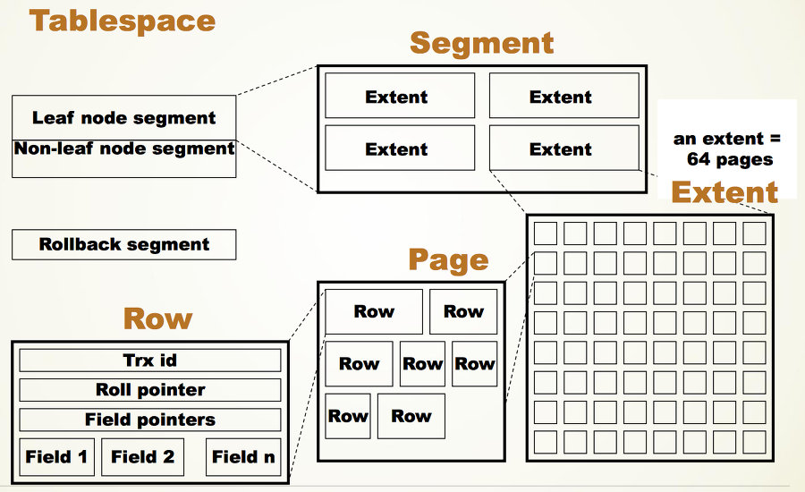
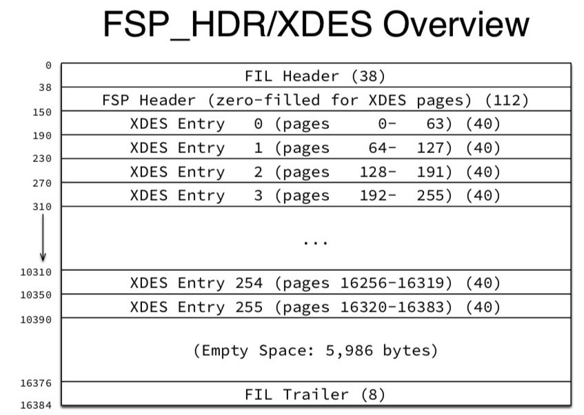
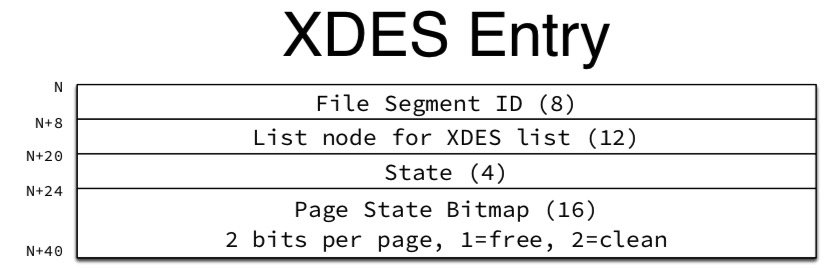
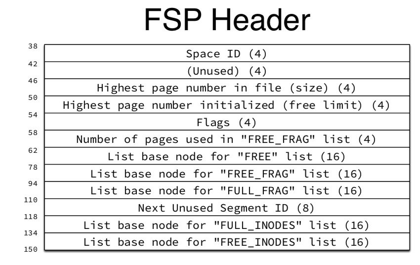
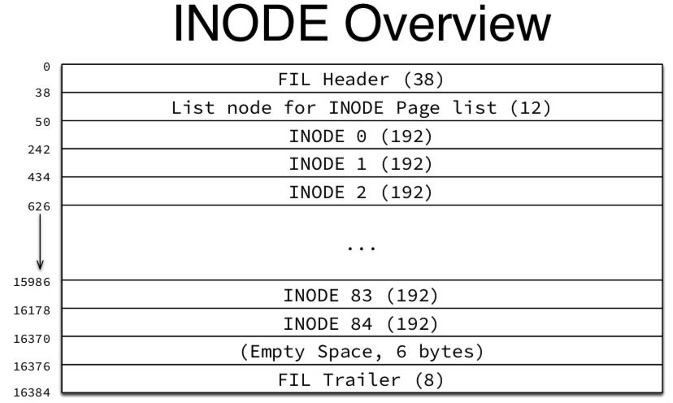
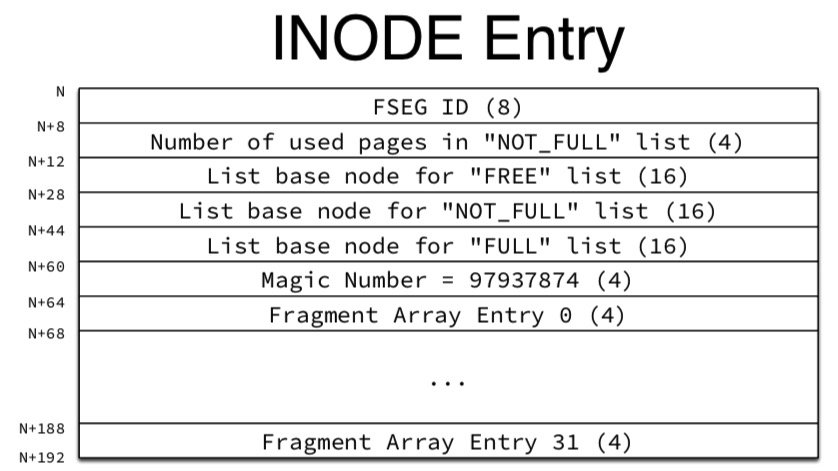

# Tablespaces


## 系统表空间 - (ibdata1)

SYSTEM表空间是InnoDB数据字典、双写缓冲区、更改缓冲区和撤消日志的存储区。如果表是在SYSTEM表空间中创建的，而不是在file-per-table或常规表空间中创建的，则它还可能包含表和索引数据。

SYSTEM表空间可以有一个或多个数据文件。默认情况下，在数据目录中创建名为ibdata1的单个系统表空间数据文件。系统表空间数据文件的大小和数量由Innodb_data_file_path启动选项定义。有关配置信息，请参见系统表空间数据文件配置。


```
# 查看默认的表空间文件及一些信息

mysql> show variables like 'innodb_data_file_path';
+-----------------------+------------------------+
| Variable_name         | Value                  |
+-----------------------+------------------------+
| innodb_data_file_path | ibdata1:12M:autoextend |
+-----------------------+------------------------+
1 row in set, 1 warning (0.00 sec)
```

可以在my.cnf配置文件里配置多个表空间文件：

```
[mysqld]
innodb_data_file_path = /db/ibdata:2000M;/db2/ibdata2:2000M:autoextend
```

用两个文件组成共享表空间，若这两个文件在不同的磁盘上，	磁盘的负载将会被平均，可以提升数据库的整体性能。

autoextend：表示用完了指定的大小空间后，会自增。

### 调整系统表空间的大小

#### 增大系统表空间

增加SYSTEM表空间大小的最简单方法是将其配置为自动扩展。为此，请在Innodb_DATA_FILE_PATH设置中为最后一个数据文件指定自动扩展属性，然后重新启动服务器。例如：

```
innodb_data_file_path=ibdata1:10M:autoextend
```


指定自动扩展属性时，数据文件的大小会根据需要的空间自动增加8MB增量。INNODB_AUTOEXTEND_INCREMENT变量控制增量大小.

您还可以通过添加另一个数据文件来增加SYSTEM表空间大小。需要以下操作：

1. 停止MySQL服务器
2. 如果Innodb_DATA_FILE_PATH设置中的最后一个数据文件是使用自动扩展属性定义的，请将其删除，然后修改大小属性以反映当前数据文件的大小。要确定要指定的适当数据文件大小，请检查文件系统中的文件大小，并将该值向下舍入为最接近的MB值，其中MB等于1024 x 1024
3. 将新数据文件附加到Innodb_DATA_FILE_PATH设置，可以选择指定自动扩展属性。只能为Innodb_DATA_FILE_PATH设置中的最后一个数据文件指定自动扩展属性
4. 启动MySQL服务器

例如，此表空间具有一个自动扩展数据文件：

```shell
innodb_data_home_dir = innodb_data_file_path = /ibdata/ibdata1:10M:autoextend
```


假设数据文件随时间增长到988MB。这是[`innodb_data_file_path`](https://dev.mysql.com/doc/refman/5.7/en/innodb-parameters.html#sysvar_innodb_data_file_path) 修改大小属性以反映当前数据文件大小之后，并指定新的50MB自动扩展数据文件之后的设置：

```none
innodb_data_home_dir =
innodb_data_file_path = /ibdata/ibdata1:988M;/disk2/ibdata2:50M:autoextend
```

添加新数据文件时，请勿指定现有文件名。`InnoDB`启动服务器时，将创建并初始化新的数据文件。

#### 减小系统表空间

您不能从系统表空间中删除数据文件。要减小系统表空间大小，请使用以下过程：

1. 使用[**mysqldump**](https://dev.mysql.com/doc/refman/5.7/en/mysqldump.html)转储所有 `InnoDB`表，包括 模式中的`InnoDB`表 `mysql`。使用以下查询标识 模式中的`InnoDB`表 `mysql`：

   ```mysql
   mysql> SELECT TABLE_NAME from INFORMATION_SCHEMA.TABLES WHERE TABLE_SCHEMA='mysql' and ENGINE='InnoDB';
   +---------------------------+
   | TABLE_NAME                |
   +---------------------------+
   | engine_cost               |
   | gtid_executed             |
   | help_category             |
   | help_keyword              |
   | help_relation             |
   | help_topic                |
   | innodb_index_stats        |
   | innodb_table_stats        |
   | plugin                    |
   | server_cost               |
   | servers                   |
   | slave_master_info         |
   | slave_relay_log_info      |
   | slave_worker_info         |
   | time_zone                 |
   | time_zone_leap_second     |
   | time_zone_name            |
   | time_zone_transition      |
   | time_zone_transition_type |
   +---------------------------+
   ```

2. 停止服务器。

3. 删除所有现有的表空间文件（`*.ibd`），包括 `ibdata`和`ib_log` 文件。不要忘记删除 架构`*.ibd` 中表的文件`mysql`。

4. 删除表的所有`.frm`文件 `InnoDB`。

5. 为新系统表空间配置数据文件。请参阅 [系统表空间数据文件配置](https://dev.mysql.com/doc/refman/5.7/en/innodb-init-startup-configuration.html#innodb-startup-data-file-configuration)。

6. 重新启动服务器。

7. 导入转储文件。

### 对系统表空间使用原始磁盘分区

您可以将原始磁盘分区用作`InnoDB` [系统表空间](https://dev.mysql.com/doc/refman/5.7/en/glossary.html#glos_system_tablespace)中的数据文件 。此技术可在Windows以及某些Linux和Unix系统上启用无缓冲的I / O，而不会增加文件系统的开销。在有和没有原始分区的情况下执行测试，以验证此更改是否确实提高了系统性能。

使用原始磁盘分区时，请确保运行MySQL服务器的用户ID具有该分区的读写特权。例如，如果您以`mysql`用户身份运行服务器 ，则分区必须可由读取和写入`mysql`。如果使用该[`--memlock`](https://dev.mysql.com/doc/refman/5.7/en/server-options.html#option_mysqld_memlock)选项运行服务器，则该服务器必须以身份运行`root`，因此该分区必须可由读取和写入`root`。

下述步骤涉及选项文件的修改。有关更多信息，请参见[第4.2.2.2节“使用选项文件”](https://dev.mysql.com/doc/refman/5.7/en/option-files.html)。

## 每个表的文件表空间( .ibd )

每表文件表空间包含单个`InnoDB`表的数据和索引 ，并存储在文件系统中自己的数据文件中

> 具体结构可查询[MySQL · 引擎特性 · Innodb 表空间](http://mysql.taobao.org/monthly/2019/10/01/)

### 每表文件表空间配置

默认情况下，InnoDB在每个表的文件表空间中创建表。此行为由INONDB_FILE_PER_TABLE变量控制。禁用Innodb_file_per_table会导致InnoDB在SYSTEM表空间中创建表。

Innodb_file_per_table设置可以在选项文件中指定，也可以在运行时使用SET GLOBAL语句进行配置。在运行时更改设置需要足够的权限来设置全局系统变量。

- 配置文件

  ```
  [mysqld]
  innodb_file_per_table=ON
  ```

- [`SET GLOBAL`](https://dev.mysql.com/doc/refman/5.7/en/set-variable.html) 

  ```sql
  mysql> SET GLOBAL innodb_file_per_table=ON;
  ```

MySQL 5.6及更高版本默认开启Innodb_file_per_table。如果需要考虑与早期版本的MySQL的向后兼容性，您可以考虑禁用它。

### 每表文件表空间数据文件

在MySQL数据目录下的模式目录中的.idb数据文件中创建每个表的文件表空间。.ibd文件根据表(table_name.ibd)命名。例如，表test.t1的数据文件创建在MySQL数据目录下的test目录下：

### 每表文件表空间的优势

```sql
mysql> USE test;

mysql> CREATE TABLE t1 (
   id INT PRIMARY KEY AUTO_INCREMENT,
   name VARCHAR(100)
 ) ENGINE = InnoDB;

shell> cd /path/to/mysql/data/test
shell> ls
t1.ibd
```

可以使用CREATE TABLE语句的DATA DIRECTORY子句在数据目录之外隐式创建每个表文件的表空间数据文件。有关详细信息，请参阅第14.6.1.2节“在外部创建表”。

### 每表文件表空间的优势

与共享表空间(如SYSTEM表空间或常规表空间)相比，逐表文件表空间具有以下优势。

- 截断或删除在逐表文件的表空间中创建的表后，磁盘空间将返回给操作系统。截断或删除存储在共享表空间中的表会在共享表空间数据文件中创建空闲空间，这些空间只能用于InnoDB数据。换句话说，**在表被截断或删除后，共享表空间数据文件的大小不会缩小。**

- 对驻留在共享表空间中的表执行表复制ALTER TABLE操作可能会增加表空间占用的磁盘空间量。此类操作可能需要与表中的数据加上索引一样多的额外空间。与逐表文件表空间不同，此空间不会释放回操作系统。

- 在驻留在逐表文件的表空间中的表上执行截断表时，性能会更好。

- 出于I/O优化、空间管理或备份的目的，可以在单独的存储设备上创建每个表的文件空间数据文件。请参阅第14.6.1.2节“外部创建表”。

- 您可以从另一个MySQL实例导入驻留在逐表文件表空间中的表。请参阅第14.6.1.3节“导入InnoDB表”。

- 在逐表文件的表空间中创建的表使用Barracuda文件格式。请参阅第14.10节“InnoDB文件格式管理”。Barracuda文件格式启用与动态和压缩行格式相关联的功能。请参阅第14.11节，“InnoDB行格式”。

- 当发生数据损坏、备份或二进制日志不可用或MySQL服务器实例无法重新启动时，存储在各个表空间数据文件中的表可以节省时间并提高成功恢复的机会。

- 您可以使用MySQL Enterprise Backup快速备份或恢复在逐个表的文件空间中创建的表，而不会中断其他InnoDB表的使用。这对于具有不同备份计划的表或备份频率较低的表很有用。有关详细信息，请参阅创建部分备份。

- 逐表文件表空间允许通过监视表空间数据文件的大小来监视文件系统上的表大小。

- 当Innodb_flush_method设置为O_DIRECT时，常见的Linux文件系统不允许对单个文件(如共享表空间数据文件)进行并发写入。因此，将逐表文件表空间与此设置结合使用时，可能会提高性能。

- 共享表空间中的表受64TB表空间大小限制。相比之下，每个表文件的表空间都有64TB的大小限制，这为各个表的大小增长提供了足够的空间。

### 每表文件表空间的缺点

与共享表空间(如SYSTEM表空间或常规表空间)相比，逐表文件表空间具有以下缺点。

- 对于逐表文件的表空间，每个表可能都有未使用的空间，这些空间只能由同一个表的行使用，如果管理不当，可能会导致空间浪费。
- 对每个表的多个文件数据文件执行fsync操作，而不是对单个共享表空间数据文件执行fsync操作。因为fsync操作是按文件进行的，所以不能组合多个表的写操作，这可能会导致fsync操作的总数更高。
- Mysqld必须为每个按表文件的表空间保留一个打开的文件句柄，如果在按表文件的表空间中有多个表，这可能会影响性能。
- 当每个表都有自己的数据文件时，需要更多的文件描述符。
- 可能会出现更多碎片，这可能会影响DROP TABLE和表扫描性能。但是，如果管理碎片，则每个表的文件表空间可以提高这些操作的性能。
- 当删除驻留在逐表文件的表空间中的表时，将扫描缓冲池，对于大型缓冲池，这可能需要几秒钟的时间。扫描使用较宽的内部锁执行，这可能会延迟其他操作。
- INONDB_AUTOEXTEND_INCREMENT变量定义自动扩展共享表空间文件变满时用于扩展其大小的增量大小，该变量不适用于每个表文件的文件，无论INONDB_AUTO EXTEND_INCREMENT设置如何，这些文件都会自动扩展。最初的每个表的文件空间扩展是少量的，之后以4MB为增量进行扩展。

### “.ibd” 文件结构：

众所周知，InnodDB采用Btree作为存储结构，当用户创建一个Table的时候，就会根据显示或隐式定义的主键构建了一棵Btree，而构成Btree的叶子节点被称为Page，默认大小为16KB，每个Page都有一个独立的Page_no。在我们对数据库中的Table进行修改时，最终产生的影响都是去修改对应TableSpace所对应的Btree上的一个或多个Page。这中间还涉及到BufferPool的联动，Page的修改都是在Buffer Pool中进行的，当Page被修改后，即被标记为Dirty Page，这些Page会从Buffer pool中flush到磁盘上，最终保存在”.ibd”文件中，完成对数据的持久化，BufferPool的细节我们就不在这里展开了，详情可以关注之前的月报InnoDB Buffer Pool浅析。

“.ibd”文件为了把一定数量的Page整合为一个Extent，默认是64个16KB的Page（共1M），而多个Extent又构成了一个Segment，默认一个Tablespace的文件结构如图所示：



其中，Segment可以简单理解为是一个逻辑的概念，在每个Tablespace创建之初，就会初始化两个Segment，其中Leaf node segment可以理解为InnoDB中的INode，而Extent是一个物理概念，每次Btree的扩容都是以Extent为单位来扩容的，默认一次扩容不超过4个Extent。

### “.ibd”文件的管理Page：

为了更加方便管理和维护Extent和Page，设置了一些特殊的Page来索引它们，也就是大家常常提起的Page0，Page1，Page2，Page3，从代码的注释来看，各个Page的作用如下：

```
/* We create a new generic empty tablespace.
  We initially let it be 4 pages:
  - page 0 is the fsp header and an extent descriptor page,
  - page 1 is an ibuf bitmap page,
  - page 2 is the first inode page,
  - page 3 will contain the root of the clustered index of the
  first table we create here. */
```

#### Page0和Extent 描述页：

我们今天主要展开一下Page0和Page2这两个特殊的Page，Page0即”.ibd”文件的第一个Page，这个Page是在创建一个新的Tablespace的时候初始化，类型为FIL_PAGE_TYPE_FSP_HDR，**这个Page用来跟踪后续256个Extent（约256M）的空间管理，所以每隔256M空间大小就需要创建相仿于Page0的Page，这个Page被称之为Extent的描述页，这个Extent的描述页和Page0除了文件头部信息有些不同外，有着相同的数据结构，且大小都是为16KB，而每个Extent Entry占用40字节，总共分配出了256个Extent Entry，所以Page0和Extent描述页只管理后续256个Extent，**具体结构如下：



**而每个Extent entry中又通过2个字节来描述一个Page，其中一个字节表示其是否被使用，另外一个字节暂为保留字节，尚未使用，具体的结构如下图所示：**



Page0会在Header的FSP_HEADER_SIZE字段中记录整个”.ibd”文件的相关信息，具体如下：



其中最主要的信息就是几个用于描述Tablespace内所有Extent和INode的链表，当InnoDB在写入数据的时候，会从这些链表上进行分配或回收Extent和Page，便于高效的利用文件空间。

### Page2（INode Page）：

接下来我们再谈谈Page2，也就是INode Page，先来看看结构：



在INode Page的每一个INode Entry对应一个Segment，结构如下：



InnoDB通过Inode Entry来管理每个Segment占用的Page，Inode Entry所在的inode page有可能存放满，因此在Page0中维护了Inode Page链表。

Page0中维护了表空间内Extent的FREE、FREE_FRAG、FULL_FRAG三个Extent链表，而每个Inode Entry也维护了对应的FREE、NOT_FULL、FULL三个Extent链表。这些链表之间存在着转换关系，以便于更高效的利用数据文件空间。

当用户创建一个新的索引时，在InnoDB内部会构建出一棵新的btree(`btr_create`)，先为Non-leaf Node Segment分配一个INode Entry，再创建Root Page，并将该Segment的位置记录到Root Page中，然后分配Leaf Segment的Inode entry，也记录到root page中。

## InnoDB 内存中对”.ibd”文件的管理

前文中简单叙述了一下”.ibd”文件的结构和管理，接下来继续探讨一下在InnoDB内存中是如何维护各个Tablespace的信息的，而每个Tablespace又是如何和具体的”.ibd”文件映射起来的。

之前提到在”innodb_file_per_table”为ON的情况下，当用户创建一个表时，实际就会在datadir目录下创建一个对应的”.ibd”文件。在InnoDB启动时，会先从datadir这个目录下scan所有的”.ibd”文件，并且解析其中的Page0-3，读取对应的Space_id，检查是否存在相同Space_ID但文件名不同的”.ibd”文件，并且和文件名也就是Tablespace名做一个映射，保存在Fil_system的Tablespace_dirs midrs中，这个mdirs主要用来在InnoDB的crash recovery阶段解析log record时，会通过log record中记录的Space_id去mdirs中获取对应的ibd文件并打开，并根据Page_no去读取对应的Page，并最终Apply对应的redo，恢复数据库到crash的那一刻。

在InnoDB运行过程中，在内存中会保存所有Tablesapce的Space_id，Space_name以及相应的”.ibd”文件的映射，这个结构都存储在InnoDB的Fil_system这个对象中，在Fil_system这个对象中又包含64个shard，每个shard又会管理多个Tablespace，整体的关系为：Fil_system -> shard -> Tablespace。

在这64个shard中，一些特定的Tablesapce会被保存在特定的shard中，shard0是被用于存储系统表的Tablespace，58-61的shard被用于存储Undo space，最后一个，也就是shard63被用于存储redo，而其余的Tablespace都会根据Space_ID来和UNDO_SHARDS_START取模，来保存其Tablespace，具体可以查看shard_by_id()函数。

```c++
Fil_shard *shard_by_id(space_id_t space_id) const
      MY_ATTRIBUTE((warn_unused_result)) {
#ifndef UNIV_HOTBACKUP
    if (space_id == dict_sys_t::s_log_space_first_id) {
      /* space_id为dict_sys_t::s_log_space_first_id, 返回m_shards[63] */
      return (m_shards[REDO_SHARD]);

    } else if (fsp_is_undo_tablespace(space_id)) {
      /* space_id介于
         dict_sys_t::s_min_undo_space_id 和
      	 dict_sys_t::s_max_undo_space_id之间，返回m_shards[UNDO_SHARDS_START + limit] */
      const size_t limit = space_id % UNDO_SHARDS;

      return (m_shards[UNDO_SHARDS_START + limit]);
    }

    ut_ad(m_shards.size() == MAX_SHARDS);

    /* 剩余的Tablespace根据space_id取模获得对应的shard */
    return (m_shards[space_id % UNDO_SHARDS_START]);
#else  /* !UNIV_HOTBACKUP */
    ut_ad(m_shards.size() == 1);

    return (m_shards[0]);
#endif /* !UNIV_HOTBACKUP */
  }
```

其中，在每个shard上会保存一个Space_id和fil_space_t的map m_space，以及Space_name和fil_space_t的map m_names，分别用于通过Space_id和Space_name来查找对应的ibd文件。而每个fil_space_t对应一个Tablespace，在fil_space_t中包含一个fil_node_t的vector，意味着每个Tablesace对应一个或多个fil_node_t，也就是其中的”.ibd”文件，默认用户的Tablespace只有一个”.ibd”文件，但某些系统表可能存在多个文件的情况，这里要特别注明的一个情况是：**分区表实际是由多个Tablespace组成的，每个Tablespace有独立的”.ibd”文件和Space_id，其中”.ibd”文件的名字会以分区名加以区分，但给用户返回的是一个统一的逻辑表**。

之前提到InnoDB会将Tablesapce的Space_id，Space_name以及相应的”.ibd”文件的映射一直保存在内存中，实际就是在shard的m_space和m_names中，但这两个结构并非是在InnoDB启动的时候就把所有的Tablespace和对应的”.ibd”文件映射都保存下来，而是只按需去open，比如去初始化redo和Undo等，而用户表只有在crash recovery中解析到了对应Tablespace的redo log，才会去调用fil_tablespace_open_for_recovery，在scan出mdirs中找到对应的”.ibd”文件来打开，并将其保存在m_space和m_names中，方便下次查找。也就是说，**在crash recovery阶段，实际在Fil_system并不会保存全量的”.ibd”文件映射，这个概念一定要记住，在排查crash recovery阶段ddl问题的时非常重要**。

在crash recovery结束后，InnoDB的启动就已经基本结束了，而此时在启动阶段scan出的保存在mdirs中的”.ibd”文件就可以清除了，此时会通过ha_post_recovery()函数最终释放掉所有scan出的”.ibd”文件。那此时就会有小伙伴要问了，如果不保存全量的文件映射，难不成用户的读请求进来时，还需要重新去查找ibd文件并打开嘛？这当然不会，实际在InnoDB启动之后，还会去初始化Data Dictionary Table（数据字典，简称DD，后文中的DD代称数据字典），在DD的初始化过程中，会把DD中所保存的Tablesapce全部进行validate check一遍，用于检查是否有丢失ibd文件或者数据有残缺等情况，在这个过程中，会把所有保存在DD中的Tablespace信息，且在crash recovery中未能open的Tablespace全部打开一遍，并保存在Fil_system中，至此，整个InnoDB中所有的Tablespace的映射信息都会加载到内存中。具体的调用逻辑为：

```
sql/dd/impl/bootstrapper.cc
|--initialize
	|--initialize_dictionary
		|--DDSE_dict_recover
storage/innobase/handler/ha_innodb.cc
			|--innobase_dict_recover
				|--boot_tablespaces
					|--Validate_files.validate
						|--alidate_files::check
							|--fil_ibd_open
```

当用户发起Create Table或Drop Table时，实际也会联动到Fil_system中m_space和m_names的信息，会对应的在其中添加或者删除”.ibd”文件的映射，并且也会持久化在DD中。

## 数据字典（DD）和”.ibd”文件的关系

接下来我们讨论一下数据字典和”.ibd”文件的关系，首先我们来介绍一下什么是数据字典。

数据字典是有关数据库对象的信息的集合，例如作为表，视图，存储过程等，也称为数据库的元数据信息。换一种说法来讲，数据字典存储了有关例如表结构，其中每个表具有的列，索引等信息。数据字典还将有关表的信息存储在INFORMATION_SCHEMA中 和PERFORMANCE_SCHEMA中，这两个表都只是在内存中，他们有InnoDB运行过程中动态填充，并不会持久化在存储中引擎中。 从Mysql 8.0开始，数据字典不在使用MyISAM作为默认存储引擎，而是直接存储在InnoDB中，所以现在DD表的写入和更新都是支持ACID的。

每当我们执行show databases或show tables时，此时就会查询数据字典，更准确的说是会从数据字典的cache中获取出相应的表信息，但show create table并不是访问数据字典的cache，这个操作或直接访问到schema表中的数据，这就是为什么有时候我们会遇到一些表在show tables能看到而show create table却看不到的问题，通常都是因为一些bug使得在DD cache中还保留的是旧的表信息导致的。

当我们执行一条SQL访问一个表时，在Mysql中首先会尝试去Open table，这个过程首先会访问到DD cache，通过表名从中获取Tablespace的信息，如果DD cache中没有，就会尝试从DD表中读取，一般来说DD cache和DD表中的数据，以及InnoDB内部的Tablespace是完全对上的。

在我们执行DDL操作的时候，一般都会触发清理DD cache的操作，这个过程是必须要先持有整个Tablespace的MDL X锁，在对DDL操作完成之后，最终还会修改DD表中的信息，而在用户发起下一次读取的时候会将该信息从DD表中读取出来并缓存在DD cache中。

## 通用表空间

通用表空间功能提供以下功能：

- 类似于系统表空间，通用表空间是共享表空间，可以存储多个表的数据。
- 通用表空间比[每表文件](https://dev.mysql.com/doc/refman/5.7/en/innodb-file-per-table-tablespaces.html)表空间具有潜在的内存优势 。服务器在表空间的生存期内将表空间元数据保留在内存中。与单独的每表文件表空间中的相同数量的表相比，较少的通用表空间中的多个表为表空间元数据消耗的内存更少。
- 通用表空间数据文件可以放置在相对于MySQL数据目录或独立于MySQL数据目录的目录中，该目录为您提供了许多数据文件和[每表文件表空间的](https://dev.mysql.com/doc/refman/5.7/en/innodb-file-per-table-tablespaces.html)存储管理功能 。与每表文件表空间一样，将数据文件放置在MySQL数据目录之外的功能使您可以分别管理关键表的性能，为特定表设置RAID或DRBD或将表绑定到特定磁盘。
- 通用表空间支持Antelope和Barracuda文件格式，因此支持所有表行格式和相关功能。支持两种文件格式，通用表空间不依赖 [`innodb_file_format`](https://dev.mysql.com/doc/refman/5.7/en/innodb-parameters.html#sysvar_innodb_file_format)或 [`innodb_file_per_table`](https://dev.mysql.com/doc/refman/5.7/en/innodb-parameters.html#sysvar_innodb_file_per_table) 设置，这些变量也不影响通用表空间。
- 该`TABLESPACE`选项可用于 [`CREATE TABLE`](https://dev.mysql.com/doc/refman/5.7/en/create-table.html)在通用表空间，每表文件表空间或系统表空间中创建表。
- 该`TABLESPACE`选项可用于 [`ALTER TABLE`](https://dev.mysql.com/doc/refman/5.7/en/alter-table.html)在通用表空间，每表文件表空间和系统表空间之间移动表。以前，不可能将表从每个表文件表空间移至系统表空间。使用通用表空间功能，您现在可以这样做。

## 创建通用表空间

常规表空间是使用[`CREATE TABLESPACE`](https://dev.mysql.com/doc/refman/5.7/en/create-tablespace.html)语法创建的 。

```sql
CREATE TABLESPACE tablespace_name
    ADD DATAFILE 'file_name'
    [FILE_BLOCK_SIZE = value]
        [ENGINE [=] engine_name]
```

## 撤销表空间

Undo表空间包含Undo日志，它们是Undo日志记录的集合，其中包含关于如何通过事务撤销对聚集索引记录的最新更改的信息。撤消日志存在于撤消日志段中，而撤消日志段包含在回滚段中。innodb_rollback_segments变量定义了分配给每个undo表空间的回滚段的数量。

[撤消日志](https://dev.mysql.com/doc/refman/5.7/en/glossary.html#glos_undo_log)可以存储在一个或多个[撤消表空间中，](https://dev.mysql.com/doc/refman/5.7/en/glossary.html#glos_undo_tablespace)而不是 [系统表空间中](https://dev.mysql.com/doc/refman/5.7/en/glossary.html#glos_system_tablespace)。此布局与默认配置不同，在默认配置中，撤消日志位于[系统表空间中](https://dev.mysql.com/doc/refman/5.7/en/glossary.html#glos_system_tablespace)。撤消日志的I / O模式使撤消表空间成为[SSD](https://dev.mysql.com/doc/refman/5.7/en/glossary.html#glos_ssd)存储的理想候选者 ，同时将系统表空间保留在硬盘存储上。

## 临时表空间

在共享临时表空间中创建非压缩的、用户创建的临时表和磁盘上的内部临时表。innodb_temp_data_file_path配置选项定义临时表空间数据文件的相对路径、名称、大小和属性。如果没有为innodb_temp_data_file_path指定值，默认行为是在innodb_data_home_dir目录中创建一个名为ibtmp1的自动扩展数据文件，该文件略大于12MB。

> 在MySQL 5.6中，未压缩的临时表是在临时文件目录下的每个文件表空间中创建的，如果innodb_file_per_table被禁用，也可以在数据目录下的InnoDB系统表空间中创建。MySQL 5.7中引入的共享临时表空间消除了为每个临时表创建和删除每个表文件的表空间所带来的性能成本。专用的临时表空间也意味着不再需要将临时表元数据保存到InnoDB系统表中。
>
> 这里不做探索，具体可研究官网[The Temporary Tablespace](https://dev.mysql.com/doc/refman/5.7/en/innodb-temporary-tablespace.html)

