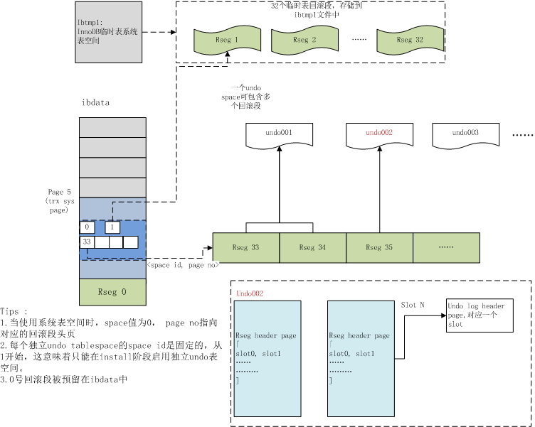
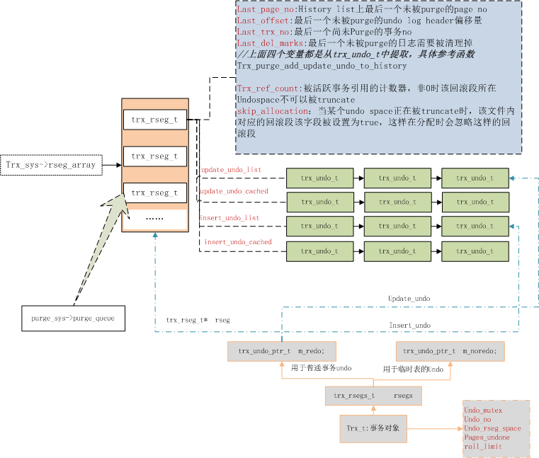

# 回滚日志 Undo log

## （一）了解几个概念

### undo

在事务的整个生命周期中维护的数据，记录所有更改，以便在回滚操作时可以撤消这些更改。它存储在系统表空间(在MySQL 5.7或更早版本中)的undo日志中，或者存储在单独的undo表空间中。从MySQL 8.0开始，默认情况下，undo日志驻留在undo表空间中。

### undo log buffer

同 redo log buffer一样，在内存中，有一个区域，用于存放undo log buffer

撤消日志被分割成单独的部分:**插入撤消缓冲区**和**更新撤消缓冲区**。

### undo log

**存储由活动事务修改的数据副本的区域。**如果另一个事务需要查看原始数据(作为一致的读操作的一部分)，则从该存储区域检索未修改的数据。

在MySQL 5.6和5.7中，你可以使用innodb_undo_tablespaces变量让undo日志驻留在undo表空间中，它可以放在另一个存储设备上，比如SSD。在MySQL 8.0中，undo日志驻留在两个默认的undo表空间中，它们是在MySQL初始化时创建的，另外的undo表空间可以使用CREATE undo TABLESPACE语法创建。

### undo log segment

撤消日志的集合。撤销日志段存在于回滚段中。撤消日志段可以包含来自多个事务的撤消日志。undo log段一次只能被一个事务使用，但是在事务提交或回滚时释放它之后可以重用。也可以称为“撤销段”。

### undo tablespace

撤消表空间包含撤消日志。撤消日志存在于撤消日志段中，而撤消日志段包含在回滚段中。回滚段通常位于system表空间中。在MySQL 5.6中，回滚段可以驻留在undo表空间中。在MySQL 5.6和5.7中，undo表空间的数量是由innodb_undo_tablespaces配置选项控制的。在MySQL 8.0中，当初始化MySQL实例时，会创建两个默认的undo表空间，并且可以使用CREATE undo TABLESPACE语法创建额外的undo表空间。

## （二）简介

在数据修改的时候，不仅记录了redo，还记录了相对应的undo，如果因为某些原因导致事务失败或回滚了，可以借助该undo进行回滚。Undo记录中存储的是老版本数据，当一个旧的事务需要读取数据时，为了能读取到老版本的数据，需要顺着undo链找到满足其可见性的记录。当版本链很长时，通常可以认为这是个比较耗时的操作（例如[bug#69812](http://bugs.mysql.com/bug.php?id=69812)）。

大多数对数据的变更操作包括INSERT/DELETE/UPDATE，其中INSERT操作在事务提交前只对当前事务可见，因此产生的Undo日志可以在事务提交后直接删除（谁会对刚插入的数据有可见性需求呢！！），而对于UPDATE/DELETE则需要维护多版本信息，在InnoDB里，UPDATE和DELETE操作产生的Undo日志被归成一类，即update_undo。

undo log和redo log记录物理日志不一样，它是逻辑日志。**可以认为当delete一条记录时，undo log中会记录一条对应的insert记录，反之亦然，当update一条记录时，它记录一条对应相反的update记录。**

当执行rollback时，就可以从undo log中的逻辑记录读取到相应的内容并进行回滚。有时候应用到行版本控制的时候，也是通过undo log来实现的：当读取的某一行被其他事务锁定时，它可以从undo log中分析出该行记录以前的数据是什么，从而提供该行版本信息，让用户实现非锁定一致性读取。

**undo log是采用段(segment)的方式来记录的，每个undo操作在记录的时候占用一个undo log segment。**

另外，**undo log也会产生redo log**，因为undo log也要实现持久性保护。

## （三）作用

**undo用来回滚行记录到某个版本。undo log一般是逻辑日志，根据每行记录进行记录。**

- 提供回滚
- 多个行版本控制(MVCC)

## （四）存储方式

innodb存储引擎对undo的管理采用段的方式。**rollback segment**称为回滚段，每个回滚段中有**1024个undo log segment**。

在以前老版本，只支持1个rollback segment，这样就只能记录1024个undo log segment。后来MySQL5.5可以支持128个rollback segment，即支持128*1024个undo操作，还可以通过变量 innodb_undo_logs (5.6版本以前该变量是 innodb_rollback_segments )自定义多少个rollback segment，默认值为128。

为了保证事务并发操作时，在写各自的undo log时不产生冲突，InnoDB采用回滚段的方式来维护undo log的并发写入和持久化。回滚段实际上是一种 Undo 文件组织方式，每个回滚段又有多个undo log slot。具体的文件组织方式如下图所示：

上图展示了基本的Undo回滚段布局结构，其中:

1. rseg0预留在系统表空间ibdata中;
2. rseg 1~rseg 32这32个回滚段存放于临时表的系统表空间中;
3. rseg33~ 则根据配置存放到独立undo表空间中（如果没有打开独立Undo表空间，则存放于ibdata中）

如果我们使用独立Undo tablespace，则总是从第一个Undo space开始轮询分配undo 回滚段。大多数情况下这是OK的，但假设我们将回滚段的个数从33开始依次递增配置到128，就可能导致所有的回滚段都存放在同一个undo space中。(参考函数trx_sys_create_rsegs 以及 [bug#74471](http://bugs.mysql.com/bug.php?id=74471))

每个回滚段维护了一个段头页，在该page中又划分了1024个slot(TRX_RSEG_N_SLOTS)，每个slot又对应到一个undo log对象，因此**理论上InnoDB最多支持 96 * 1024个普通事务。ibtemp1文件中还有32个回滚段，加起来一共为 128.**

## （五）关键结构体

为了便于管理和使用undo记录，在内存中维持了如下关键结构体对象：

1. 所有回滚段都记录在`trx_sys->rseg_array`，数组大小为128，分别对应不同的回滚段；
2. rseg_array数组类型为trx_rseg_t，用于维护回滚段相关信息；
3. 每个回滚段对象trx_rseg_t还要管理undo log信息，对应结构体为trx_undo_t，使用多个链表来维护trx_undo_t信息;
4. 事务开启时，会专门给他指定一个回滚段，以后该事务用到的undo log页，就从该回滚段上分配;
5. 事务提交后，需要purge的回滚段会被放到purge队列上(`purge_sys->purge_queue`)。

各个结构体之间的联系如下：

> 关于分配回滚段、使用回滚段、写入undo log，参考[阿里数据库月报2015/04/01](http://mysql.taobao.org/monthly/2015/04/01/)

## （六）purge线程

当事务提交的时候，innodb不会立即删除undo log，因为后续还可能会用到undo log，如隔离级别为repeatable read时，事务读取的都是开启事务时的最新提交行版本，只要该事务不结束，该行版本就不能删除，即undo log不能删除。**(MVCC的影响，不能立即删除undo log)**

**但是在事务提交的时候，会将该事务对应的undo log放入到删除列表中，未来通过purge来删除。并且提交事务时，还会判断undo log分配的页是否可以重用，如果可以重用，则会分配给后面来的事务，避免为每个独立的事务分配独立的undo log页而浪费存储空间和性能。**

通过undo log记录delete和update操作的结果发现：(insert操作无需分析，就是插入行而已)

- delete操作实际上不会直接删除，而是将数据行中打上delete flag，标记为删除，最终的删除操作是purge线程完成的。
- update分为两种情况：update的列是否是主键列。
  - 如果不是主键列，在undo log中直接反向记录是如何update的。即update是直接进行的。
  - 如果是主键列，update分两部执行：先删除该行，再插入一行目标行。

## （七）group commit

为了提高性能，通常会将有关联性的多个数据修改操作放在一个事务中，这样可以避免对每个修改操作都执行完整的持久化操作。这种方式，可以看作是人为的组提交(group commit)。

除了将多个操作组合在一个事务中，记录binlog的操作也可以按组的思想进行优化：将多个事务涉及到的binlog一次性flush，而不是每次flush一个binlog。

事务在提交的时候不仅会记录事务日志，还会记录二进制日志，但是它们谁先记录呢？二进制日志是MySQL的上层日志，先于存储引擎的事务日志被写入。

在MySQL5.6以前，当事务提交(即发出commit指令)后，MySQL接收到该信号进入commit prepare阶段；进入prepare阶段后，立即写内存中的二进制日志，写完内存中的二进制日志后就相当于确定了commit操作；然后开始写内存中的事务日志；最后将二进制日志和事务日志刷盘，它们如何刷盘，分别由变量 sync_binlog 和 innodb_flush_log_at_trx_commit 控制。

但因为要保证二进制日志和事务日志的一致性，在提交后的prepare阶段会启用一个**prepare_commit_mutex**锁来保证它们的顺序性和一致性。但这样会导致开启二进制日志后group commmit失效，特别是在主从复制结构中，几乎都会开启二进制日志。

在MySQL5.6中进行了改进。提交事务时，在存储引擎层的上一层结构中会将事务按序放入一个队列，队列中的第一个事务称为leader，其他事务称为follower，leader控制着follower的行为。虽然顺序还是一样先刷二进制，再刷事务日志，但是机制完全改变了：删除了原来的prepare_commit_mutex行为，也能保证即使开启了二进制日志，group commit也是有效的。

MySQL5.6中分为3个步骤：**flush阶段、sync阶段、commit阶段。**

- flush阶段：向内存中写入每个事务的二进制日志。
- sync阶段：将内存中的二进制日志刷盘。若队列中有多个事务，那么仅一次fsync操作就完成了二进制日志的刷盘操作。这在MySQL5.6中称为BLGC(binary log group commit)。
- commit阶段：leader根据顺序调用存储引擎层事务的提交，由于innodb本就支持group commit，所以解决了因为锁 prepare_commit_mutex 而导致的group commit失效问题。

在flush阶段写入二进制日志到内存中，但是不是写完就进入sync阶段的，而是要等待一定的时间，多积累几个事务的binlog一起进入sync阶段，等待时间由变量 binlog_max_flush_queue_time 决定，默认值为0表示不等待直接进入sync，设置该变量为一个大于0的值的好处是group中的事务多了，性能会好一些，但是这样会导致事务的响应时间变慢，所以建议不要修改该变量的值，除非事务量非常多并且不断的在写入和更新。

进入到sync阶段，会将binlog从内存中刷入到磁盘，刷入的数量和单独的二进制日志刷盘一样，由变量 sync_binlog 控制。

当有一组事务在进行commit阶段时，其他新事务可以进行flush阶段，它们本就不会相互阻塞，所以group commit会不断生效。当然，group commit的性能和队列中的事务数量有关，如果每次队列中只有1个事务，那么group commit和单独的commit没什么区别，当队列中事务越来越多时，即提交事务越多越快时，group commit的效果越明显。

## （八）存储位置

- MySQL8.0以下，在共享表空间中
- MySQL8.0中，在mysql的数据文件目录下会有单独的文件保存undo log