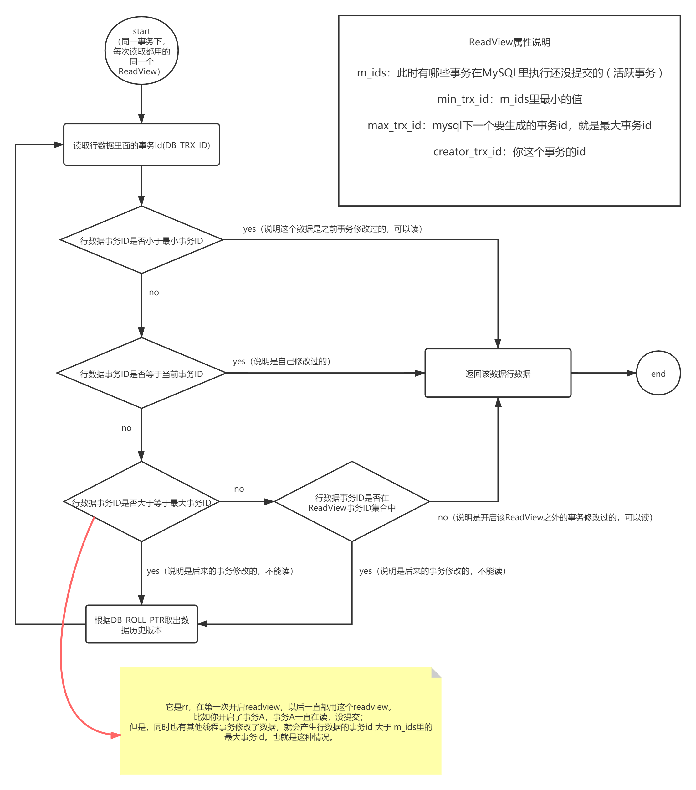

# 多版本并发控制 - MVCC

> 以下部分内容参考自：[MVCC 和快照读当前读](https://blog.csdn.net/weixin_42030357/article/details/106877489)，因博客中图片错误容易误导，故摘抄过来并修改。

## （一）简介 - 来源官网，建议背诵全文

`InnoDB`是一个 [多版本的存储引擎](https://dev.mysql.com/doc/refman/5.7/en/glossary.html#glos_mvcc)：它保留有关已更改行的旧版本的信息，以支持诸如并发和[回滚之](https://dev.mysql.com/doc/refman/5.7/en/glossary.html#glos_rollback)类的事务功能 。此信息以称为[回滚段](https://dev.mysql.com/doc/refman/5.7/en/glossary.html#glos_rollback_segment)的数据结构存储在表空间中 （在Oracle中类似的数据结构）。`InnoDB` 使用回滚段中的信息来执行事务回滚中所需的撤消操作。它还使用该信息来构建行的早期版本，以实现 [一致的读取](https://dev.mysql.com/doc/refman/5.7/en/glossary.html#glos_consistent_read)。

在内部，`InnoDB`向数据库中存储的每一行添加三个字段：

- `DB_TRX_ID`字段：6字节，指示插入或更新该行的最后一个事务的事务id。
- `DB_ROLL_PTR`字段：7字节，称为回滚指针。回滚指针指向写入回滚段的撤消日志记录。如果行已更新，则撤消日志记录将包含在更新行之前重建行内容所必需的信息。此外，删除在内部被视为更新，在该更新中，该行中的特殊位被设置为将其标记为已删除。
- `DB_ROW_ID`字段：6字节，包含一个行ID，该ID在插入新行时会单调增加。如果 `InnoDB`自动生成聚集索引，该索引包含行ID值。否则，该 `DB_ROW_ID`列不会出现在任何索引中。（不显示指定主键的时候）

***重点：只在聚簇索引，即真实数据行中。***

**回滚段中的撤消日志分为插入和更新撤消日志。插入撤消日志仅在事务回滚中才需要，并且在事务提交后可以立即将其丢弃。更新撤消日志也用于一致的读取，但是只有在不存在为其`InnoDB`分配了快照的事务（ 一致的读取可能需要更新撤消日志中的信息来构建数据库的早期版本）后，才能将其撤消行。**

**因此，在undo log中，会有一堆数据的历史版本。每行数据都用回滚指针指向历史版本数据，该链，称为版本链。**

定期提交您的事务，包括仅发出一致读取的交易。否则， `InnoDB`将无法丢弃更新撤消日志中的数据，并且回滚段可能会变得太大而填满表空间。

回滚段中撤消日志记录的物理大小通常小于相应的插入或更新的行。您可以使用此信息来计算回滚段所需的空间。

在`InnoDB`多版本方案中，当您使用SQL语句删除行时，并不会立即将其从数据库中物理删除。`InnoDB`仅在丢弃为删除而编写的更新撤消日志记录时，才物理删除相应的行及其索引记录。此删除操作称为[purge](https://dev.mysql.com/doc/refman/5.7/en/glossary.html#glos_purge)，它非常快，通常花费与执行删除操作的SQL语句相同的时间顺序。

如果您在表中以几乎相同的速度以较小的批插入和删除行，那么清除线程就会开始滞后，并且由于所有“死”行，表可能会变得越来越大，从而使所有内容都绑定到磁盘上，并且非常慢。在这种情况下，通过调优innodb_max_purge_lag系统变量来控制新的行操作，并为清除线程分配更多的资源。

## （二）snapshot - 快照 与 read view

### 1. snapshot - 快照 与 read view简介

表示在特定时间的数据，即使其他事务提交了更改，该表示也保持不变。由某些隔离级别使用，以允许一致的读取。

InnoDB支持MVCC多版本，其中RC（Read Committed）和RR（Repeatable Read）隔离级别是利用**consistent read view（一致读视图）**方式支持的。 所谓consistent read view就是在某一时刻给事务系统trx_sys打**snapshot（快照）**，把当时trx_sys状态（包括活跃读写事务数组）记下来，之后的所有读操作根据其事务ID（即trx_id）与snapshot中的trx_sys的状态作比较，以此判断read view对于事务的可见性。

- 在MySQL中，Read Committed和Repeatable Read隔离级别下的区别就是它们生成ReadView的时机不同。

- **RR隔离级别（除了Gap锁之外）和RC隔离级别的差别是创建snapshot时机不同。 RR隔离级别是在事务开始时刻，确切地说是第一个读操作创建read view的；RC隔离级别是在语句开始时刻创建read view的，即每个select会创建一个read view。**

- 创建/关闭read view需要持有trx_sys->mutex，会降低系统性能，5.7版本对此进行优化，在事务提交时session会cache只读事务的read view。
  下次创建read view，判断如果是只读事务并且系统的读写事务状态没有发生变化，即trx_sys的max_trx_id没有向前推进，而且没有新的读写事务产生，就可以重用上次的read view。

- 由于InnoDB的二级索引只保存page最后更新的trx_id，当利用二级索引进行查询的时候，如果page的trx_id小于view->up_limit_id，可以直接判断page的所有记录对于当前view是可见的，否则需要回clustered索引进行判断。
- 如果记录对于view不可见，需要通过记录的DB_ROLL_PTR指针遍历history list构造当前view可见版本数据。

### 2. 根据区间判断可见性

首先我们需要知道的一个事实是：事务id是递增分配的。ReadView的机制就是在生成ReadView时确定了以下几种信息：

- **m_ids**：表示在生成ReadView时当前系统中活跃的读写事务的事务id列表。[min_trx_id ...  max_trx_id)
- **min_trx_id**：表示在生成ReadView时当前系统中活跃的读写事务中最小的事务id，也就是m_ids中的最小值。
- **max_trx_id**：表示生成ReadView时系统中将要分配给下一个事务的id值。
- **creator_trx_id**：表示生成该ReadView的事务的事务id。

这样事务id就可以分成3个区间：

- **浅绿色区间(0, min_trx_id)：如果被访问版本的 trx_id 小于 m_ids 中的最小值 min_trx_id ，说明生成该版本的事务在 ReadView 生成前就已经提交了，所以该版本可以被访问**
- **蓝色区间[min_trx_id, max_trx_id - 1 ]: 如果被访问版本的 trx_id 属性值在 m_ids 列表中最大值和最小值之间，那就需要判断一下 trx_id 的值是不是在 m_ids 列表中。**
  - **如果在，说明创建 ReadView 时生成该版本所属事务还是活跃的，因此该版本不可以被访问，需要查找 Undo Log 链得到上一个版本，然后根据该版本的 DB_TRX_ID 再从头计算一次可见性。**
  - **例外：访问的事务id与当前事务id一致，代表是该事务修改的，是可见的**
- **红色区间[max_trx_id, +∞)：如果被访问版本的 trx_id 大于等于 max_trx_id，说明生成该版本的事务在生成 ReadView 后才生成，所以该版本不可以被当前事务访问。需要根据 Undo Log 链找到前一个版本，然后根据该版本的 DB_TRX_ID 重新判断可见性**


下面我们根据ReadView提供的条件信息，顺着版本链从头结点开始查找最新的可被读取的版本记录：

1. 首先判断版本记录的trx_id与ReadView中的creator_trx_id是否相等。如果相等，那就说明该版本的记录是在当前事务中生成的，自然也就能够被当前事务读取；否则进行第2步。
2. 根据版本记录的trx_id以及上述3个区间信息，判断生成该版本记录的事务是否是已提交事务，进而确定该版本记录是否可被当前事务读取。

如果某个版本记录经过以上步骤判断确定其可被当前事务读取，则查询结果返回此版本记录；否则读取下一个版本记录继续按照上述步骤进行判断，直到版本链的尾结点。如果遍历完版本链没有找到可读取的版本，则说明该记录对当前事务不可见，查询结果为空。



## （三）MVCC快照读案例

1. **版本链案例**

   首先我们创建一个表book，就三个字段，分别是主键book_id, 表名为：book。然后向表中批量插入一些数据：

   ```sql
   CREATE TABLE `book` (
     `book_id` int(100) NOT NULL AUTO_INCREMENT,
     `book_name` varchar(100) NOT NULL,
     `book_stock` int(100) NOT NULL,
     PRIMARY KEY (`book_id`)
   ) ENGINE=InnoDB DEFAULT CHARSET=utf8;
   
   BEGIN;
   INSERT INTO book VALUES(1, '数据结构', 100);
   INSERT INTO book VALUES(2, 'C++指南', 100);
   INSERT INTO book VALUES(3, '精通Java', 100);
   COMMIT;
   # 批量插入数据时，会开启一个事务，假设事务编号为119
   ```

   此时表中有三条数据，当开启一个事务更新数据时(事务id为120)：

   ```sql
   BEGIN;
   UPDATE book SET book_stock = 200 WHERE book_id = 1;
   UPDATE book SET book_stock = 300 WHERE book_id = 1;
   ```

   此时，id = 1 的数据在undo log中的版本链为：

   

2. **RC 隔离级别下的 MVCC，关闭自动提交，选择手动提交事务**

   ```sql
   # session 1
   mysql> SET SESSION TRANSACTION ISOLATION LEVEL READ COMMITTED;
   Query OK, 0 rows affected (0.00 sec)
   
   mysql> set autocommit = 0;
   Query OK, 0 rows affected (0.00 sec)
   
   # 开启事务1，事务id为121
   # 由于关闭自动提交，只要不提交，就不会最终修改数据
   mysql> UPDATE book SET book_stock = 200 WHERE book_id = 2;
   Query OK, 1 row affected (0.01 sec)
   Rows matched: 1  Changed: 1  Warnings: 0
   ```

   版本链为：

   

   此时开启第二个会话，设置隔离级别为 RC，且关闭自动提交，手动开启事务。进行查询

   ```sql
   # session 2
   mysql> SET SESSION TRANSACTION ISOLATION LEVEL READ COMMITTED;
   Query OK, 0 rows affected (0.00 sec)
   
   mysql> set autocommit = 0;
   Query OK, 0 rows affected (0.00 sec)
   
   # 只读sql，不开启事务，故不分配事务id
   # 由于事务1并未提交，所以读到的数据为100
   mysql> begin;
   Query OK, 0 rows affected (0.00 sec)
   mysql> select * from book WHERE book_id = 2;
   +---------+-----------+------------+
   | book_id | book_name | book_stock |
   +---------+-----------+------------+
   |       2 | C++指南   |        100 |
   +---------+-----------+------------+
   1 row in set (0.00 sec)
   ```

   分析过程：

   1. 此查询在执行时，活跃事务id只有 121 ，用中括号框起来，故 m_ids 为 [121]

   2. InnoDB内部维护的一个自增事务id，下一个修改数据的事务过来才会分配，故下一个事务id为：122

   3. 由于当前事务不修改数据，故 creator_trx_id 为 0 

   4. 最后形成的快照为  [121]122 : 0

   5. 当session2读取 book_id = 2 的数据时，来到undo log 版本链：图1.6.10，开始比较：
      第一个遇到的事务id为 121，121在生成快照中的中括号内，落在了区间[min_trx_id, max_trx_id - 1]，代表生成快照时，121为活跃事务，且 121 不等于 0，故该条数据对当前查询不可见。
      
   6. 顺着回滚指针，找到事务id为 119 的数据。119在快照中落在区间 (0,min_trx_id)，代表该数据在查询时已被提交，故可见，所以查到的 book_stock = 100
      
      

   返回第一个会话进行查询

   ```sql
   # session 1
   mysql> select * from book WHERE book_id = 2;
   +---------+-----------+------------+
   | book_id | book_name | book_stock |
   +---------+-----------+------------+
   |       2 | C++指南   |        200 |
   +---------+-----------+------------+
   1 row in set (0.00 sec)
   ```

   分析：

   1. 发起查询时，活跃的事务id为121，故 m_ids 为 [121]
   2. 下一个事务id依旧是122
   3. 当前事务id为121，故 creator_trx_id 为 121
   4. 最后形成的快照为  [121]122 : 121
   5. 在图1.6.10中，找到第一个事务id为 121，发现落在区间 [min_trx_id, max_trx_id - 1] 内，且 正好等于当前事务id，故这个版本对当前查询可见。结果为200

   紧接着，提交session1，但session2，仍未关闭，也就是说session2手动开启的事务还未关闭。

   ```sql
   # session 1
   mysql> commit;
   Query OK, 0 rows affected (0.01 sec)
   ```

   此时去session2中查询，

   ```
   # session 2
   mysql> select * from book WHERE book_id = 2;
   +---------+-----------+------------+
   | book_id | book_name | book_stock |
   +---------+-----------+------------+
   |       2 | C++指南   |        200 |
   +---------+-----------+------------+
   1 row in set (0.00 sec)
   ```

   分析：

   ​	由于session1已经提交，session2查询时，没有事务正在修改数据，undo log中无版本链，直接读取数据为200

   

   开启第三个session，同样设置隔离级别为RC ，关闭自动提交，手动开启事务，但不提交事务

   ```sql
   # session 3
   mysql> SET SESSION TRANSACTION ISOLATION LEVEL READ COMMITTED;
   Query OK, 0 rows affected (0.00 sec)
   
   mysql> set autocommit = 0;
   Query OK, 0 rows affected (0.00 sec)
   
   # 开启事务1，事务id为122
   # 由于关闭自动提交，只要不提交，就不会最终修改数据
   mysql> UPDATE book SET book_stock = 300 WHERE book_id = 2;
   Query OK, 1 row affected (0.01 sec)
   Rows matched: 1  Changed: 1  Warnings: 0
   ```

   此时，版本链为：

   

   在session2中接着查询（此处赘述，加深理解）：

   ```sql
   # session 2
   
   mysql> select * from book WHERE book_id = 2;
   +---------+-----------+------------+
   | book_id | book_name | book_stock |
   +---------+-----------+------------+
   |       2 | C++指南   |        200 |
   +---------+-----------+------------+
   1 row in set (0.00 sec)
   ```

   分析：

   1. 此查询在执行时，活跃事务id只有 122 ，用中括号框起来，故 m_ids 为 [122]
   2. 下一个事务id为：123
   3. 由于当前事务不修改数据，故 creator_trx_id 为 0 
   4. 最后形成的快照为  [122]123 : 0
   5. 当session2读取 book_id = 2 的数据时，来到undo log 版本链：图1.6.13，开始比较：
      第一个遇到的事务id为 122，122在生成快照中的中括号内，落在了区间[min_trx_id, max_trx_id - 1]，代表生成快照时，122为活跃事务，且 122 不等于 0，故该条数据对当前查询不可见。
   6. 顺着回滚指针，找到事务id为 121 的数据。121在快照中落在区间 (0,min_trx_id)，代表该数据在查询时已被提交，故可见，所以查到的 book_stock = 200
      

   当session3提交后，session2查询时，结果变为 300 ，此处不再赘述。

   例2整体过程如下：

   | 原始数据： book_stock = 100 | session 1                                                    | session 2                                                    | session 3                                                    |
   | :-------------------------: | :----------------------------------------------------------- | ------------------------------------------------------------ | ------------------------------------------------------------ |
   |                             | 设置隔离级别：RC                                             |                                                              |                                                              |
   |                             | 关闭自动提交                                                 |                                                              |                                                              |
   |                             | # 开启一个事务，事务id为121 begin;                           |                                                              |                                                              |
   |                             | UPDATE book  SET book_stock = 200  WHERE book_id = 2;        |                                                              |                                                              |
   |                             |                                                              | 设置隔离级别：RC                                             |                                                              |
   |                             |                                                              | 关闭自动提交                                                 |                                                              |
   |                             |                                                              | begin;                                                       |                                                              |
   |                             |                                                              | select * from book  WHERE book_id = 2; <br />快照：[121] 122 : 0 <br />查询结果为：100 |                                                              |
   |                             | select * from book  WHERE book_id = 2; <br />快照：[121]122 : 121 <br />查询结果：200 |                                                              |                                                              |
   |                             | commit;                                                      |                                                              |                                                              |
   |                             |                                                              | select * from book  WHERE book_id = 2; <br />无活跃事务，不需要快照 <br />查询结果为：200 |                                                              |
   |                             |                                                              |                                                              | 设置隔离级别：RC                                             |
   |                             |                                                              |                                                              | 关闭自动提交                                                 |
   |                             |                                                              |                                                              | # 开启一个事务，事务id为122 begin;                           |
   |                             |                                                              |                                                              | UPDATE book  SET book_stock = 300  WHERE book_id = 2;        |
   |                             |                                                              | select * from book  WHERE book_id = 2; <br />快照：[122] 123 : 0 <br />查询结果为：200 |                                                              |
   |                             |                                                              |                                                              | select * from book  WHERE book_id = 2; <br />快照：[122]123 : 122 <br />查询结果：300 |
   |                             |                                                              |                                                              | commit;                                                      |
   |                             |                                                              | select * from book  WHERE book_id = 2; <br />无活跃事务，不需要快照 <br />查询结果为：300 |                                                              |
   |                             |                                                              | # 虽然没啥用，但还是提交一下<br />commit;                    |                                                              |

   **重点：由该例子可见，每当有事务提交后，其他事务就能读取到该事务提交的内容。每次会生成新的快照。这就是 RC**

3. RR 隔离级别下的 MVCC
   mysql默认隔离级别就是 RR ，因此，不需要可以改变

   开启一个session A，关闭自动提交，手动开启事务，修改数据，但不提交

   ```sql
   # session A
   mysql> set autocommit = 0;
   Query OK, 0 rows affected (0.00 sec)
   
   mysql> begin;
   Query OK, 0 rows affected (0.00 sec)
   
   # 开启事务1，事务id为123
   # 由于关闭自动提交，只要不提交，就不会最终修改数据
   mysql> UPDATE book SET book_stock = 200 WHERE book_id = 3;
   Query OK, 1 row affected (0.01 sec)
   Rows matched: 1  Changed: 1  Warnings: 0
   ```

   版本链为：

   

   

   开启另一个sessionB查询，关闭在自动提交，手动开启事务：

   ```sql
   # session B
   mysql> set autocommit = 0;
   Query OK, 0 rows affected (0.00 sec)
   
   mysql> begin;
   Query OK, 0 rows affected (0.00 sec)
   
   # 只是查询，不需要开启事务，不分配事务id
   mysql> select * from book  WHERE book_id = 3;
   +---------+-----------+------------+
   | book_id | book_name | book_stock |
   +---------+-----------+------------+
   |       3 | 精通Java  |        100 |
   +---------+-----------+------------+
   1 row in set (0.00 sec)
   ```

   分析：

   1. 此查询在执行时，活跃事务id只有 123 ，用中括号框起来，故 m_ids 为 [123]
   2. 下一个事务id为：124
   3. 由于当前事务不修改数据，故 creator_trx_id 为 0 
   4. 最后形成的快照为  [123]124 : 0
   5. 当sessionB读取 book_id = 3 的数据时，来到undo log 版本链：图1.6.15，开始比较：
      第一个遇到的事务id为 123，123在生成快照中的中括号内，落在了区间[min_trx_id, max_trx_id - 1]，代表生成快照时，123为活跃事务，且 123 不等于 0，故该条数据对当前查询不可见。
   6. 顺着回滚指针，找到事务id为 119 的数据。119在快照中落在区间 (0,min_trx_id)，代表该数据在查询时已被提交，故可见，所以查到的 book_stock = 100
      

   紧接着session A中查询数据

   ```sql
   # session A
   
   mysql> select * from book  WHERE book_id = 3;
   +---------+-----------+------------+
   | book_id | book_name | book_stock |
   +---------+-----------+------------+
   |       3 | 精通Java  |        200 |
   +---------+-----------+------------+
   1 row in set (0.00 sec)
   ```

   分析：

   1. 此查询在执行时，活跃事务id只有 123 ，用中括号框起来，故 m_ids 为 [123]
   2. 下一个事务id为：124
   3. 由于当前事务不修改数据，故 creator_trx_id 为 123 
   4. 最后形成的快照为  [123]124 : 123
   5. 当sessionA读取 book_id = 3 的数据时，来到undo log 版本链：图1.6.15，开始比较：
      第一个遇到的事务id为 123，123在生成快照中的中括号内，落在了区间[min_trx_id, max_trx_id - 1]，代表生成快照时，123为活跃事务，且 123 = 123，故该条数据对当前查询可见。j结果为200.

   紧接着 session A 提交事务，但session B仍保持打开状态：

   ```sql
   # session A
   mysql> commit;
   Query OK, 0 rows affected (0.01 sec)
   ```

   此时，继续在session B中查询，有趣的地方来了，依旧还是100，且看下边分析：

   ```sql
   # session B
   
   mysql> select * from book  WHERE book_id = 3;
   +---------+-----------+------------+
   | book_id | book_name | book_stock |
   +---------+-----------+------------+
   |       3 | 精通Java  |        100 |
   +---------+-----------+------------+
   1 row in set (0.00 sec)
   ```

   分析：

   1. 此查询在执行时，无活跃事务，但发现之前已经生成过一次快照了，直接拿过来用：  [123]124 : 0 
   2. 当sessionB读取 book_id = 3 的数据时，来到undo log 版本链：图1.6.15，开始比较：
      第一个遇到的事务id为 123，123在生成快照中的中括号内，落在了区间[min_trx_id, max_trx_id - 1]，代表生成快照时，123为活跃事务，且 123 不等于 0，故该条数据对当前查询不可见。
   3. 顺着回滚指针，找到事务id为 119 的数据。119在快照中落在区间 (0,min_trx_id)，代表该数据在查询时已被提交，故可见，所以查到的 book_stock = 100

   **注意：这便是 RR 区别于 RC 的地方，他用的同一个快照，所以能保证可重复读。**
   若此时查看 innodb 状态，可发现有一个 read view，

   ```shell
   --------------
   ROW OPERATIONS
   --------------
   0 queries inside InnoDB, 0 queries in queue
   1 read views open inside InnoDB
   Process ID=4808, Main thread ID=7040, state: sleeping
   Number of rows inserted 7010, updated 6, deleted 0, read 50422
   0.00 inserts/s, 0.04 updates/s, 0.00 deletes/s, 0.04 reads/s
   ```

   

   此时再来一个session C，同样修改数据

   ```
   # session C
   mysql> set autocommit = 0;
   Query OK, 0 rows affected (0.00 sec)
   
   mysql> begin;
   Query OK, 0 rows affected (0.00 sec)
   
   # 开启事务1，事务id为124
   # 由于关闭自动提交，只要不提交，就不会最终修改数据
   mysql> UPDATE book SET book_stock = 300 WHERE book_id = 3;
   Query OK, 1 row affected (0.01 sec)
   Rows matched: 1  Changed: 1  Warnings: 0
   ```

   此时，在session B中查询，结果依旧是 100，因为快照还是没有发生变化

   ```sql
   # session B
   
   mysql> select * from book  WHERE book_id = 3;
   +---------+-----------+------------+
   | book_id | book_name | book_stock |
   +---------+-----------+------------+
   |       3 | 精通Java  |        100 |
   +---------+-----------+------------+
   1 row in set (0.00 sec)
   ```

   session C 自己查询，数据为300，可自己想版本链，事务id区间

   ```sql
   # session C
   
   mysql> select * from book  WHERE book_id = 3;
   +---------+-----------+------------+
   | book_id | book_name | book_stock |
   +---------+-----------+------------+
   |       3 | 精通Java  |        300 |
   +---------+-----------+------------+
   1 row in set (0.00 sec)
   
   mysql> commit;
   Query OK, 0 rows affected (0.01 sec)
   ```

   此时 session 2中进行以下操作，并获得结果：

   ```
   # session B
   
   mysql> select * from book  WHERE book_id = 3;
   +---------+-----------+------------+
   | book_id | book_name | book_stock |
   +---------+-----------+------------+
   |       3 | 精通Java  |        100 |
   +---------+-----------+------------+
   1 row in set (0.00 sec)
   
   mysql> commit;
   Query OK, 0 rows affected (0.00 sec)
   
   mysql> show engine innodb status;
   --------------
   ROW OPERATIONS
   --------------
   0 queries inside InnoDB, 0 queries in queue
   0 read views open inside InnoDB
   Process ID=4808, Main thread ID=7040, state: sleeping
   Number of rows inserted 7010, updated 6, deleted 0, read 50424
   0.00 inserts/s, 0.00 updates/s, 0.00 deletes/s, 0.02 reads/s
   
   mysql> select * from book  WHERE book_id = 3;
   +---------+-----------+------------+
   | book_id | book_name | book_stock |
   +---------+-----------+------------+
   |       3 | 精通Java  |        300 |
   +---------+-----------+------------+
   1 row in set (0.00 sec)
   ```

   分析：

   1. 在commit 之前，依旧还是之前的事务，用的还是同一个快照，故结果依旧是100
   2. commit之后，事务提交，此时查看innodb 状态，可以看到 read view 变为0，此时session A的undo log才被 purge清除
   3. commit之后，再次查询，结果变为300，此时，无活跃事务，无快照生成，直接读取真实数据。

   用表格来表示为：

   | 原始数据： book_stock = 100 | session A                                                    | session B                                                    | session C                                                    |
   | --------------------------- | ------------------------------------------------------------ | ------------------------------------------------------------ | ------------------------------------------------------------ |
   |                             | 关闭自动提交                                                 |                                                              |                                                              |
   |                             | # 开启一个事务，事务id为123 begin;                           |                                                              |                                                              |
   |                             | UPDATE book  SET book_stock = 200  WHERE book_id = 3;        |                                                              |                                                              |
   |                             |                                                              | 关闭自动提交                                                 |                                                              |
   |                             |                                                              | begin;                                                       |                                                              |
   |                             |                                                              | select * from book  WHERE book_id = 3; <br />快照：[123] 124 : 0 <br />查询结果为：100 |                                                              |
   |                             | select * from book  WHERE book_id = 3; <br />快照：[123]124 : 123 <br />查询结果：200 |                                                              |                                                              |
   |                             | commit;                                                      |                                                              |                                                              |
   |                             |                                                              | select * from book  WHERE book_id = 3; <br />无活跃事务，但有快照 [123] 124 : 0<br />查询结果为：100 |                                                              |
   |                             |                                                              |                                                              | 关闭自动提交                                                 |
   |                             |                                                              |                                                              | # 开启一个事务，事务id为122 begin;                           |
   |                             |                                                              |                                                              | UPDATE book  SET book_stock = 300  WHERE book_id = 3;        |
   |                             |                                                              | select * from book  WHERE book_id = 3; <br />快照：[123] 124 : 0 <br />查询结果为：100 |                                                              |
   |                             |                                                              |                                                              | select * from book  WHERE book_id = 3; <br />快照：[124]125 : 124 <br />查询结果：300 |
   |                             |                                                              |                                                              | commit;                                                      |
   |                             |                                                              | select * from book  WHERE book_id = 3; <br />无活跃事务，但有快照 [123] 124 : 0 <br />查询结果为：100 |                                                              |
   |                             |                                                              | # 提交当前事务 purge 清除undo log，删除快照 <br />commit;    |                                                              |
   |                             |                                                              | select * from book  WHERE book_id = 3; <br />无活跃事务，无快照 <br />查询结果为：300 |                                                              |

## （四）MVCC的快照读 与 当前读的例子

快照读与当前读的区别

1. 作用不同
   - 快照读，用来保证一致性读取，即事务中，前后读取的内容是一致的。这里的读取，指的是普通读取
   - 当前读，在多事务并发处理数据时，想要打破 MVCC 的一致性读，获取最新的已提交数据，用于业务中的连贯性。
2. 加锁机制不同
   - 快照读，不需要加锁，只是打了一个快照snapshot，以后读取数据，用这个快照来读取数据
   - 当前读，需要加共享读锁或排他写锁，因为当前读一般用于修改数据前，读取数据。

案例：

1. 多个session修改数据的案例

   首先准备数据：

   ```sql
   INSERT INTO `testmybatis`.`book`(`book_id`, `book_name`, `book_stock`) VALUES (4, '精通MySQL', 100);
   ```

   用表格的方式，演示 MVCC 快照读 与 当前读：

   | 原始数据： book_stock = 100 | session A                                                    | session B                                                    | session C                                                    |
   | --------------------------- | ------------------------------------------------------------ | ------------------------------------------------------------ | ------------------------------------------------------------ |
   |                             | 关闭自动提交                                                 |                                                              |                                                              |
   |                             | # 开启一个事务，假设事务id为130 begin;                       |                                                              |                                                              |
   |                             | UPDATE book  SET book_stock = 200  WHERE book_id = 4;        |                                                              |                                                              |
   |                             |                                                              | 关闭自动提交                                                 |                                                              |
   |                             |                                                              | begin;                                                       |                                                              |
   |                             |                                                              | select * from book  WHERE book_id = 4; 快照：[130] 131 : 0 查询结果为：100 |                                                              |
   |                             | select * from book  WHERE book_id = 4; 快照：[130]131 : 130 查询结果：200 |                                                              |                                                              |
   |                             | commit;                                                      |                                                              |                                                              |
   |                             |                                                              | select * from book  WHERE book_id = 4; 快照：[130] 131 : 0 查询结果为：100 |                                                              |
   |                             |                                                              | select * from book  WHERE book_id = 4 for update; 由于是加锁当前读，不需要快照，直接获取最新结果 查询结果为：200，并且给 book_id = 4加上了写锁 |                                                              |
   |                             |                                                              |                                                              | 关闭自动提交                                                 |
   |                             |                                                              |                                                              | # 开启一个事务，事务id为131 begin;                           |
   |                             |                                                              |                                                              | UPDATE book  SET book_stock = 300  WHERE book_id = 4; #锁等待，等session 2释放写锁 |
   |                             |                                                              | commit;                                                      | #session 2 commit之后，session 3获取到写锁，并修改数据       |
   |                             |                                                              | begin; # 关闭自动提交后，默认会 自动开启下一个事务           |                                                              |
   |                             |                                                              | select * from book  WHERE book_id = 4; 快照：[131] 132 : 0 查询结果为：200 |                                                              |
   |                             |                                                              |                                                              | select * from book  WHERE book_id = 4; 快照：[131]132 : 131 查询结果：300 |
   |                             |                                                              |                                                              | commit;                                                      |
   |                             |                                                              | select * from book  WHERE book_id = 4; 快照：[131] 132 : 0 查询结果为：200 |                                                              |
   |                             |                                                              | select * from book  WHERE book_id = 4 for update; 由于是加锁当前读，不需要快照，直接获取最新结果 查询结果为：300，并且给 book_id = 4加上了写锁 |                                                              |
   |                             |                                                              | # 提交当前事务 # purge 清除undo log，删除快照 commit;        |                                                              |
   |                             |                                                              | select * from book  WHERE book_id = 4; 无活跃事务，无快照 查询结果为：300 |                                                              |

2. 另一个session 插入数据

   | session A                                                    | session B                                                    |
   | ------------------------------------------------------------ | ------------------------------------------------------------ |
   | 关闭自动提交                                                 |                                                              |
   | # 开启一个事务，假设事务id为140 begin;                       |                                                              |
   | select * from book  WHERE book_id = 5; Empty set (0.00 sec) <br />#建立快照：[140]141 : 0 #查询结果：空 |                                                              |
   |                                                              | 关闭自动提交                                                 |
   |                                                              | begin;                                                       |
   |                                                              | INSERT INTO `testmybatis`.`book`(`book_id`, `book_name`, `book_stock`)  VALUES (5, '精通InnoDB', 100); <br />#Query OK, 1 row affected (0.01 sec) |
   |                                                              | commit;                                                      |
   | select * from book  WHERE book_id = 5;<br /> #快照：[140]141 : 0 <br />#查询结果：空 <br />########## <br />出现幻读 <br />########## |                                                              |
   | INSERT INTO `testmybatis`.`book`(`book_id`, `book_name`, `book_stock`)  VALUES (5, '精通MYISAM', 100); <br />#ERROR 1062 (23000): Duplicate entry '5' for key 'PRIMARY' #刚刚查询到没有 5，结果我插入5说是已经存在5，出现幻读 |                                                              |
   | select * from book  WHERE book_id = 5 FOR UPDATE; <br /># 查询结果：100 <br /># 用当前读解决幻读 |                                                              |
   | commit;                                                      |                                                              |

## （五）由上引发一个问题，MVCC 有没有解决幻读？

在RR隔离级别下， MVCC中使用快照读，提供一致性读取。使用 gap 锁 和 next-key 锁，防止幻读的出现，但并未完全解决幻读的问题。此时可以通过当前读来解决幻读。

当前读需要加锁，所以性能上会有一些损耗。

## （六）MVCC对聚簇索引和二级索引的处理方式的区别

`InnoDB`多版本并发控制（MVCC）对二级索引的处理方式不同于聚簇索引。聚簇索引中的记录将**就地更新**，其隐藏的系统列指向撤消日志条目，可以从中重建记录的早期版本。与聚簇索引记录不同，辅助索引记录不包含隐藏的系统列，也不会就地更新。

更新二级索引列时，将对旧的二级索引记录进行删除标记，插入新记录，并最终清除带有删除标记的记录。当二级索引记录被删除标记或二级索引页被较新的事务更新时，`InnoDB`在聚集索引中查找数据库记录。在聚集索引中，`DB_TRX_ID`检查记录，如果在启动读取事务后修改了记录，则从撤消日志中检索记录的正确版本。

如果二级索引记录被标记为删除或二级索引页被更新的事务更新， 则不使用[覆盖索引](https://dev.mysql.com/doc/refman/5.7/en/glossary.html#glos_covering_index)技术。不是从索引结构中返回值，而是`InnoDB`在聚集索引中查找记录。

但是，如果启用了 [索引条件下推（ICP）](https://dev.mysql.com/doc/refman/5.7/en/index-condition-pushdown-optimization.html)优化，并且`WHERE`仅可以使用索引中的字段来评估部分条件，则MySQL服务器仍会将`WHERE`条件的这一部分下推到存储引擎，并使用索引。如果在删除标记的记录中，找不到匹配的记录，则避免聚集索引查找(使用undo log中的旧版数据)。如果找到了匹配的记录，即使在删除标记的记录中，则在 `InnoDB`聚簇索引中查找记录。


