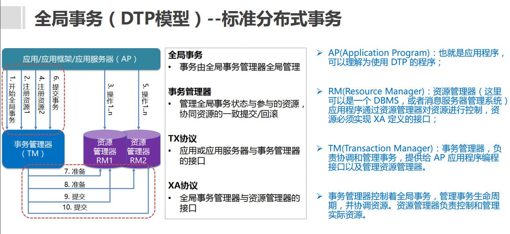
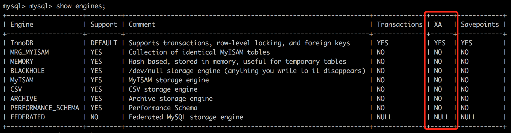

# 分布式事务解决方案

## XA

### 简介

XA是由X/Open组织提出的分布式事务的规范。 XA规范主要定义了**(全局)事务管理器(TM)和(局 部)资源管理器(RM)**之间的接口。主流的关系型 数据库产品都是实现了XA接口的。 

-  XA接口是双向的系统接口，在事务管理器 （TM）以及一个或多个资源管理器（RM）之 间形成通信桥梁。

-  XA之所以需要引入事务管理器是因为，在分布 式系统中，从理论上讲两台机器理论上无法达 到一致的状态，需要引入一个单点进行协调。

-  由全局事务管理器管理和协调的事务，可以跨 越多个资源（如数据库或JMS队列）和进程。 全局事务管理器一般使用 XA 二阶段提交协议 与数据库进行交互。



### 组成部分

1. 资源管理器（resource manager）：用来管理系统资源，是通向事务资源的途径。数据库就是一种资源管理器。资源管理还应该具有管理事务提交或回滚的能力。
2. 事务管理器（transaction manager）：事务管理器是分布式事务的核心管理者。事务管理器与每个资源管理器（resource manager）进行通信，协调并完成事务的处理。事务的各个分支由唯一命名进行标识
   Xid 接口 Xid, Xid 接口是 X/Open 事务标识符 XID 结构的 Java 映射。此接口指定三个访问器方法，以检索全局事务格式 ID、全局事务 ID 和分支限定符。Xid 接口供事务管理器和资源管理器使用。此接口对应用程序不可见。

 ### XA 不能自动提交 - 分段提交

XA需要两阶段提交: prepare 和 commit. 

- 第一阶段为 准备（prepare）阶段。即所有的参与者准备执行事务并锁住需要的资源。参与者ready时，向transaction manager报告已准备就绪。 

- 第二阶段为提交阶段（commit）。当transaction manager确认所有参与者都ready后，向所有参与者发送commit命令。 

假设有两个Connection, con1, con2, 大体的过程如下 .

```java
con1 = XAResouce1.getConnection...     
con2 = XAResouce2.getConnection...   

con1 do some thing.     
con2 do some thing.     

after they finish.     

pre1 = XAResouce1.prepare();     
pre2 = XAResouce2.prepare();     

if( both pre1 and pre2 are OK）{     
	XAResouce1 and 2 commit     
}else {     
	XAResouce1 and 2 rollback     
}    
```

### 事务协调/管理者

因为XA 事务是基于两阶段提交协议的，所以需要有一个事务协调者（transaction manager）来保证所有的事务参与者都完成了准备工作(第一阶段)。如果事务协调者（transaction manager）收到所有参与者都准备好的消息，就会通知所有的事务都可以提交了（第二阶段）。MySQL 在这个XA事务中扮演的是参与者的角色，而不是事务协调者（transaction manager）。

### MySQL对XA的支持

MySQL 从5.0.3开始支持XA分布式事务，且只有InnoDB存储引擎支持。MySQL Connector/J 从5.0.0版本之后开始直接提供对XA的支持。



需要注意的是， 在DTP模型中，mysql属于资源管理器(RM)。而一个完整的分布式事务中，一般会存在多个RM，由事务管理器TM来统一进行协调。因此，这里所说的mysql对XA分布式事务的支持，一般指的是单台mysql实例如何执行自己的事务分支。

#### **MySQL XA 事务SQL语法**

>  https://dev.mysql.com/doc/refman/5.7/en/xa-statements.html

```less
XA {START|BEGIN} xid [JOIN|RESUME]   //开启XA事务，如果使用的是XA START而不是XA BEGIN，那么不支持[JOIN|RESUME]，xid是一个唯一值，表示事务分支标识符
XA END xid [SUSPEND [FOR MIGRATE]]   //结束一个XA事务，不支持[SUSPEND [FOR MIGRATE]]
XA PREPARE xid 准备提交
XA COMMIT xid [ONE PHASE] //提交，如果使用了ONE PHASE，则表示使用一阶段提交。两阶段提交协议中，如果只有一个RM参与，那么可以优化为一阶段提交
XA ROLLBACK xid  //回滚
XA RECOVER [CONVERT XID]  //列出所有处于PREPARE阶段的XA事务
```

下面是一个简单的msyql XA事务案例，演示了mysql作为全局事务中的一个事务分支，将一行记录插入到一个表中

```sql
mysql> XA START 'xatest’;  //其中'xatest’就是xid的值
Query OK, 0 rows affected (0.00 sec)
 
mysql> insert into user(name) values("tianshozuhi");
Query OK, 1 row affected (0.00 sec)
 
mysql> XA END 'xatest';
Query OK, 0 rows affected (0.00 sec)
 
mysql> XA PREPARE 'xatest';
Query OK, 0 rows affected (0.01 sec)
 
mysql> XA COMMIT 'xatest';
Query OK, 0 rows affected (0.01 sec)
```

#### Mysql XA事务状态

XA事务的状态，按照如下步骤进行展开

1. 使用XA START来启动一个XA事务，并把它置于`ACTIVE`状态。

2. 对于一个ACTIVE状态的 XA事务，我们可以执行构成事务的SQL语句，然后发布一个XA END语句。XA END把事务放入`IDLE`状态。

3. 对于一个IDLE 状态XA事务，可以执行一个XA PREPARE语句或一个XA COMMIT…ONE PHASE语句：

   - XA PREPARE把事务放入`PREPARED`状态。在此点上的XA RECOVER语句将在其输出中包括事务的xid值，因为XA RECOVER会列出处于PREPARED状态的所有XA事务。

   - XA COMMIT…ONE PHASE用于预备和提交事务。xid值将不会被XA RECOVER列出，因为事务终止。

4. 对于一个PREPARED状态的 XA事务，您可以发布一个XA COMMIT语句来提交和终止事务，或者发布XA ROLLBACK来回滚并终止事务。

  针对一个给定的客户端连接而言，XA事务和非XA事务(即本地事务)是互斥的。例如，已经执行了”XA START”命令来开启一个XA事务，则本地事务不会被启动，直到XA事务已经被提交或被 回滚为止。相反的，如果已经使用START TRANSACTION启动一个本地事务，则XA语句不能被使用，直到该事务被提交或被 回滚为止。

  最后，如果一个XA事务处于ACTIVE状态，是不能直接进行提交的，如果这样做，mysql会抛出异常：

```csharp
ERROR 1399 (XAE07): XAER_RMFAIL: The command cannot be executed
when global transaction is in the ACTIVE state
```

#### **关于XID的说明**

mysql中使用xid来作为一个事务分支的标识符。事实上xid作为事务分支标识符是在XA规范中定义的，在<< Distributed Transaction Processing: The XA Specification>> 4.2 节中，规定了一个xid的结构，通过C语言进行描述，如下：

```cpp
    /∗
    ∗ Transaction branch identification: XID and NULLXID:
    ∗/

    #define XIDDATASIZE 128  /∗ size in bytes ∗/
    #define MAXGTRIDSIZE 64  /∗ maximum size in bytes of gtrid ∗/
    #define MAXBQUALSIZE 64  /∗ maximum size in bytes of bqual ∗/

    struct xid_t {
        long formatID;     /* format identifier */
        long gtrid_length; /* value 1-64 */
        long bqual_length; /* value 1-64 */
        char data[XIDDATASIZE];
        };

    /∗
    ∗ A value of -1 in formatID means that the XID is null.
    ∗/

    typedef struct xid_t XID;

    /∗
    ∗ Declarations of routines by which RMs call TMs:
    ∗/

    extern int ax_reg(int, XID ∗, long);
    extern int ax_unreg(int, long);
```

XA规范定义了一个xid有4个部分组成：

**gtrid：**

   全局事务标识符(global transaction identifier)，最大不能超过64字节

**bqual：**

   分支限定符(branch qualifier)，最大不能超过64字节

**data：**

  xid的值，其是 gtrid和bqual拼接后的内容。因为gtrid和bqual最大都是64个字节，因此data的最大长度为128。不过，在xid的结构体中，并没有gtrid和bqual，只有gtrid_length、bqual_length。由于二者的内容都存储在data中，因此我们可以根据data反推出gtrid和bqual。举例来说，假设gtrid为”g1234”(5个字节)，bqual为”b456”(4个字节)。那么在构造xid结构体时，gtrid_length=5，bqual_length=4，data=”g1234b456”，那么在反推的时候：

**从data[0]到data[gtrid_length-1]之间的部分就是gtrid的值；从data[gtrid_length]到data[gtrid_length+bqual_length-1]部分就是bqual的值。**

**formatId：**

  而formatId的作用就是记录gtrid、bqual的格式，类似于memcached中flags字段的作用。XA规范中通过一个结构体约定了xid的组成部分，但是并没有规定data中存储的gtrid、bqual内容到底应该是什么格式。你可以选择使用数字，也可以选择使用字符串，到底选择什么由开发者自行决定，只要最终能保证data中的内容是全局唯一的即可。XA规范建议使用OSI CCR风格来组织xid的内容，此时formatId应该设置为0.


在mysql官方文档中，关于xid的组成也有类似的说明：

```shell
xid: gtrid [, bqual [, formatID ]]
```

其中，bqual、formatID是可选的。解释如下：

gtrid : 是一个全局事务标识符(global transaction identifier)，

bqual:是一个分支限定符(branch qualifier)，如果没有提供bqual，那么默认值为空字符串''。

formatID：是一个数字，用于标记gtrid和bqual值的格式，这是一个无符号整数(unsigned integer)，也就是说，最小为0。如果没有提供formatID，那么其默认值为1。

 ** 特别需要注意的是，xid作为一个事务分支的标识符，理论上只要有分支限定符(bqual)就可以了，为什么要包含全局事务标识符(gtrid)？这主要是为了管理方便，通过包含进xid，我们可以很容易的判断出这个事务分支属于哪一个全局事务。 **

  例如，前面提到 XA RECOVER命令的作用是列出所有处于PREPARE阶段的XA事务，以下是一个案例：

```sql
    mysql>  XA RECOVER;
    +----------+--------------+--------------+--------------+
    | formatID | gtrid_length | bqual_length | data         |
    +----------+--------------+--------------+--------------+
    |        1 |            6 |            6 | g12345b67890 |
    +----------+--------------+--------------+--------------+
```

这里列出的是一个分支事务xid的组成信息，根据前面的介绍，我们可以推断出：

  gtrid是data[0]到data[gtrid_length-1]部分的内容，即data[0]到data[6-1=5]部分的内容，结果为g12345；

  而bqual是data[gtrid_length]到data[gtrid_length+bqual_length-1]部分的内容，即data[6]到data[6+6-1=11]部分的内容，结果b67890。

因此，根据这个信息，我们就可以判断出这个xid表示的是：全局事务(g12345)中的事务分支(b67890)。

#### 通过jdbc操作mysql xa事务**

   MySQL Connector/J 从5.0.0版本之后开始直接提供对XA的支持，也就是提供了java版本XA接口的实现。意味着我们可以直接通过java代码来执行mysql xa事务。

   需要注意的是，业务开发人员在编写代码时，不应该直接操作这些XA事务操作的接口。因为在DTP模型中，RM上的事务分支的开启、结束、准备、提交、回滚等操作，都应该是由事务管理器TM来统一管理。

  由于目前我们还没有接触到TM，那么我们不妨做一回"人肉事务管理器"，用你智慧的大脑，来控制多个mysql实例上xa事务分支的执行，提交/回滚。通过直接操作这些接口，你将对xa事务有更深刻的认识。

```java
import com.mysql.jdbc.jdbc2.optional.MysqlXAConnection;
import com.mysql.jdbc.jdbc2.optional.MysqlXid;
import javax.sql.XAConnection;
import javax.transaction.xa.XAException;
import javax.transaction.xa.XAResource;
import javax.transaction.xa.Xid;
import java.sql.Connection;
import java.sql.DriverManager;
import java.sql.PreparedStatement;
import java.sql.SQLException;

public class MysqlXAConnectionTest {
    
   public static void main(String[] args) throws SQLException {

      //true表示打印XA语句,，用于调试
      boolean logXaCommands = true;

      // 获得资源管理器操作接口实例 RM1
      Connection conn1 = DriverManager.getConnection("jdbc:mysql://localhost:3306/test", "root", "shxx12151022");
      XAConnection xaConn1 = new MysqlXAConnection((com.mysql.jdbc.Connection) conn1, logXaCommands);

      XAResource rm1 = xaConn1.getXAResource();

      // 获得资源管理器操作接口实例 RM2
      Connection conn2 = DriverManager.getConnection("jdbc:mysql://localhost:3306/test", "root","shxx12151022");

      XAConnection xaConn2 = new MysqlXAConnection((com.mysql.jdbc.Connection) conn2, logXaCommands);

      XAResource rm2 = xaConn2.getXAResource();

      // AP请求TM执行一个分布式事务，TM生成全局事务id
      byte[] gtrid = "g12345".getBytes();
      int formatId = 1;

      try {
         // ==============分别执行RM1和RM2上的事务分支====================
         // TM生成rm1上的事务分支id
         byte[] bqual1 = "b00001".getBytes();

         Xid xid1 = new MysqlXid(gtrid, bqual1, formatId);

         // 执行rm1上的事务分支
         rm1.start(xid1, XAResource.TMNOFLAGS);//One of TMNOFLAGS, TMJOIN, or TMRESUME.
         PreparedStatement ps1 = conn1.prepareStatement("INSERT into user(name) VALUES ('tianshouzhi')");

         ps1.execute();
         rm1.end(xid1, XAResource.TMSUCCESS);

         // TM生成rm2上的事务分支id
         byte[] bqual2 = "b00002".getBytes();
         Xid xid2 = new MysqlXid(gtrid, bqual2, formatId);

         // 执行rm2上的事务分支
         rm2.start(xid2, XAResource.TMNOFLAGS);
         PreparedStatement ps2 = conn2.prepareStatement("INSERT into user(name) VALUES ('wangxiaoxiao')");

         ps2.execute();

         rm2.end(xid2, XAResource.TMSUCCESS);

         // ===================两阶段提交================================
         // phase1：询问所有的RM 准备提交事务分支
         int rm1_prepare = rm1.prepare(xid1);
         int rm2_prepare = rm2.prepare(xid2);

         // phase2：提交所有事务分支
         boolean onePhase = false; //TM判断有2个事务分支，所以不能优化为一阶段提交

         if (rm1_prepare == XAResource.XA_OK
               && rm2_prepare == XAResource.XA_OK
               ) {//所有事务分支都prepare成功，提交所有事务分支
            rm1.commit(xid1, onePhase);
            rm2.commit(xid2, onePhase);
         } else {//如果有事务分支没有成功，则回滚
            rm1.rollback(xid1);
            rm1.rollback(xid2);
         }
      } catch (XAException e) {
         // 如果出现异常，也要进行回滚
         e.printStackTrace();
      }
   }
}
```

  在这个案例中，演示了2个RM的情况下分布式事务的工作流程。因为我们充当了"人肉事务管理器”TM，因此很多本应该由TM来处理的工作处理细节也直接体现在上述代码中，如:生成全局事务id和分支事务id、在RM上开启事务分支、两阶段提交等。虽然我们自己作为"人肉事务管理器”是很不可靠的，但是上述代码可以让我们了解一个TM内部的主要工作流程是怎样的。

  在实际开发中，代码绝不会像上表面那样复杂，因为我们通常都会使用第三方或者容器提供的TM功能，因此在操作分布式事务时，代码可以得到极大的简化。

  最后，由于我们设置了logXaCommands=true，程序在运行的时候回打印出执行的XA命令。如下所示：

```apache
    Fri Feb 02 18:09:29 CST 2018 DEBUG: Executing XA statement: XA START 0x673132333435,0x623030303031,0x1
    Fri Feb 02 18:09:29 CST 2018 DEBUG: Executing XA statement: XA END 0x673132333435,0x623030303031,0x1
    Fri Feb 02 18:09:29 CST 2018 DEBUG: Executing XA statement: XA START 0x673132333435,0x623030303032,0x1
    Fri Feb 02 18:09:29 CST 2018 DEBUG: Executing XA statement: XA END 0x673132333435,0x623030303032,0x1
    Fri Feb 02 18:09:29 CST 2018 DEBUG: Executing XA statement: XA PREPARE 0x673132333435,0x623030303031,0x1
    Fri Feb 02 18:09:29 CST 2018 DEBUG: Executing XA statement: XA PREPARE 0x673132333435,0x623030303032,0x1
    Fri Feb 02 18:09:29 CST 2018 DEBUG: Executing XA statement: XA COMMIT 0x673132333435,0x623030303031,0x1
    Fri Feb 02 18:09:29 CST 2018 DEBUG: Executing XA statement: XA COMMIT 0x673132333435,0x623030303032,0x1
```

#### MySQL Connector/J XA事务支持源码简单分析**

  最后，我们对上述源码进行一下简单的分析。在前面直接使用mysql命令操作的时候，我们通过"XA START xid”等XA命令来执行XA事务。而在上述java代码中，我们是获取了一个普通的链接Connection之后，封装成了`MysqlXAConnection`。如下：

com.mysql.jdbc.jdbc2.optional.MysqlXAConnection

```java
public class MysqlXAConnection extends MysqlPooledConnection implements XAConnection, XAResource {

  private com.mysql.jdbc.Connection underlyingConnection;
  private Log log;
  protected boolean logXaCommands;

  //构造方法
  public MysqlXAConnection(com.mysql.jdbc.Connection connection, boolean logXaCommands) throws SQLException {
    super(connection);
    this.underlyingConnection = connection;
    this.log = connection.getLog();
    this.logXaCommands = logXaCommands;
  }

}
```

可以看到，MysqlXAConnection本身就实现了`XAResource`接口，因此当调用getXAResource()方法时，返回的就是其自己

com.mysql.jdbc.jdbc2.optional.MysqlXAConnection#getXAResource

```java
public XAResource getXAResource() throws SQLException {
    return this;
}
```

之后，我们调用XAResource的start方法来开启XA事务。start方法源码如下所示：

com.mysql.jdbc.jdbc2.optional.MysqlXAConnection#start

```java
public void start(Xid xid, int flags) throws XAException {
    //1、封装XA命令
    StringBuilder commandBuf = new StringBuilder(MAX_COMMAND_LENGTH);
    commandBuf.append("XA START ");
    appendXid(commandBuf, xid);

    //2、添加flag标记
    switch (flags) {
        case TMJOIN:
            commandBuf.append(" JOIN");
            break;
        case TMRESUME:
            commandBuf.append(" RESUME");
            break;
        case TMNOFLAGS:
            // no-op
            break;
        default:
            throw new XAException(XAException.XAER_INVAL);
    }

    //执行命令
    dispatchCommand(commandBuf.toString());
    this.underlyingConnection.setInGlobalTx(true);
}
```

 可以看到，当我们调用MysqlXAConnection的start方法时，实际上就是执行了一个”XA START xid [JOIN|RESUME]”命令而已，和我们直接在命令行中的操作是一样一样的，只不过通过封装简化了我们的操作。

   对于MysqlXAConnection的end、prepare、commit、rollback等方法，也都是是类似的，不再赘述。

  最后提示， MySQL Connector/J 中提供的XA操作接口，如上面提到的XAConnection、XAResource、Xid等，实际上都遵循了JTA规范。