# mysql面试题，每日一更，敬请关注~~

（直接点击目录，即可直达答案位置）

* [（一）架构问题](#%E4%B8%80%E6%9E%B6%E6%9E%84%E9%97%AE%E9%A2%98)
  * [1\.谈一下MYSQL架构，都由哪些组成？一条SQL大概的执行流程是什么？](#1%E8%B0%88%E4%B8%80%E4%B8%8Bmysql%E6%9E%B6%E6%9E%84%E9%83%BD%E7%94%B1%E5%93%AA%E4%BA%9B%E7%BB%84%E6%88%90%E4%B8%80%E6%9D%A1sql%E5%A4%A7%E6%A6%82%E7%9A%84%E6%89%A7%E8%A1%8C%E6%B5%81%E7%A8%8B%E6%98%AF%E4%BB%80%E4%B9%88)
  * [2\. MySQL本身是有缓存的，为什么不建议使用MySQL本身的缓存，反而使用Redis、Memcache？](#2-mysql%E6%9C%AC%E8%BA%AB%E6%98%AF%E6%9C%89%E7%BC%93%E5%AD%98%E7%9A%84%E4%B8%BA%E4%BB%80%E4%B9%88%E4%B8%8D%E5%BB%BA%E8%AE%AE%E4%BD%BF%E7%94%A8mysql%E6%9C%AC%E8%BA%AB%E7%9A%84%E7%BC%93%E5%AD%98%E5%8F%8D%E8%80%8C%E4%BD%BF%E7%94%A8redismemcache)
  * [3\. InnoDB缓冲池里面有缓存，而且经常用，上边不是说MySQL不建议使用缓存吗？](#3-innodb%E7%BC%93%E5%86%B2%E6%B1%A0%E9%87%8C%E9%9D%A2%E6%9C%89%E7%BC%93%E5%AD%98%E8%80%8C%E4%B8%94%E7%BB%8F%E5%B8%B8%E7%94%A8%E4%B8%8A%E8%BE%B9%E4%B8%8D%E6%98%AF%E8%AF%B4mysql%E4%B8%8D%E5%BB%BA%E8%AE%AE%E4%BD%BF%E7%94%A8%E7%BC%93%E5%AD%98%E5%90%97)
  * [4\. MySQL存储引擎有哪些？Memory引擎了解过没，什么情况下会用到？TempTable呢？](#4-mysql%E5%AD%98%E5%82%A8%E5%BC%95%E6%93%8E%E6%9C%89%E5%93%AA%E4%BA%9Bmemory%E5%BC%95%E6%93%8E%E4%BA%86%E8%A7%A3%E8%BF%87%E6%B2%A1%E4%BB%80%E4%B9%88%E6%83%85%E5%86%B5%E4%B8%8B%E4%BC%9A%E7%94%A8%E5%88%B0temptable%E5%91%A2)
  * [5\.MySQL是一个单进程多线程架构，分别有哪些线程？作用是什么？](#5mysql%E6%98%AF%E4%B8%80%E4%B8%AA%E5%8D%95%E8%BF%9B%E7%A8%8B%E5%A4%9A%E7%BA%BF%E7%A8%8B%E6%9E%B6%E6%9E%84%E5%88%86%E5%88%AB%E6%9C%89%E5%93%AA%E4%BA%9B%E7%BA%BF%E7%A8%8B%E4%BD%9C%E7%94%A8%E6%98%AF%E4%BB%80%E4%B9%88)
  * [6\.MYSQL优化器是怎么运行的，为什么会做出错误决定，使用错误的索引？怎么解决？](#6mysql%E4%BC%98%E5%8C%96%E5%99%A8%E6%98%AF%E6%80%8E%E4%B9%88%E8%BF%90%E8%A1%8C%E7%9A%84%E4%B8%BA%E4%BB%80%E4%B9%88%E4%BC%9A%E5%81%9A%E5%87%BA%E9%94%99%E8%AF%AF%E5%86%B3%E5%AE%9A%E4%BD%BF%E7%94%A8%E9%94%99%E8%AF%AF%E7%9A%84%E7%B4%A2%E5%BC%95%E6%80%8E%E4%B9%88%E8%A7%A3%E5%86%B3)
  * [7\. 怎么理解MySQL对于SQL的执行是基于成本模型的？](#7-%E6%80%8E%E4%B9%88%E7%90%86%E8%A7%A3mysql%E5%AF%B9%E4%BA%8Esql%E7%9A%84%E6%89%A7%E8%A1%8C%E6%98%AF%E5%9F%BA%E4%BA%8E%E6%88%90%E6%9C%AC%E6%A8%A1%E5%9E%8B%E7%9A%84)
  * [8\. MySQL中有哪些文件？分别有什么用？——未完](#8-mysql%E4%B8%AD%E6%9C%89%E5%93%AA%E4%BA%9B%E6%96%87%E4%BB%B6%E5%88%86%E5%88%AB%E6%9C%89%E4%BB%80%E4%B9%88%E7%94%A8%E6%9C%AA%E5%AE%8C)
  * [9\. 从性能和安全方面，MySQL是怎么做的？——未完](#9-%E4%BB%8E%E6%80%A7%E8%83%BD%E5%92%8C%E5%AE%89%E5%85%A8%E6%96%B9%E9%9D%A2mysql%E6%98%AF%E6%80%8E%E4%B9%88%E5%81%9A%E7%9A%84%E6%9C%AA%E5%AE%8C)
* [（二）schema问题](#%E4%BA%8Cschema%E9%97%AE%E9%A2%98)
  * [1\. MySQL中，主键自增ID用完了会发生什么问题？该怎么解决？](#1-mysql%E4%B8%AD%E4%B8%BB%E9%94%AE%E8%87%AA%E5%A2%9Eid%E7%94%A8%E5%AE%8C%E4%BA%86%E4%BC%9A%E5%8F%91%E7%94%9F%E4%BB%80%E4%B9%88%E9%97%AE%E9%A2%98%E8%AF%A5%E6%80%8E%E4%B9%88%E8%A7%A3%E5%86%B3)
  * [2\. count(1) 和 count(\*) 相比有什么差异？与count(列名) 相比呢？](#2-count1-%E5%92%8C-count-%E7%9B%B8%E6%AF%94%E6%9C%89%E4%BB%80%E4%B9%88%E5%B7%AE%E5%BC%82%E4%B8%8Ecount%E5%88%97%E5%90%8D-%E7%9B%B8%E6%AF%94%E5%91%A2)
  * [3\.谈一下数据库的三大范式？为什么需要反范式？](#3%E8%B0%88%E4%B8%80%E4%B8%8B%E6%95%B0%E6%8D%AE%E5%BA%93%E7%9A%84%E4%B8%89%E5%A4%A7%E8%8C%83%E5%BC%8F%E4%B8%BA%E4%BB%80%E4%B9%88%E9%9C%80%E8%A6%81%E5%8F%8D%E8%8C%83%E5%BC%8F)
  * [4\.MySQL中字段有哪些类型？](#4mysql%E4%B8%AD%E5%AD%97%E6%AE%B5%E6%9C%89%E5%93%AA%E4%BA%9B%E7%B1%BB%E5%9E%8B)
  * [5\.VARCHAR 和 CHAR有什么区别？除了空格的差异还有其他吗？](#5varchar-%E5%92%8C-char%E6%9C%89%E4%BB%80%E4%B9%88%E5%8C%BA%E5%88%AB%E9%99%A4%E4%BA%86%E7%A9%BA%E6%A0%BC%E7%9A%84%E5%B7%AE%E5%BC%82%E8%BF%98%E6%9C%89%E5%85%B6%E4%BB%96%E5%90%97)
  * [6\.BLOB 和 TEXT 有什么不好的地方？该怎么解决？](#6blob-%E5%92%8C-text-%E6%9C%89%E4%BB%80%E4%B9%88%E4%B8%8D%E5%A5%BD%E7%9A%84%E5%9C%B0%E6%96%B9%E8%AF%A5%E6%80%8E%E4%B9%88%E8%A7%A3%E5%86%B3)
  * [7\. TIMESTAMP和DATETIME有什么区别？——未完](#7-timestamp%E5%92%8Cdatetime%E6%9C%89%E4%BB%80%E4%B9%88%E5%8C%BA%E5%88%AB%E6%9C%AA%E5%AE%8C)
  * [8\. MySQL中，一个数据页只有16K，当一个字段特别大，超过16K了，怎么存储？](#8-mysql%E4%B8%AD%E4%B8%80%E4%B8%AA%E6%95%B0%E6%8D%AE%E9%A1%B5%E5%8F%AA%E6%9C%8916k%E5%BD%93%E4%B8%80%E4%B8%AA%E5%AD%97%E6%AE%B5%E7%89%B9%E5%88%AB%E5%A4%A7%E8%B6%85%E8%BF%8716k%E4%BA%86%E6%80%8E%E4%B9%88%E5%AD%98%E5%82%A8)
        * [记录中的数据太多产生的溢出](#%E8%AE%B0%E5%BD%95%E4%B8%AD%E7%9A%84%E6%95%B0%E6%8D%AE%E5%A4%AA%E5%A4%9A%E4%BA%A7%E7%94%9F%E7%9A%84%E6%BA%A2%E5%87%BA)
  * [9\. 为什么要尽量设定一个主键?——未完](#9-%E4%B8%BA%E4%BB%80%E4%B9%88%E8%A6%81%E5%B0%BD%E9%87%8F%E8%AE%BE%E5%AE%9A%E4%B8%80%E4%B8%AA%E4%B8%BB%E9%94%AE%E6%9C%AA%E5%AE%8C)
  * [10\. 主键选用什么类型？使用自增ID还是UUID?——未完](#10-%E4%B8%BB%E9%94%AE%E9%80%89%E7%94%A8%E4%BB%80%E4%B9%88%E7%B1%BB%E5%9E%8B%E4%BD%BF%E7%94%A8%E8%87%AA%E5%A2%9Eid%E8%BF%98%E6%98%AFuuid%E6%9C%AA%E5%AE%8C)
  * [11\. 字段为什么要求定义为not null?——未完](#11-%E5%AD%97%E6%AE%B5%E4%B8%BA%E4%BB%80%E4%B9%88%E8%A6%81%E6%B1%82%E5%AE%9A%E4%B9%89%E4%B8%BAnot-null%E6%9C%AA%E5%AE%8C)
  * [12\. 解释一下水平分表和垂直分表,可以分别举一个适合他们的例子吗?——未完](#12-%E8%A7%A3%E9%87%8A%E4%B8%80%E4%B8%8B%E6%B0%B4%E5%B9%B3%E5%88%86%E8%A1%A8%E5%92%8C%E5%9E%82%E7%9B%B4%E5%88%86%E8%A1%A8%E5%8F%AF%E4%BB%A5%E5%88%86%E5%88%AB%E4%B8%BE%E4%B8%80%E4%B8%AA%E9%80%82%E5%90%88%E4%BB%96%E4%BB%AC%E7%9A%84%E4%BE%8B%E5%AD%90%E5%90%97%E6%9C%AA%E5%AE%8C)
* [（三）SQL语句方面的问题](#%E4%B8%89sql%E8%AF%AD%E5%8F%A5%E6%96%B9%E9%9D%A2%E7%9A%84%E9%97%AE%E9%A2%98)
  * [1\. ALTER TABLE 会有什么影响？有没有解决办法？——未完](#1-alter-table-%E4%BC%9A%E6%9C%89%E4%BB%80%E4%B9%88%E5%BD%B1%E5%93%8D%E6%9C%89%E6%B2%A1%E6%9C%89%E8%A7%A3%E5%86%B3%E5%8A%9E%E6%B3%95%E6%9C%AA%E5%AE%8C)
  * [2\. 怎么优化 order by 、group by？——未完](#2-%E6%80%8E%E4%B9%88%E4%BC%98%E5%8C%96-order-by-group-by%E6%9C%AA%E5%AE%8C)
  * [3\.  select \* from A group by a desc; 这么写对吗？为什么？](#3--select--from-a-group-by-a-desc-%E8%BF%99%E4%B9%88%E5%86%99%E5%AF%B9%E5%90%97%E4%B8%BA%E4%BB%80%E4%B9%88)
  * [4\. 怎么理解“延迟关联”？（怎么优化limit？）](#4-%E6%80%8E%E4%B9%88%E7%90%86%E8%A7%A3%E5%BB%B6%E8%BF%9F%E5%85%B3%E8%81%94%E6%80%8E%E4%B9%88%E4%BC%98%E5%8C%96limit)
  * [5\. 超大分页怎么处理?——未完](#5-%E8%B6%85%E5%A4%A7%E5%88%86%E9%A1%B5%E6%80%8E%E4%B9%88%E5%A4%84%E7%90%86%E6%9C%AA%E5%AE%8C)
  * [6\.如何优化子查询？——未完](#6%E5%A6%82%E4%BD%95%E4%BC%98%E5%8C%96%E5%AD%90%E6%9F%A5%E8%AF%A2%E6%9C%AA%E5%AE%8C)
  * [7\. MySQL是如何如何优化连表查询？——未完](#7-mysql%E6%98%AF%E5%A6%82%E4%BD%95%E5%A6%82%E4%BD%95%E4%BC%98%E5%8C%96%E8%BF%9E%E8%A1%A8%E6%9F%A5%E8%AF%A2%E6%9C%AA%E5%AE%8C)
  * [8\. union 和 union all的区别？](#8-union-%E5%92%8C-union-all%E7%9A%84%E5%8C%BA%E5%88%AB)
  * [9\.一些有趣的问题](#9%E4%B8%80%E4%BA%9B%E6%9C%89%E8%B6%A3%E7%9A%84%E9%97%AE%E9%A2%98)
    * [(1) select sid from sc where score &lt; 60 group by sid;  与 select distinct sid from sc where score &lt; 60; 相比性能如何？](#1-select-sid-from-sc-where-score--60-group-by-sid--%E4%B8%8E-select-distinct-sid-from-sc-where-score--60-%E7%9B%B8%E6%AF%94%E6%80%A7%E8%83%BD%E5%A6%82%E4%BD%95)
* [（四）索引方面的问题](#%E5%9B%9B%E7%B4%A2%E5%BC%95%E6%96%B9%E9%9D%A2%E7%9A%84%E9%97%AE%E9%A2%98)
  * [1\. 索引有哪些类型？怎么分类呢？](#1-%E7%B4%A2%E5%BC%95%E6%9C%89%E5%93%AA%E4%BA%9B%E7%B1%BB%E5%9E%8B%E6%80%8E%E4%B9%88%E5%88%86%E7%B1%BB%E5%91%A2)
  * [2\. 覆盖索引了解过没，有什么优势，怎么使用？考虑以下几个问题，会不会用到索引？——未完](#2-%E8%A6%86%E7%9B%96%E7%B4%A2%E5%BC%95%E4%BA%86%E8%A7%A3%E8%BF%87%E6%B2%A1%E6%9C%89%E4%BB%80%E4%B9%88%E4%BC%98%E5%8A%BF%E6%80%8E%E4%B9%88%E4%BD%BF%E7%94%A8%E8%80%83%E8%99%91%E4%BB%A5%E4%B8%8B%E5%87%A0%E4%B8%AA%E9%97%AE%E9%A2%98%E4%BC%9A%E4%B8%8D%E4%BC%9A%E7%94%A8%E5%88%B0%E7%B4%A2%E5%BC%95%E6%9C%AA%E5%AE%8C)
  * [3\. 了解过前缀索引/压缩索引没？工作原理是啥？正序查询和倒叙查询会有什么不同？——未完](#3-%E4%BA%86%E8%A7%A3%E8%BF%87%E5%89%8D%E7%BC%80%E7%B4%A2%E5%BC%95%E5%8E%8B%E7%BC%A9%E7%B4%A2%E5%BC%95%E6%B2%A1%E5%B7%A5%E4%BD%9C%E5%8E%9F%E7%90%86%E6%98%AF%E5%95%A5%E6%AD%A3%E5%BA%8F%E6%9F%A5%E8%AF%A2%E5%92%8C%E5%80%92%E5%8F%99%E6%9F%A5%E8%AF%A2%E4%BC%9A%E6%9C%89%E4%BB%80%E4%B9%88%E4%B8%8D%E5%90%8C%E6%9C%AA%E5%AE%8C)
  * [4\. 聚簇索引和非聚簇索引有什么区别?](#4-%E8%81%9A%E7%B0%87%E7%B4%A2%E5%BC%95%E5%92%8C%E9%9D%9E%E8%81%9A%E7%B0%87%E7%B4%A2%E5%BC%95%E6%9C%89%E4%BB%80%E4%B9%88%E5%8C%BA%E5%88%AB)
  * [5\. 为什么使用索引？不使用索引会怎样？——未完](#5-%E4%B8%BA%E4%BB%80%E4%B9%88%E4%BD%BF%E7%94%A8%E7%B4%A2%E5%BC%95%E4%B8%8D%E4%BD%BF%E7%94%A8%E7%B4%A2%E5%BC%95%E4%BC%9A%E6%80%8E%E6%A0%B7%E6%9C%AA%E5%AE%8C)
  * [6\. 索引采用了哪些数据结构，分别有什么特征？——未完](#6-%E7%B4%A2%E5%BC%95%E9%87%87%E7%94%A8%E4%BA%86%E5%93%AA%E4%BA%9B%E6%95%B0%E6%8D%AE%E7%BB%93%E6%9E%84%E5%88%86%E5%88%AB%E6%9C%89%E4%BB%80%E4%B9%88%E7%89%B9%E5%BE%81%E6%9C%AA%E5%AE%8C)
  * [7\.哈希索引了解过没，用在那里，解决了什么问题，有什么优势？有什么弊端？——未完](#7%E5%93%88%E5%B8%8C%E7%B4%A2%E5%BC%95%E4%BA%86%E8%A7%A3%E8%BF%87%E6%B2%A1%E7%94%A8%E5%9C%A8%E9%82%A3%E9%87%8C%E8%A7%A3%E5%86%B3%E4%BA%86%E4%BB%80%E4%B9%88%E9%97%AE%E9%A2%98%E6%9C%89%E4%BB%80%E4%B9%88%E4%BC%98%E5%8A%BF%E6%9C%89%E4%BB%80%E4%B9%88%E5%BC%8A%E7%AB%AF%E6%9C%AA%E5%AE%8C)
  * [8\. InnoDB自适应哈希索引是什么，怎么工作的，有什么优势？——未完](#8-innodb%E8%87%AA%E9%80%82%E5%BA%94%E5%93%88%E5%B8%8C%E7%B4%A2%E5%BC%95%E6%98%AF%E4%BB%80%E4%B9%88%E6%80%8E%E4%B9%88%E5%B7%A5%E4%BD%9C%E7%9A%84%E6%9C%89%E4%BB%80%E4%B9%88%E4%BC%98%E5%8A%BF%E6%9C%AA%E5%AE%8C)
  * [9\. 为什么使用B\+树作为索引的数据结构，不用二叉树，平衡二叉树，B树？](#9-%E4%B8%BA%E4%BB%80%E4%B9%88%E4%BD%BF%E7%94%A8b%E6%A0%91%E4%BD%9C%E4%B8%BA%E7%B4%A2%E5%BC%95%E7%9A%84%E6%95%B0%E6%8D%AE%E7%BB%93%E6%9E%84%E4%B8%8D%E7%94%A8%E4%BA%8C%E5%8F%89%E6%A0%91%E5%B9%B3%E8%A1%A1%E4%BA%8C%E5%8F%89%E6%A0%91b%E6%A0%91)
  * [10\. B\+树的插入和删除是怎样进行的？——未完](#10-b%E6%A0%91%E7%9A%84%E6%8F%92%E5%85%A5%E5%92%8C%E5%88%A0%E9%99%A4%E6%98%AF%E6%80%8E%E6%A0%B7%E8%BF%9B%E8%A1%8C%E7%9A%84%E6%9C%AA%E5%AE%8C)
  * [11\. 根据B\+树的插入规则来看，有点浪费空间，MySQL是怎么解决的？——未完](#11-%E6%A0%B9%E6%8D%AEb%E6%A0%91%E7%9A%84%E6%8F%92%E5%85%A5%E8%A7%84%E5%88%99%E6%9D%A5%E7%9C%8B%E6%9C%89%E7%82%B9%E6%B5%AA%E8%B4%B9%E7%A9%BA%E9%97%B4mysql%E6%98%AF%E6%80%8E%E4%B9%88%E8%A7%A3%E5%86%B3%E7%9A%84%E6%9C%AA%E5%AE%8C)
  * [12\. 怎么查看sql是否走了索引？详细解释一下explain？——未完](#12-%E6%80%8E%E4%B9%88%E6%9F%A5%E7%9C%8Bsql%E6%98%AF%E5%90%A6%E8%B5%B0%E4%BA%86%E7%B4%A2%E5%BC%95%E8%AF%A6%E7%BB%86%E8%A7%A3%E9%87%8A%E4%B8%80%E4%B8%8Bexplain%E6%9C%AA%E5%AE%8C)
  * [13\. like查询为什么前面不加%就可以走索引？前面加了%一定不走索引吗？——未完](#13-like%E6%9F%A5%E8%AF%A2%E4%B8%BA%E4%BB%80%E4%B9%88%E5%89%8D%E9%9D%A2%E4%B8%8D%E5%8A%A0%E5%B0%B1%E5%8F%AF%E4%BB%A5%E8%B5%B0%E7%B4%A2%E5%BC%95%E5%89%8D%E9%9D%A2%E5%8A%A0%E4%BA%86%E4%B8%80%E5%AE%9A%E4%B8%8D%E8%B5%B0%E7%B4%A2%E5%BC%95%E5%90%97%E6%9C%AA%E5%AE%8C)
  * [14\. UUID和SHA、MD5生成的值什么不适合建立索引？有什么影响？有什么解决方案？——未完](#14-uuid%E5%92%8Cshamd5%E7%94%9F%E6%88%90%E7%9A%84%E5%80%BC%E4%BB%80%E4%B9%88%E4%B8%8D%E9%80%82%E5%90%88%E5%BB%BA%E7%AB%8B%E7%B4%A2%E5%BC%95%E6%9C%89%E4%BB%80%E4%B9%88%E5%BD%B1%E5%93%8D%E6%9C%89%E4%BB%80%E4%B9%88%E8%A7%A3%E5%86%B3%E6%96%B9%E6%A1%88%E6%9C%AA%E5%AE%8C)
  * [15\.为什么不建议删除数据，而是添加删除标识？——未完](#15%E4%B8%BA%E4%BB%80%E4%B9%88%E4%B8%8D%E5%BB%BA%E8%AE%AE%E5%88%A0%E9%99%A4%E6%95%B0%E6%8D%AE%E8%80%8C%E6%98%AF%E6%B7%BB%E5%8A%A0%E5%88%A0%E9%99%A4%E6%A0%87%E8%AF%86%E6%9C%AA%E5%AE%8C)
  * [16\. 数据存储碎片有哪些？——未完](#16-%E6%95%B0%E6%8D%AE%E5%AD%98%E5%82%A8%E7%A2%8E%E7%89%87%E6%9C%89%E5%93%AA%E4%BA%9B%E6%9C%AA%E5%AE%8C)
  * [17\. MySQL是如何构建索引的？——未完](#17-mysql%E6%98%AF%E5%A6%82%E4%BD%95%E6%9E%84%E5%BB%BA%E7%B4%A2%E5%BC%95%E7%9A%84%E6%9C%AA%E5%AE%8C)
  * [18\. 聊一聊十大经典排序算法？MySQL中使用了哪些排序算法？——未完](#18-%E8%81%8A%E4%B8%80%E8%81%8A%E5%8D%81%E5%A4%A7%E7%BB%8F%E5%85%B8%E6%8E%92%E5%BA%8F%E7%AE%97%E6%B3%95mysql%E4%B8%AD%E4%BD%BF%E7%94%A8%E4%BA%86%E5%93%AA%E4%BA%9B%E6%8E%92%E5%BA%8F%E7%AE%97%E6%B3%95%E6%9C%AA%E5%AE%8C)
  * [19\. 构建好索引后，往索引里插入数据是一条一条的插入吗？有什么解决方案？——未完](#19-%E6%9E%84%E5%BB%BA%E5%A5%BD%E7%B4%A2%E5%BC%95%E5%90%8E%E5%BE%80%E7%B4%A2%E5%BC%95%E9%87%8C%E6%8F%92%E5%85%A5%E6%95%B0%E6%8D%AE%E6%98%AF%E4%B8%80%E6%9D%A1%E4%B8%80%E6%9D%A1%E7%9A%84%E6%8F%92%E5%85%A5%E5%90%97%E6%9C%89%E4%BB%80%E4%B9%88%E8%A7%A3%E5%86%B3%E6%96%B9%E6%A1%88%E6%9C%AA%E5%AE%8C)
  * [20\.索引中，对 NULL 值是怎么统计的？分别有什么影响？——未完](#20%E7%B4%A2%E5%BC%95%E4%B8%AD%E5%AF%B9-null-%E5%80%BC%E6%98%AF%E6%80%8E%E4%B9%88%E7%BB%9F%E8%AE%A1%E7%9A%84%E5%88%86%E5%88%AB%E6%9C%89%E4%BB%80%E4%B9%88%E5%BD%B1%E5%93%8D%E6%9C%AA%E5%AE%8C)
  * [21\. 哪些场景会使索引失效？该如何避免索引失效？——未完](#21-%E5%93%AA%E4%BA%9B%E5%9C%BA%E6%99%AF%E4%BC%9A%E4%BD%BF%E7%B4%A2%E5%BC%95%E5%A4%B1%E6%95%88%E8%AF%A5%E5%A6%82%E4%BD%95%E9%81%BF%E5%85%8D%E7%B4%A2%E5%BC%95%E5%A4%B1%E6%95%88%E6%9C%AA%E5%AE%8C)
  * [22\. 多列索引中为什么范围匹配之后，索引失效？——未完](#22-%E5%A4%9A%E5%88%97%E7%B4%A2%E5%BC%95%E4%B8%AD%E4%B8%BA%E4%BB%80%E4%B9%88%E8%8C%83%E5%9B%B4%E5%8C%B9%E9%85%8D%E4%B9%8B%E5%90%8E%E7%B4%A2%E5%BC%95%E5%A4%B1%E6%95%88%E6%9C%AA%E5%AE%8C)
  * [23\. 联合索引是什么?为什么需要注意联合索引中的顺序?——未完](#23-%E8%81%94%E5%90%88%E7%B4%A2%E5%BC%95%E6%98%AF%E4%BB%80%E4%B9%88%E4%B8%BA%E4%BB%80%E4%B9%88%E9%9C%80%E8%A6%81%E6%B3%A8%E6%84%8F%E8%81%94%E5%90%88%E7%B4%A2%E5%BC%95%E4%B8%AD%E7%9A%84%E9%A1%BA%E5%BA%8F%E6%9C%AA%E5%AE%8C)
  * [24\. 如何创建/使用高性能索引？——未完](#24-%E5%A6%82%E4%BD%95%E5%88%9B%E5%BB%BA%E4%BD%BF%E7%94%A8%E9%AB%98%E6%80%A7%E8%83%BD%E7%B4%A2%E5%BC%95%E6%9C%AA%E5%AE%8C)
  * [25\. 为什么不建议对性别建立索引？那我非要对性别进行查询（例如：查北京东城的男生），有什么解决方案？](#25-%E4%B8%BA%E4%BB%80%E4%B9%88%E4%B8%8D%E5%BB%BA%E8%AE%AE%E5%AF%B9%E6%80%A7%E5%88%AB%E5%BB%BA%E7%AB%8B%E7%B4%A2%E5%BC%95%E9%82%A3%E6%88%91%E9%9D%9E%E8%A6%81%E5%AF%B9%E6%80%A7%E5%88%AB%E8%BF%9B%E8%A1%8C%E6%9F%A5%E8%AF%A2%E4%BE%8B%E5%A6%82%E6%9F%A5%E5%8C%97%E4%BA%AC%E4%B8%9C%E5%9F%8E%E7%9A%84%E7%94%B7%E7%94%9F%E6%9C%89%E4%BB%80%E4%B9%88%E8%A7%A3%E5%86%B3%E6%96%B9%E6%A1%88)
  * [26\.假设一个索引中，字段是varchar类型，输入值是int类型，会走索引吗？](#26%E5%81%87%E8%AE%BE%E4%B8%80%E4%B8%AA%E7%B4%A2%E5%BC%95%E4%B8%AD%E5%AD%97%E6%AE%B5%E6%98%AFvarchar%E7%B1%BB%E5%9E%8B%E8%BE%93%E5%85%A5%E5%80%BC%E6%98%AFint%E7%B1%BB%E5%9E%8B%E4%BC%9A%E8%B5%B0%E7%B4%A2%E5%BC%95%E5%90%97)
  * [27\. 假设一个索引中，字段是int类型，输入值是varchar类型，会走索引吗？](#27-%E5%81%87%E8%AE%BE%E4%B8%80%E4%B8%AA%E7%B4%A2%E5%BC%95%E4%B8%AD%E5%AD%97%E6%AE%B5%E6%98%AFint%E7%B1%BB%E5%9E%8B%E8%BE%93%E5%85%A5%E5%80%BC%E6%98%AFvarchar%E7%B1%BB%E5%9E%8B%E4%BC%9A%E8%B5%B0%E7%B4%A2%E5%BC%95%E5%90%97)
  * [28\. 假设我没有索引，该怎么优化SQL？](#28-%E5%81%87%E8%AE%BE%E6%88%91%E6%B2%A1%E6%9C%89%E7%B4%A2%E5%BC%95%E8%AF%A5%E6%80%8E%E4%B9%88%E4%BC%98%E5%8C%96sql)
* [（五）算法类问题](#%E4%BA%94%E7%AE%97%E6%B3%95%E7%B1%BB%E9%97%AE%E9%A2%98)
  * [1\.InnoDB的缓冲池有缓存页，他是怎么淘汰缓存的？跟传统的LRU相比有何优势？](#1innodb%E7%9A%84%E7%BC%93%E5%86%B2%E6%B1%A0%E6%9C%89%E7%BC%93%E5%AD%98%E9%A1%B5%E4%BB%96%E6%98%AF%E6%80%8E%E4%B9%88%E6%B7%98%E6%B1%B0%E7%BC%93%E5%AD%98%E7%9A%84%E8%B7%9F%E4%BC%A0%E7%BB%9F%E7%9A%84lru%E7%9B%B8%E6%AF%94%E6%9C%89%E4%BD%95%E4%BC%98%E5%8A%BF)
  * [2\. order by排序有哪两种算法？——未完](#2-order-by%E6%8E%92%E5%BA%8F%E6%9C%89%E5%93%AA%E4%B8%A4%E7%A7%8D%E7%AE%97%E6%B3%95%E6%9C%AA%E5%AE%8C)
  * [3\. 构建索引时用到了什么算法？聊一聊其他同类型算法？](#3-%E6%9E%84%E5%BB%BA%E7%B4%A2%E5%BC%95%E6%97%B6%E7%94%A8%E5%88%B0%E4%BA%86%E4%BB%80%E4%B9%88%E7%AE%97%E6%B3%95%E8%81%8A%E4%B8%80%E8%81%8A%E5%85%B6%E4%BB%96%E5%90%8C%E7%B1%BB%E5%9E%8B%E7%AE%97%E6%B3%95)
* [（六）事务类问题](#%E5%85%AD%E4%BA%8B%E5%8A%A1%E7%B1%BB%E9%97%AE%E9%A2%98)
  * [1\. 事务的隔离级别有哪些，各隔离级别下会出现什么问题？——未完](#1-%E4%BA%8B%E5%8A%A1%E7%9A%84%E9%9A%94%E7%A6%BB%E7%BA%A7%E5%88%AB%E6%9C%89%E5%93%AA%E4%BA%9B%E5%90%84%E9%9A%94%E7%A6%BB%E7%BA%A7%E5%88%AB%E4%B8%8B%E4%BC%9A%E5%87%BA%E7%8E%B0%E4%BB%80%E4%B9%88%E9%97%AE%E9%A2%98%E6%9C%AA%E5%AE%8C)
  * [2\. RC 和 RR 有什么区别？——未完](#2-rc-%E5%92%8C-rr-%E6%9C%89%E4%BB%80%E4%B9%88%E5%8C%BA%E5%88%AB%E6%9C%AA%E5%AE%8C)
  * [3\. 事务的特性？——未完](#3-%E4%BA%8B%E5%8A%A1%E7%9A%84%E7%89%B9%E6%80%A7%E6%9C%AA%E5%AE%8C)
  * [4\. 事务是怎么实现的？——未完](#4-%E4%BA%8B%E5%8A%A1%E6%98%AF%E6%80%8E%E4%B9%88%E5%AE%9E%E7%8E%B0%E7%9A%84%E6%9C%AA%E5%AE%8C)
  * [5\. 谈一谈InnoDB的MVCC，他是怎么运行的，解决了什么问题？——未完](#5-%E8%B0%88%E4%B8%80%E8%B0%88innodb%E7%9A%84mvcc%E4%BB%96%E6%98%AF%E6%80%8E%E4%B9%88%E8%BF%90%E8%A1%8C%E7%9A%84%E8%A7%A3%E5%86%B3%E4%BA%86%E4%BB%80%E4%B9%88%E9%97%AE%E9%A2%98%E6%9C%AA%E5%AE%8C)
  * [6\. 分布式事务解决方案？——未完](#6-%E5%88%86%E5%B8%83%E5%BC%8F%E4%BA%8B%E5%8A%A1%E8%A7%A3%E5%86%B3%E6%96%B9%E6%A1%88%E6%9C%AA%E5%AE%8C)
* [（七）日志类问题](#%E4%B8%83%E6%97%A5%E5%BF%97%E7%B1%BB%E9%97%AE%E9%A2%98)
  * [1\. redo log 和 bin log有什么区别？](#1-redo-log-%E5%92%8C-bin-log%E6%9C%89%E4%BB%80%E4%B9%88%E5%8C%BA%E5%88%AB)
  * [2\.事务提交时，redo log和binlog的写入顺序是怎样的——未完](#2%E4%BA%8B%E5%8A%A1%E6%8F%90%E4%BA%A4%E6%97%B6redo-log%E5%92%8Cbinlog%E7%9A%84%E5%86%99%E5%85%A5%E9%A1%BA%E5%BA%8F%E6%98%AF%E6%80%8E%E6%A0%B7%E7%9A%84%E6%9C%AA%E5%AE%8C)
  * [3\.redo log什么时候释放？undo log什么时候释放？——未完](#3redo-log%E4%BB%80%E4%B9%88%E6%97%B6%E5%80%99%E9%87%8A%E6%94%BEundo-log%E4%BB%80%E4%B9%88%E6%97%B6%E5%80%99%E9%87%8A%E6%94%BE%E6%9C%AA%E5%AE%8C)
  * [4\.什么是write\-Ahead Log策略？——未完](#4%E4%BB%80%E4%B9%88%E6%98%AFwrite-ahead-log%E7%AD%96%E7%95%A5%E6%9C%AA%E5%AE%8C)
  * [5\.bin log记录日志有哪些方式？常用哪种？为什么？各有什么优劣势？——未完](#5bin-log%E8%AE%B0%E5%BD%95%E6%97%A5%E5%BF%97%E6%9C%89%E5%93%AA%E4%BA%9B%E6%96%B9%E5%BC%8F%E5%B8%B8%E7%94%A8%E5%93%AA%E7%A7%8D%E4%B8%BA%E4%BB%80%E4%B9%88%E5%90%84%E6%9C%89%E4%BB%80%E4%B9%88%E4%BC%98%E5%8A%A3%E5%8A%BF%E6%9C%AA%E5%AE%8C)
  * [6\.关心过业务系统里面的sql耗时吗?统计过慢查询吗?对慢查询都怎么优化过?——未完](#6%E5%85%B3%E5%BF%83%E8%BF%87%E4%B8%9A%E5%8A%A1%E7%B3%BB%E7%BB%9F%E9%87%8C%E9%9D%A2%E7%9A%84sql%E8%80%97%E6%97%B6%E5%90%97%E7%BB%9F%E8%AE%A1%E8%BF%87%E6%85%A2%E6%9F%A5%E8%AF%A2%E5%90%97%E5%AF%B9%E6%85%A2%E6%9F%A5%E8%AF%A2%E9%83%BD%E6%80%8E%E4%B9%88%E4%BC%98%E5%8C%96%E8%BF%87%E6%9C%AA%E5%AE%8C)
  * [7\.总结一下 bin\-log 和 redo\-log 的刷脏参数？——未完](#7%E6%80%BB%E7%BB%93%E4%B8%80%E4%B8%8B-bin-log-%E5%92%8C-redo-log-%E7%9A%84%E5%88%B7%E8%84%8F%E5%8F%82%E6%95%B0)
  * [8\.聊一下 WAL 策略？——未完](#8%E8%81%8A%E4%B8%80%E4%B8%8B-wal-%E7%AD%96%E7%95%A5)
* [（八）锁问题](#%E5%85%AB%E9%94%81%E9%97%AE%E9%A2%98)
  * [1\. 数据库中有哪些锁，有什么作用，有什么弊端？——未完](#1-%E6%95%B0%E6%8D%AE%E5%BA%93%E4%B8%AD%E6%9C%89%E5%93%AA%E4%BA%9B%E9%94%81%E6%9C%89%E4%BB%80%E4%B9%88%E4%BD%9C%E7%94%A8%E6%9C%89%E4%BB%80%E4%B9%88%E5%BC%8A%E7%AB%AF%E6%9C%AA%E5%AE%8C)
  * [2\.latch 和 lock 有什么区别——未完](#2latch-%E5%92%8C-lock-%E6%9C%89%E4%BB%80%E4%B9%88%E5%8C%BA%E5%88%AB%E6%9C%AA%E5%AE%8C)
  * [3\.RC 和 RR 在加锁方面有什么不同？——未完](#3rc-%E5%92%8C-rr-%E5%9C%A8%E5%8A%A0%E9%94%81%E6%96%B9%E9%9D%A2%E6%9C%89%E4%BB%80%E4%B9%88%E4%B8%8D%E5%90%8C%E6%9C%AA%E5%AE%8C)
  * [4\.什么是死锁，怎么避免死锁？有没有遇到死锁？——未完](#4%E4%BB%80%E4%B9%88%E6%98%AF%E6%AD%BB%E9%94%81%E6%80%8E%E4%B9%88%E9%81%BF%E5%85%8D%E6%AD%BB%E9%94%81%E6%9C%89%E6%B2%A1%E6%9C%89%E9%81%87%E5%88%B0%E6%AD%BB%E9%94%81%E6%9C%AA%E5%AE%8C)
  * [5\.如何查看死锁信息？——未完](#5%E5%A6%82%E4%BD%95%E6%9F%A5%E7%9C%8B%E6%AD%BB%E9%94%81%E4%BF%A1%E6%81%AF%E6%9C%AA%E5%AE%8C)
  * [6\.发生死锁怎么办？怎么处理？——未完](#6%E5%8F%91%E7%94%9F%E6%AD%BB%E9%94%81%E6%80%8E%E4%B9%88%E5%8A%9E%E6%80%8E%E4%B9%88%E5%A4%84%E7%90%86%E6%9C%AA%E5%AE%8C)
  * [7\.MYISAM 和 InnoDB 是怎么支持并发插入的？——未完](#7myisam-%E5%92%8C-innodb-%E6%98%AF%E6%80%8E%E4%B9%88%E6%94%AF%E6%8C%81%E5%B9%B6%E5%8F%91%E6%8F%92%E5%85%A5%E7%9A%84%E6%9C%AA%E5%AE%8C)
  * [8\.怎么理解latch中的自旋锁？比较下Java中的自旋锁——未完](#8%E6%80%8E%E4%B9%88%E7%90%86%E8%A7%A3latch%E4%B8%AD%E7%9A%84%E8%87%AA%E6%97%8B%E9%94%81%E6%AF%94%E8%BE%83%E4%B8%8Bjava%E4%B8%AD%E7%9A%84%E8%87%AA%E6%97%8B%E9%94%81%E6%9C%AA%E5%AE%8C)
  * [9\. InnoDB对于聚簇索引和非聚簇索引，采用了不同的锁机制，为什么？——未完](#9-innodb%E5%AF%B9%E4%BA%8E%E8%81%9A%E7%B0%87%E7%B4%A2%E5%BC%95%E5%92%8C%E9%9D%9E%E8%81%9A%E7%B0%87%E7%B4%A2%E5%BC%95%E9%87%87%E7%94%A8%E4%BA%86%E4%B8%8D%E5%90%8C%E7%9A%84%E9%94%81%E6%9C%BA%E5%88%B6%E4%B8%BA%E4%BB%80%E4%B9%88%E6%9C%AA%E5%AE%8C)
  * [10\.什么是间隙锁，有什么好处和坏处？——未完](#10%E4%BB%80%E4%B9%88%E6%98%AF%E9%97%B4%E9%9A%99%E9%94%81%E6%9C%89%E4%BB%80%E4%B9%88%E5%A5%BD%E5%A4%84%E5%92%8C%E5%9D%8F%E5%A4%84%E6%9C%AA%E5%AE%8C)
* [（九）InnoDB类问题](#%E4%B9%9Dinnodb%E7%B1%BB%E9%97%AE%E9%A2%98)
  * [1\.什么是缓冲池？有什么用？](#1%E4%BB%80%E4%B9%88%E6%98%AF%E7%BC%93%E5%86%B2%E6%B1%A0%E6%9C%89%E4%BB%80%E4%B9%88%E7%94%A8)
  * [2\.聊一聊LRU算法，InnoDB是怎么实现LRU的？](#2%E8%81%8A%E4%B8%80%E8%81%8Alru%E7%AE%97%E6%B3%95innodb%E6%98%AF%E6%80%8E%E4%B9%88%E5%AE%9E%E7%8E%B0lru%E7%9A%84)
  * [3\.聊一聊InnoDB架构，各组成部分有什么用？](#3%E8%81%8A%E4%B8%80%E8%81%8Ainnodb%E6%9E%B6%E6%9E%84%E5%90%84%E7%BB%84%E6%88%90%E9%83%A8%E5%88%86%E6%9C%89%E4%BB%80%E4%B9%88%E7%94%A8)
  * [4\.脏页刷盘机制是什么？脏页刷盘过程中，服务器或MySQL宕机了怎么办？——未完](#4%E8%84%8F%E9%A1%B5%E5%88%B7%E7%9B%98%E6%9C%BA%E5%88%B6%E6%98%AF%E4%BB%80%E4%B9%88%E8%84%8F%E9%A1%B5%E5%88%B7%E7%9B%98%E8%BF%87%E7%A8%8B%E4%B8%AD%E6%9C%8D%E5%8A%A1%E5%99%A8%E6%88%96mysql%E5%AE%95%E6%9C%BA%E4%BA%86%E6%80%8E%E4%B9%88%E5%8A%9E%E6%9C%AA%E5%AE%8C)
  * [5\.什么是页？怎么理解页？](#5%E4%BB%80%E4%B9%88%E6%98%AF%E9%A1%B5%E6%80%8E%E4%B9%88%E7%90%86%E8%A7%A3%E9%A1%B5)
  * [6\.怎么查看 InnoDB 状态？能看到什么信息？——未完](#6%E6%80%8E%E4%B9%88%E6%9F%A5%E7%9C%8B-innodb-%E7%8A%B6%E6%80%81%E8%83%BD%E7%9C%8B%E5%88%B0%E4%BB%80%E4%B9%88%E4%BF%A1%E6%81%AF%E6%9C%AA%E5%AE%8C)
  * [7\.聊一下伙伴内存分配系统——未完](#7%E8%81%8A%E4%B8%80%E4%B8%8B%E4%BC%99%E4%BC%B4%E5%86%85%E5%AD%98%E5%88%86%E9%85%8D%E7%B3%BB%E7%BB%9F%E6%9C%AA%E5%AE%8C)
  * [8\.聊一下InnoDB的关键特性](#8%E8%81%8A%E4%B8%80%E4%B8%8Binnodb%E7%9A%84%E5%85%B3%E9%94%AE%E7%89%B9%E6%80%A7)
* [（十）超级大问题](#%E5%8D%81%E8%B6%85%E7%BA%A7%E5%A4%A7%E9%97%AE%E9%A2%98)
  * [1\. 怎么优化MySQL？——未完待续](#1-%E6%80%8E%E4%B9%88%E4%BC%98%E5%8C%96mysql%E6%9C%AA%E5%AE%8C%E5%BE%85%E7%BB%AD)
  * [2\. MYISAM 和 InnoDB 有什么区别？——未完](#2-myisam-%E5%92%8C-innodb-%E6%9C%89%E4%BB%80%E4%B9%88%E5%8C%BA%E5%88%AB%E6%9C%AA%E5%AE%8C)


---

# （一）架构问题

## 1.谈一下MYSQL架构，都由哪些组成？一条SQL大概的执行流程是什么？

首先看看MySQL架构图：


图示一条查询SQL大概执行流程，来源于《高性能MySQL 第3版》

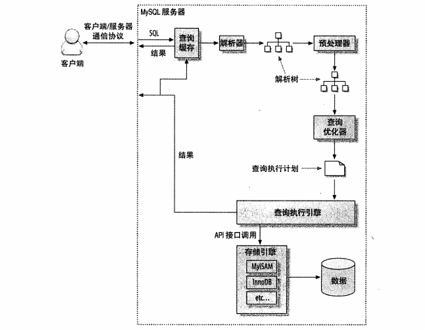

1. 客户端发送一条查询给服务器
2. 服务器先检查查询缓存，如果命中了缓存，则立刻返回存储在缓存中的结果。否则进入下一阶段
3. 服务器端进行SQL解析、预处理，再由优化器生成对应的执行计划。
4. MySQL根据优化器生成的执行计划，调用存储引擎的API执行查询
5. 将结果返回给客户端

更多详细介绍，参照这篇文章：[MySQL架构及组成介绍](https://github.com/asdbex1078/MySQL/blob/master/mysql-optimization/mysql%E6%9E%B6%E6%9E%84%E2%80%94%E2%80%94%E6%9E%B6%E6%9E%84%E5%8F%8A%E4%BB%8B%E7%BB%8D.md#mysql%E6%9E%B6%E6%9E%84%E5%8F%8A%E7%BB%84%E6%88%90%E4%BB%8B%E7%BB%8D)


---


## 2. MySQL本身是有缓存的，为什么不建议使用MySQL本身的缓存，反而使用Redis、Memcache？

关于MySQL缓存介绍，可以参考[这里](https://github.com/asdbex1078/MySQL/blob/master/mysql-optimization/mysql%E6%9E%B6%E6%9E%84%E2%80%94%E2%80%94%E6%9E%B6%E6%9E%84%E5%8F%8A%E4%BB%8B%E7%BB%8D.md#7%E7%BC%93%E5%AD%98%E4%B8%BB%E4%BB%B6caches--buffers)

跟Redis、Memcache相比：

1. 占用内存方面：
   - MySQL缓存占用的是本机服务器的内存，对于InnoDB来说，本身就很吃内存，再加上最外层的缓存机制，及其耗费性能。
   - redis、memcache可以不用跟MySQL同一台服务器，相对来说，为MySQL的高效运行节省了内存

2. 缓存同步问题：
   - MySQL缓存只是在一台机器上的缓存，不会同步到其他机器上，哪怕主从复制也不会同步缓存
   - Redis、memcache可以分布式部署，同步缓存
3. 缓存内容重复问题
   - MySQL中，sql语句的注释，空格，大小写都会被认为是不同的SQL，从而缓存的内容会重复
   - Redis、memcache相对灵活，可以自定义key。如可以根据功能来定义key，缓存内容就不会重复
4. 高可用问题（实际上就是问题2）
   - MySQL缓存不会同步，导致无法高可能
   - Redis、Memcache可以分布式部署，可实现高可用


---


## 3. InnoDB缓冲池里面有缓存，而且经常用，上边不是说MySQL不建议使用缓存吗？

首先，需要考虑一个问题：

- 缓冲 - buffer：在计算机领域，缓冲器指的是缓冲寄存器，它分输入缓冲器和输出缓冲器两种。前者的作用是将外设送来的数据暂时存放，以便处理器将它取走；后者的作用是用来暂时存放处理器送往外设的数据。**有了数控缓冲器，就可以使高速工作的CPU与慢速工作的外设起协调和缓冲作用，实现数据传送的同步。**由于缓冲器接在数据总线上，故必须具有三态输出功能。
- 缓存 - cache：缓存是指可以进行高速[数据](https://baike.baidu.com/item/数据)交换的[存储器](https://baike.baidu.com/item/存储器)，它先于[内存](https://baike.baidu.com/item/内存)与[CPU](https://baike.baidu.com/item/CPU)交换数据，因此[速率](https://baike.baidu.com/item/速率)很快。L1 Cache([一级缓存](https://baike.baidu.com/item/一级缓存))是CPU第一层[高速缓存](https://baike.baidu.com/item/高速缓存)。内置的[L1高速缓存](https://baike.baidu.com/item/L1高速缓存)的容量和结构对CPU的性能影响较大，不过[高速缓冲存储器](https://baike.baidu.com/item/高速缓冲存储器)均由静态RAM组成，结构较复杂，在CPU管芯面积不能太大的情况下，L1级高速缓存的容量不可能做得太大。一般L1缓存的容量通常在32—256KB。L2　Cache([二级缓存](https://baike.baidu.com/item/二级缓存))是CPU的第二层[高速缓存](https://baike.baidu.com/item/高速缓存)，分内部和外部两种芯片。内部的芯片[二级缓存](https://baike.baidu.com/item/二级缓存)运行[速率](https://baike.baidu.com/item/速率)与[主频](https://baike.baidu.com/item/主频)相同，而外部的二级缓存则只有主频的一半。L2[高速缓存](https://baike.baidu.com/item/高速缓存)容量也会影响CPU的性能，原则是越大越好，普通[台式机](https://baike.baidu.com/item/台式机)CPU的L2缓存一般为128KB到2MB或者更高，笔记本、[服务器](https://baike.baidu.com/item/服务器)和[工作站](https://baike.baidu.com/item/工作站)上用CPU的L2高速缓存最高可达1MB-3MB。由于高速缓存的速度越高价格也越贵，故有的计算机系统中设置了两级或多级高速缓存。紧靠[内存](https://baike.baidu.com/item/内存/103614)的一级高速缓存的速度最高，而容量最小，二级高速缓存的容量稍大，速度也稍低。

**一言以蔽之：缓存（cache）是在读取硬盘中的数据时，把最常用的数据保存在内存的缓存区中，再次读取该数据时，就不去硬盘中读取了，而在缓存中读取。缓冲（buffer）是在向硬盘写入数据时，先把数据放入缓冲区,然后再一起向硬盘写入，把分散的写操作集中进行，减少磁盘碎片和硬盘的反复寻道，从而提高系统性能。**

然后，InnoDB架构中，有非常重要的一个部分——**缓冲池**。该缓冲池需要占用服务器内存，且**专用于MySQL的服务器，建议把80%的内存交给MySQL。**

简单看一下缓冲池的作用：

1. **缓存数据页。将本次查询所需要的数据页，加载到缓冲池中，再从缓冲池中查找出最终数据。**
2. **利用缓存的数据页，节省从磁盘获取数据的IO成本。**
3. 所有的增删改查都是在缓冲池中完成，然后脏页刷盘，进行持久化。
4. 自适应哈希索引等等

由上可以看出，缓冲池有一个缓存的功能。这个缓存，是InnoDB自带的，而且经常会用到。该缓存功能并不是MySQL架构中的缓存组件。这是两者最大的区别。

- **MySQL组件中的缓存**：
  1. 所处位置：MySQL架构中的缓存组件
  2. 缓存内容：缓存的是SQL 和 该SQL的查询结果。如果SQL的大小写，格式，注释不一致，则被认为是不同的SQL，重新查询数据库，并缓存一份数据。
  3. 可否关闭：是可以手动关闭，并卸载该组件的。**
- **InnoDB中的缓存**：
  1. 所处位置：InnoDB架构中的缓冲池
  2. 缓存内容：缓存的是所有需要查找的数据，所在的数据页。
  3. 可否关闭：是InnoDB缓冲池自带的功能，**无法关闭，无法卸载**。如果InnoDB的缓冲池被关闭或卸载，则InnoDB直接瘫痪。所以说缓冲池是InnoDB的最重要的一部分。

不建议使用MySQL的缓存是指，不建议使用MySQL架构中的缓存组件，并不是同时否定了InnoDB中的缓存功能。


---


## 4. MySQL存储引擎有哪些？Memory引擎了解过没，什么情况下会用到？TempTable呢？

通过 `show engines;`可查看MySQL中的存储引擎

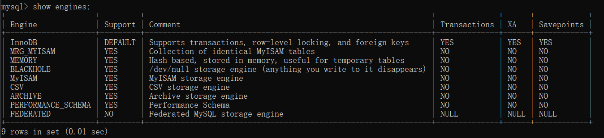

**(1) . InnoDB**：从 MySQL5.5.5 开始成为默认存储引擎。特性：支持外键、事务、行锁、容灾修复数据。

**(2) . MYISAM**：MySQL5.1及之前版本的默认储存引擎，支持全文索引、表锁，无事务，无法容灾修复数据。

**(3) . MEG_MYISAM**：又可称为 MERGE 存储引擎，是多个 MYISAM 表的集合，相当于分表。例如：

```sql
CREATE TABLE `user_1` (
`id` int(11) NOT NULL AUTO_INCREMENT ,
`user_name` varchar(255) NULL ,
`user_sex` varchar(255) NULL ,
`user_birth_date` datetime NULL ,
PRIMARY KEY (`id`)
)ENGINE = MYISAM DEFAULT CHARSET=utf8mb4;

CREATE TABLE `user_2` (
`id` int(11) NOT NULL AUTO_INCREMENT ,
`user_name` varchar(255) NULL ,
`user_sex` varchar(255) NULL ,
`user_birth_date` datetime NULL ,
PRIMARY KEY (`id`)
)ENGINE = MYISAM DEFAULT CHARSET=utf8mb4;

CREATE TABLE `user_3` (
`id` int(11) NOT NULL AUTO_INCREMENT ,
`user_name` varchar(255) NULL ,
`user_sex` varchar(255) NULL ,
`user_birth_date` datetime NULL ,
PRIMARY KEY (`id`)
)ENGINE = MYISAM DEFAULT CHARSET=utf8mb4;

# 插入表数据
INSERT INTO user_1 (user_name,user_sex,user_birth_date) VALUES ('张1', '男', now());
INSERT INTO user_1 (user_name,user_sex,user_birth_date) VALUES ('张2', '男', now());
INSERT INTO user_1 (user_name,user_sex,user_birth_date) VALUES ('张3', '男', now());

INSERT INTO user_2 (user_name,user_sex,user_birth_date) VALUES ('王1', '女', now());
INSERT INTO user_2 (user_name,user_sex,user_birth_date) VALUES ('王2', '女', now());
INSERT INTO user_2 (user_name,user_sex,user_birth_date) VALUES ('王3', '女', now());

INSERT INTO user_3 (user_name,user_sex,user_birth_date) VALUES ('李1', '女', now());
INSERT INTO user_3 (user_name,user_sex,user_birth_date) VALUES ('李2', '女', now());
INSERT INTO user_3 (user_name,user_sex,user_birth_date) VALUES ('李3', '女', now());

2.创建merge表
CREATE TABLE `user_merge` (
`id` int(11) NOT NULL AUTO_INCREMENT ,
`user_name` varchar(255) NULL ,
`user_sex` varchar(255) NULL ,
`user_birth_date` datetime NULL ,
PRIMARY KEY (`id`)
)ENGINE = MERGE UNION = (user_1,user_2,user_3);

# 然后查询该表，select * from user_merge 会把 user1、user2、user3 的所有数据查出来
```

**(4) . BlackHole**：黑洞存储引擎，没有实现任何存储机制，它会丢弃所有插入的数据，不做任何保存。但是服务器会记录 BlackHole 的日志，所以可以用于复制数据到备库，或者只是简单地记录到日志。这种特殊的存储引擎可以在一些特殊的复制架构和日志审核时发挥作用。但会出现很多以外的问题，不建议使用。

**(5) . MEMORY**：基于内存的存储引擎。

​	特征：

- 基于内存的表，服务器重启后，表结构会被保留，但表中的数据会被清空。

- 不需要进行磁盘IO，比 MYISAM 快了一个数量级。

- 表级锁，故并发插入性能较低。

- 每一行是固定的，VARCHAR 列在 memory 存储引擎中会变成 CHAR，可能导致内存浪费。

- 不支持 BLOB 或 TEXT 列，如果sql返回的结果列中包含 BLOB 或 TEXT，就直接采用 MYISAM 存储引擎，在磁盘上建临时表

- 支持哈希索引，B+树索引

  

MEMORY 存储引擎在很多地方可以发挥很好的作用：

- 用于查找或映射表，例如邮编和州名的映射表
- 用于缓存周期性聚合数据的结果
- **用于保存数据分析中产生的中间结果。即SQL执行过程中用到的临时表**
- **监控MySQL内存中的执行情况，例如：information_schema 库下的表基本都是 memory 存储引擎，监控InnoDB缓冲池中page(INNODB_BUFFER_PAGE表)，InnoDB缓冲池状态(INNODB_BUFFER_POOL_STATS表)、InnoDB缓存页淘汰记录(INNODB_BUFFER_PAGE_LRU表)、InnoDB锁等待(INNODB_LOCK_WAITS表)、InnoDB锁信息(INNODB_LOCKS表)、InnoDB中正在执行的事务(INNODB_TRX表)等**

MEMORY 存储引擎默认 hash 索引，故等值查询特别快。同时也支持B+树索引。虽然查询速度特别快，但依旧无法取代传统的磁盘建表。

**(6) . CSV**：该引擎支持将普通的 CSV 文件作为MySQL的表处理，但不支持索引。CSV 储存引擎可以在数据库运行时拷入和拷出文件。可以将 Excel 等电子文件中的数据转化为 CSV 文件，然后复制到MySQL数据目录下，就能在MySQL中打开和使用。同样，MySQL将数据写入 CSV 引擎表后，其他外部程序就可以读取 CSV 格式的数据，作为数据交换的机制，十分有用。

**(7) . ARCHIVE**：只支持 INSERT 和 SELECT 操作。

**(8) . PERFORMANCE_SCHEMA**：用于监控MySQL server在一个较低级别的运行过程中的资源消耗、资源等待等情况，它具有以下特点：

1. 提供了一种在数据库运行时实时检查server的内部执行情况的方法。performance_schema 数据库中的表使用performance_schema存储引擎。该数据库主要关注数据库运行过程中的性能相关的数据，与information_schema不同，information_schema主要关注server运行过程中的元数据信息。
2. performance_schema通过监视server的事件来实现监视server内部运行情况， “事件”就是server内部活动中所做的任何事情以及对应的时间消耗，利用这些信息来判断server中的相关资源消耗在了哪里?一般来说，事件可以是函数调用、操作系统的等待、SQL语句执行的阶段(如sql语句执行过程中的parsing 或 sorting阶段)或者整个SQL语句与SQL语句集合。事件的采集可以方便的提供server中的相关存储引擎对磁盘文件、表I/O、表锁等资源的同步调用信息。
3. performance_schema中的事件与写入二进制日志中的事件(描述数据修改的events)、事件计划调度程序(这是一种存储程序)的事件不同。performance_schema中的事件记录的是server执行某些活动对某些资源的消耗、耗时、这些活动执行的次数等情况。
4. performance_schema中的事件只记录在本地server的performance_schema中，其下的这些表中数据发生变化时不会被写入binlog中，也不会通过复制机制被复制到其他server中。
5. 当前活跃事件、历史事件和事件摘要相关的表中记录的信息。能提供某个事件的执行次数、使用时长。进而可用于分析某个特定线程、特定对象(如mutex或file)相关联的活动。
6. performance_schema存储引擎使用server源代码中的“检测点”来实现事件数据的收集。对于performance_schema实现机制本身的代码没有相关的单独线程来检测，这与其他功能(如复制或事件计划程序)不同。
7. 收集的事件数据存储在performance_schema数据库的表中。这些表可以使用SELECT语句查询，也可以使用SQL语句更新performance_schema数据库中的表记录(如动态修改performance_schema的setup_*开头的几个配置表，但要注意：配置表的更改会立即生效，这会影响数据收集)（也可以通过SQL语句来控制那些事件被收集）。
8. performance_schema的表中的数据不会持久化存储在磁盘中，而是保存在内存中，一旦服务器重启，这些数据会丢失(包括配置表在内的整个performance_schema下的所有数据)。
9. MySQL支持的所有平台中事件监控功能都可用，但不同平台中用于统计事件时间开销的计时器类型可能会有所差异。

performance_schema实现机制遵循以下设计目标：

- 启用performance_schema不会导致server的行为发生变化。例如，它不会改变线程调度机制，不会导致查询执行计划(如EXPLAIN)发生变化。
- 启用performance_schema之后，server会持续不间断地监测，开销很小。不会导致server不可用。
- 在该实现机制中没有增加新的关键字或语句，解析器不会变化。
- 即使performance_schema的监测机制在内部对某事件执行监测失败，也不会影响server正常运行。
- 如果在开始收集事件数据时碰到有其他线程正在针对这些事件信息进行查询，那么查询会优先执行事件数据的收集，因为事件数据的收集是一个持续不断的过程，而检索(查询)这些事件数据仅仅只是在需要查看的时候才进行检索。也可能某些事件数据永远都不会去检索。

> 更多关于 performance_schema 的使用参考[这里](https://github.com/asdbex1078/MySQL/blob/master/mysql-optimization/B.%E9%BB%98%E8%AE%A4%E5%BA%93-performance%20schema.md)

**(9) . TempTable**：MySQL8.0之后的存储引擎。

- 8.0之前，内存临时表用**Memory**引擎创建，但假如字段中有BLOB或TEXT,或结果太大，就会转用MYISM在**磁盘上**建表
- 8.0之后内存临时表由MEMORY引擎更改为TempTable引擎，相比于前者，后者**支持以变长方式存储VARCHAR，VARBINARY等变长字段**。从MySQL 8.0.13开始，**TempTable引擎**支持BLOB字段。如果超过内存表大小，则用InnoDB建表。

知识点补充：

1. 当列中有VARCHAR类型时，MySQL将他读取到内存中，会给他分配定义该VARCHAR时最大的空间，所以定义好VARCHAR的长度非常重要
2. 在磁盘上进行建临时表时，5.7之前默认使用MYISAM建磁盘表。5.7版本，可以让用户自己选择，默认使用InnoDB建磁盘临时表。8.0以后不再让用户选择，直接用InnoDB

> 该问题答案参考自《高性能MySQL 第三版》


---


## 5.MySQL是一个单进程多线程架构，分别有哪些线程？作用是什么？

答案详见[这里](https://github.com/asdbex1078/MySQL/blob/master/mysql-storage-engines/innodb/1.0.MySQL%E6%9E%B6%E6%9E%84%E5%88%B0innoDB%E6%9E%B6%E6%9E%84.md#innodb%E7%9A%84%E4%B8%80%E4%B8%AA%E5%A4%9A%E7%BA%BF%E7%A8%8B%E6%A8%A1%E5%9E%8B)


---


## 6.MYSQL优化器是怎么运行的，为什么会做出错误决定，使用错误的索引？怎么解决？

在问题1中，已经涉及到了优化器的运行。此处不再赘述，查看[MySQL架构及组成介绍](https://github.com/asdbex1078/MySQL/blob/master/mysql-optimization/mysql%E6%9E%B6%E6%9E%84%E2%80%94%E2%80%94%E6%9E%B6%E6%9E%84%E5%8F%8A%E4%BB%8B%E7%BB%8D.md#mysql%E6%9E%B6%E6%9E%84%E5%8F%8A%E7%BB%84%E6%88%90%E4%BB%8B%E7%BB%8D)

**优化器为什么会做出错误决定，使用了不太对的索引？**这里错误决定分两类，第一，彻底错误。第二，基于成本最低，但执行速度不是最快。

- 第一种情况：由于InnoDB的 MVCC 功能和随机采样方式，默认随机采取8个数据页，当做总体数据。以部分代表整体，本来就有错误的风险。加上数据不断地添加过程中，索引树可能会分裂，结果更加不准确。
  解决方案：	

  1. 执行 ANALYZE TABLE <tableName> ,可以重新构建索引，使索引树不过于分裂。
  2. 调整参数，加大InnoDB采样的页数，页数越大越精确，但性能消耗更高。一般不建议这么干

- 第二种情况：在优化阶段，会对表中所有索引进行对比，优化器基于成本的原因，选择成本最低的索引，所以会错过最佳索引。带来的问题便是，执行速度很慢。
  解决方案：

  ​	第一步：通过explain查看执行计划，结合sql条件查看可以利用哪些索引。

  ​	第二步：使用 `force index(indexName)`强制走指定索引。弊端就是后期若索引名发生改变，或索引被删除，该sql语句需要调整


---


## 7. 怎么理解MySQL对于SQL的执行是基于成本模型的？

总结一下几句很熟悉的话：

MySQL是基于成本模型的。成本高的不一定执行速度快。

那么夺命连环问来了：

1. [那么什么是成本？什么是成本模型？](https://github.com/asdbex1078/MySQL/blob/master/mysql-optimization/MySQL%E6%9E%B6%E6%9E%84%E2%80%94%E2%80%94%E6%88%90%E6%9C%AC%E6%A8%A1%E5%9E%8B.md#%E4%BC%98%E5%8C%96%E5%99%A8%E6%88%90%E6%9C%AC%E6%A8%A1%E5%9E%8B)

2. [成本是怎么计算出来的？我该如何查看成本？](https://github.com/asdbex1078/MySQL/blob/master/mysql-optimization/MySQL%E6%9E%B6%E6%9E%84%E2%80%94%E2%80%942.%E6%80%8E%E4%B9%88%E6%9F%A5%E7%9C%8B%E6%88%90%E6%9C%AC%E5%80%BC.md)

3. 优化器怎么选取最佳索引的？


---

## 8. MySQL中有哪些文件？分别有什么用？——未完

---

## 9. 从性能和安全方面，MySQL是怎么做的？——未完

性能

- InnoDB缓冲池
  		LRU
    		Change Buffer
    		自适应哈希索引
    		预读
    		刷新临近页
- 索引
- 可插拔的存储引擎
- slow log

安全

- Double Write
  - 为什么数据页需要Double Write，而日志却不需要？
  - Double Write总大小为2M，那我一次刷新的总量超过2M，会不会溢出？怎么办？
    	跟后台刷新脏页线程有关，一次最多刷新100个脏页，DW中有128个页的空间，完全够用。
  - 保证事务的持久性
- 日志方面bin log
  - redo log    保证事务的持久性
  - undo log    保证事务的一致性
  - query log
- 监控方面
  - performance schema库
  - information schema库
  - 如何监控innodb?
  - 如何监控MySQL？

---


# （二）schema问题

## 1. MySQL中，主键自增ID用完了会发生什么问题？该怎么解决？

**发生的问题**：

首先区分存储引擎是什么。

- 如果是 InnoDB ，则内存表对象将包含一个称为自动增量计数器的特殊计数器，该计数器在为该列分配新值时使用。当使用的数据类型达到最大值后，(例如int 最大值2147483647)，下次插入值时，依旧以该最大值进行插入。所以会报错

  ```sql
  1062 - Duplicate entry '2147483647' for key 'tableName.PRIMARY'
  ```

  > 1062：字段值重复，入库失败
  
- 如果是 MYISAM 存储引擎，主键自增ID达到指定类型的最大值后，会报错 

  ```sql
  1264 - Out of range value for column '主键ID' at row 1
  ```

  为什么会不一样？查到了是由于sql_mode造成的。

  1. **sql_mode**是一组mysql支持的基本语法及校验规则

  2. 此时，修改sql_mode，本例以MySQL8.0为主，关键地方是一样的:

     ```sql
     mysql> select @@sql_mode;
     +-----------------------------------------------------------------------------------------------------------------------+
     | @@sql_mode                                                                                                            |
     +-----------------------------------------------------------------------------------------------------------------------+
     | ONLY_FULL_GROUP_BY,STRICT_TRANS_TABLES,NO_ZERO_IN_DATE,NO_ZERO_DATE,ERROR_FOR_DIVISION_BY_ZERO,NO_ENGINE_SUBSTITUTION |
     +-----------------------------------------------------------------------------------------------------------------------+
     1 row in set (0.02 sec)
     
     mysql> set @@sql_mode = 'ONLY_FULL_GROUP_BY,NO_ZERO_IN_DATE,NO_ZERO_DATE,ERROR_FOR_DIVISION_BY_ZERO,NO_ENGINE_SUBSTITUTION';
     Query OK, 0 rows affected (0.00 sec)
     
     # 再次执行插入sql操作，（myisam引擎，表中已有主键ID最大值）
     # 报错跟 InnoDB 表一致
     1062 - Duplicate entry '2147483647' for key 'tableName.PRIMARY'
     ```

     

  3. 去掉 sql_mode 中的 `STRICT_TRANS_TABLES`，发现myisam报错与 InnoDB一致。

  4. `STRICT_TRANS_TABLES`:为事务性存储引擎以及可能的情况下为非事务性存储引擎启用严格的SQL模式。
     innodb存储引擎（支持事务）
     myisam存储引擎（不支持事务）
     对于innodb存储引擎来说当设置sql_mode有该值时，当发现插入数据无法正常插入，会报错，并且回滚所有参数（假如一个插入操作往数据表中插入10行数据，但是在第五行数据不能插入，此时会终止插入操作并且会回滚插入成功的数据）
     对于myisam存储引擎：当插入数据是第一行无法插入时，**报错并且回滚插入数据**。当插入的数据不是第一行无法插入时，此时**MySQL将无效值转换为该列的最接近的有效值，并插入调整后的值。如果缺少值，MySQL将为列数据类型插入隐式默认值。无论哪种情况，MySQL都会生成警告而不是错误，并继续处理该语句。**

     ***也就是说，开启该参数，sql模式比较严格，MAX_INT + 1 触发了该模式。关闭之后，以 MAX_INT 方式插入，造成键值重复。***

  5. 关于更多sql_mode，参考官网：[server sql mode](https://dev.mysql.com/doc/refman/8.0/en/sql-mode.html#sql-mode-strict)


**其次解决方案**：

1. 常规情况下自增主键的数据类型：

   |     类型     |  大小   |                     范围（有符号）                      |         范围（无符号）          |    用途    |
   | :----------: | :-----: | :-----------------------------------------------------: | :-----------------------------: | :--------: |
   |   TINYINT    | 1 byte  |                       (-128，127)                       |            (0，255)             |  小整数值  |
   |   SMALLINT   | 2 bytes |                    (-32 768，32 767)                    |           (0，65 535)           |  大整数值  |
   |  MEDIUMINT   | 3 bytes |                 (-8 388 608，8 388 607)                 |         (0，16 777 215)         |  大整数值  |
   | INT或INTEGER | 4 bytes |             (-2 147 483 648，2 147 483 647)             |       (0，4 294 967 295)        |  大整数值  |
   |    BIGINT    | 8 bytes | (-9,223,372,036,854,775,808，9 223 372 036 854 775 807) | (0，18 446 744 073 709 551 615) | 极大整数值 |

   常用的是 int，且是有符号的 int ，所以范围 是 (-2 147 483 648，2 147 483 647)，可以尝试修改字段为无符号，`UNSIGNED`

   可扩大约二倍的范围。加上MySQL一张表，数据量过亿便性能变差，所以有符号的int是完全够用的。

2. 使用更大的数据类型，BIGINT 

3. 分库分表，根据主键ID进行分表，分表策略可以自定义，如按区间分表，按值取模分表等。

4. 将主键id变成 varchar 类型，失去了自增属性

5. 采用分布式ID，如雪花算法等，转成varchar类型绝对够用


---


## 2. count(1) 和 count(*) 相比有什么差异？与count(列名) 相比呢？

- **1️⃣. 对于 InnoDB 来说**

  1. count(1) 和 count(\*) 一般用来统计全表数据量或指定条件的总数量，包含null值。count(列名)只会统计该列不为null的总数。
     **所以数量上count(1) = count(*) >= count(列名)。**
  2. 从MySQL5.7开始，提供了追踪优化器功能。优化器在优化SQL之前，即准备阶段，就把 count(\*) 格式化成 count(0)。(MySQL5.6、5.7、8.0官网也有明确说明，性能是一样的)
     但是，count(列名) 并没有优化成其他方式，而且要去掉null值，所以占用了一部分性能。
     **所以性能上 count(1) = count(*) > count(列名有索引) > count(列名无索引)**

  **案例：**

  通过案例来测试一下count(*)，count(1)，count(field)的性能差异，MySQL版本为5.7.19，测试表是一张sysbench生成的表，表名sbtest1，总记录数2411645，如下：

  ```sql
  CREATE TABLE sbtest1 (
  id int(11) NOT NULL AUTO_INCREMENT,
  k int(11) DEFAULT NULL,
  c char(120) NOT NULL DEFAULT '',
  pad char(60) NOT NULL DEFAULT '',
  PRIMARY KEY (id),
  KEY k_1 (k)
  ) ENGINE=InnoDB;
  
  测试SQL语句：
  select count(*) from sbtest1;
  select count(1) from sbtest1;
  select count(id) from sbtest1;
  select count(k) from sbtest1;
  select count(c) from sbtest1;
  select count(pad) from sbtest1;
  
  针对count()、count(1)和count(id)，加了强制走主键的测试，如下：
  select count() from sbtest1 force index(primary);
  select count(1) from sbtest1 force index(primary);
  select count(id) from sbtest1 force index(primary);
  
  ```

  **汇总测试结果：**对不同的测试SQL，收集了profile，发现主要耗时都在Sending data这个阶段，记录Sending data值。

  | 类型                | 耗时(s) | 索引        | Sending data耗时(s) |
  | :------------------ | :------ | :---------- | :------------------ |
  | count(*)            | 0.47    | k_1         | 0.463624            |
  | count(1)            | 0.46    | k_1         | 0.463242            |
  | count(id)           | 0.52    | k_1         | 0.521618            |
  | count(*)强制走主键  | 0.54    | primay key  | 0.538737            |
  | count(1)强制走主键  | 0.55    | primary key | 0.545007            |
  | count(id)强制走主键 | 0.60    | primary key | 0.598975            |
  | count(k)            | 0.53    | k_1         | 0.529366            |
  | count(c)            | 0.81    | NULL        | 0.813918            |
  | count(pad)          | 0.76    | NULL        | 0.762040            |

  **结果分析：**

  1. 从以上测试结果来看，count(\*)和count(1)性能基本一样，默认走二级索引(k_1)，性能最好，这也验证了count(*)和count(1)在InnoDB内部处理方式一样。
  2. count(id) 虽然也走二级索引(k_1)，但是性能明显低于count(\*)和count(1)，因为要处理不为 null 的值。
  3. 强制走主键索引时，性能反而没有走更小的二级索引好，InnoDB存储引擎是索引组织表，行数据在主键索引的叶子节点上，走主键索引扫描时，处理的数据量比二级索引更多，所以性能不及二级索引。
  4. count(c)和count(pad)没有走索引，性能最差，但是明显count(pad)比count(c)好，因为pad字段类型为char(60)，小于字段c的char(120)，尽管两者性能垫底，但是字段小的性能相对更好些。

  

  >  count(*)延伸
  >
  > - 在5.7.18版本之前，InnoDB处理select count(*) 是通过扫描聚簇索引，来获取总记录数。
  > - 从5.7.18版本开始，InnoDB扫描一个最小的可用的二级索引来获取总记录数，或者由SQL hint来告诉优化器使用哪个索引。如果二级索引不存在，InnoDB将会扫描聚簇索引。
  >
  > 执行select count(*)在大部分场景下性能都不会太好，尤其是表记录数特别大的情况下，索引数据不在buffer pool里面，需要频繁的读磁盘，性能将更差。
  >
  > 
  >
  >  count(*)优化思路
  >
  > 1. 一种优化方法，是使用一个统计表来存储表的记录总数，在执行DML操作时，同时更新该统计表。这种方法适用于更新较少，读较多的场景，而对于高并发写操作，性能有很大影响，因为需要并发更新热点记录。
  > 2. 如果业务对count数量的精度没有太大要求，可使用show table status中的行数作为近似值。
  >
  > 
  >
  > 该案例来源于：[MySQL count(*),count(1),count(field)区别](https://www.mytecdb.com/blogDetail.php?id=81)

  ---

  **2️⃣. 对于 MYISAM 来说**

  1. Myisam表中，只执行 select count(\*) from table，没有任何条件，没有任何其他返回值。则会很快返回总行数。
     因为Myisam引擎存储了精确的行数，并且可以非常快速地返回总行数。当只有在第一列定义为NOT NULL时，COUNT(1)才会跟count(*)一样。
  2. MYISAM 的count(\*) 性能高于 InnoDB的count(*).由于 MVCC 多版本并发控制，InnoDB中不能保存精确的总行数

---


## 3.谈一下数据库的三大范式？为什么需要反范式？

**三大范式：**

- 1NF:字段不可分;
  原子性，字段不可再分，否则就不是关系数据库;

- 2NF:有主键，非主键字段依赖主键;
  唯一性，一个表只说明一个事情;

- 3NF:非主键字段不能相互依赖;
  每列都与主键有直接关系，不存在传递依赖;

**第一范式（1NF）**

即表的列具有原子性，不可再分解。即列的信息不能分解。只要数据库是关系型数据库(mysql/oracle/db2/informix/sysbase/sql server)，就**必须满足1NF**。**数据库表的每一列都是不可分割的原子数据项，而不能是集合，数组，记录等非原子数据项。如果实体中的某个属性有多个值时，必须拆分为不同的属性 。通俗理解即一个字段只存储一项信息。**

如下图所示，表一是严格遵守第一范式。表二已经不是关系型数据库了，用户信息这一列不是原子的，还能拆分成两个列。


- 关系型数据库: 
  - mysql
  - oracle
  - db2
  - informix
  - sysbase
  - sql server 

- 非关系型数据库: (特点: 面向对象或者集合) 
  - NoSql数据库: MongoDB/redis(特点是面向文档，例如上图表二，就属于文档型建表特征)

**第二范式（2NF）**

**第二范式（2NF）是在第一范式（1NF）的基础上建立起来的，即满足第二范式（2NF）必须先满足第一范式（1NF）**。第二范式（2NF）要求数据库表中的每个实例或行**必须可以被唯一地区分**。为实现区分通常需要我们设计一个主键来实现(这里的主键不包含业务逻辑)。

即满足第一范式前提，当存在多个主键的时候，才会发生不符合第二范式的情况。比如有两个主键，不能存在这样的属性，它只依赖于其中一个主键，这就是不符合第二范式。**通俗理解是任意一个字段都只依赖表中的同一个字段**。（涉及到表的拆分）

看下面的学生选课表：

| 学号  | 课程 | 成绩 | 课程学分 |
| :---: | :--: | :--: | :------: |
| 10001 | 数学 | 100  |    6     |
| 10001 | 语文 |  90  |    2     |
| 10001 | 英语 |  85  |    3     |
| 10002 | 数学 |  90  |    6     |
| 10003 | 数学 |  99  |    6     |
| 10004 | 语文 |  89  |    2     |

表中主键为 （学号，课程），我们可以表示为 (学号，课程) -> (成绩，课程学分)， 表示所有非主键列 (成绩，课程学分)都依赖于主键 (学号，课程)。 但是，表中还存在另外一个依赖：（课程）->(课程学分）。这样非主键列 ‘课程学分‘ 依赖于部分主键列 ’课程‘， 所以上表是不满足第二范式的。

我们把它拆成如下2张表：

学生选课表：

| 学号  | 课程 | 成绩 |
| :---: | :--: | :--: |
| 10001 | 数学 | 100  |
| 10001 | 语文 |  90  |
| 10001 | 英语 |  85  |
| 10002 | 数学 |  90  |
| 10003 | 数学 |  99  |
| 10004 | 语文 |  89  |

课程信息表：

| 课程 | 课程学分 |
| :--: | :------: |
| 数学 |    6     |
| 语文 |    3     |
| 英语 |    2     |

那么上面2个表，学生选课表主键为（学号，课程），课程信息表主键为（课程），表中所有非主键列都完全依赖主键。不仅符合第二范式，还符合第三范式。

 

再看这样一个学生信息表：

| 学号  |  姓名  | 性别 | 班级 |
| :---: | :----: | :--: | :--: |
| 10001 |  张三  |  男  | 一班 |
| 10002 |  李四  |  男  | 一班 |
| 10003 |  王五  |  男  | 二班 |
| 10004 | 张小三 |  男  | 二班 |

上表中，主键为：（学号），所有字段 （姓名，性别，班级）都依赖与主键（学号），不存在对主键的部分依赖。所以是满足第二范式。

 

**第三范式（3NF）**

**满足第三范式（3NF）必须先满足第二范式（2NF）。简而言之，第三范式（3NF）要求一个数据库表中不包含已在其它表中已包含的非主键字段**。就是说，**表的信息，如果能够被推导出来，就不应该单独的设计一个字段来存放(能尽量外键join就用外键join)**。**很多时候，我们为了满足第三范式往往会把一张表分成多张表**。

即满足第二范式前提，如果某一属性依赖于其他非主键属性，而其他非主键属性又依赖于主键，那么这个属性就是间接依赖于主键，这被称作传递依赖于主属性。 通俗解释就是一张表最多只存两层同类型信息。

如下图所示，商品表是被冗余过的，严格按照三范式，需要拆分成三张表。


**反三范式**

没有冗余的数据库未必是最好的数据库，有时为了提高运行效率，提高读性能，就必须降低范式标准，适当保留冗余数据。

具体做法是： 在概念数据模型设计时遵守第三范式，降低范式标准的工作放到物理数据模型设计时考虑。降低范式就是增加字段，减少了查询时的关联，提高查询效率，因为在数据库的操作中查询的比例要远远大于DML的比例。但是反范式化一定要适度，并且在原本已满足三范式的基础上再做调整的。

**范式的优点和缺点：**

当为性能问题而寻求帮助时，经常会被建议对schema进行范式化设计，尤其是写密集的场景。有以下几个优点：

- 范式化的更新操作通常比反范式化要快。
- 当数据较好地范式化时，就只有很少或者没有重复数据，所以只需要修改更少的数据。
- 范式化的表通常更小，可以更好的放在内存里，所以执行操作会更快。
- 很少有多余的数据意味着检索列表数据时更少需要DINSTINCT或者GROUP BY语句

缺点：

- 范式化设计的表的缺点是通常**需要关联**。稍微复杂一些的查询语句在符合范式的表上都可能需要至少一次关联，也许更多。**这不但代价高昂，也可能使一些索引策略无效**

**反范式的优点和缺点：**

优点：

- 可以避免关联，因为所有的数据几乎都可以在一张表上显示，减少关联查询带来的成本；
- 可以设计有效的索引；

缺点：

- 表格内的冗余较多，删除数据时候会造成表有些有用的信息丢失。
- 有时候冗余的字段忘了更新，会导致信息偏差（可以用触发器解决）

**混用范式和反范式**

严格遵守范式和反范式都有各自的优缺点，所以在现实中，需要混用范式和反范式，最常见的反范式化数据的方法就是复制或缓存，在不同的表中冗余相同的特定列。可以用触发器来级联更新冗余值。


---


## 4.MySQL中字段有哪些类型？

引入一位大神博客，答案参考[这里](https://github.com/crisxuan/bestJavaer/blob/master/mysql/mysql-datatype.md#mysql-%E6%95%B0%E6%8D%AE%E7%B1%BB%E5%9E%8B)


---

## 5.VARCHAR 和 CHAR有什么区别？除了空格的差异还有其他吗？

1. 长度是否可变：

   - varchar：可变长，有几个字符存储几个。
   - char：不可变长。不足指定个数，尾部用空格填满。

2. 尾部空格问题：

   - varchar：MySQL5.0及更高版本会保留尾部空格，4.1或更老的版本会去除尾部空格。
   - char：会去除尾部的空格。这个时候问题来了，第1点说用空格补位，这里又说去掉末尾空格。是不是很矛盾？查询时，返回的值去掉了尾部空格，但底层存储，是带空格的，因为开辟的空间就是那么大。

   ```sql
   # 一下案例显示 char 显示的时候会去掉尾部空格
   mysql> create table vctest1 (ch char(6));
   Query OK, 0 rows affected (0.05 sec)
   
   mysql> insert into vctest1 values("abc"),("abc  "),("  abc");
   Query OK, 3 rows affected (0.01 sec)
   Records: 3  Duplicates: 0  Warnings: 0
   
   mysql> select length(ch) from vctest1;
   +------------+
   | length(ch) |
   +------------+
   |          3 |
   |          3 |
   |          5 |
   +------------+
   3 rows in set (0.05 sec)
   
   mysql> select concat("'",ch,"'") as ch from vctest1;
   +---------+
   | ch      |
   +---------+
   | 'abc'   |
   | 'abc'   |
   | '  abc' |
   +---------+
   3 rows in set (0.06 sec)
   ```

   

3. 空间占用情况：

   - varchar：在表中存储数据时，只占用必要的空间。存储字节数 = 数据值的字节和 + 1字节或2个字节。是因为按照可能的数据大小，分为0 - 255(28)、256 - 65535(216)，刚好对应1字节和2字节。另外数据值得字节与编码有关。**故一定程度上，varchar比char节省空间，但不绝对，当MySQL使用 ROW_FORMAT=FIXED 时，每一行使用定长存储。**
   - char：根据定义字符串的长度分配空间。存储字节数 = 数据值的字节和 + 补位空格数

4. 是否使用额外的空间：

   - varchar：**它需要 1~2个额外字节表示字符串长度**。当列的最大长度 <= 255字节时，使用1个字节；否则使用两个字节。
   - char：定义多少就是多少，不需要额外空间

   ```sql
   # 验证 VARCHAAR 是否占两个字节？验证是否与字符集编码有关？
   # MySQL中，限制每一行大小为 65535 字节。不论存储引擎是什么。latin1中一个字符为一个字节
   
   mysql> CREATE TABLE t (a VARCHAR(65535) NOT NULL) ENGINE=InnoDB CHARACTER SET latin1;
   1118 - Row size too large. The maximum row size for the used table type, not counting BLOBs, is 65535. This includes storage overhead, check the manual. You have to change some columns to TEXT or BLOBs
   
   mysql> CREATE TABLE t (a VARCHAR(65534) NOT NULL) ENGINE=InnoDB CHARACTER SET latin1;
   1118 - Row size too large. The maximum row size for the used table type, not counting BLOBs, is 65535. This includes storage overhead, check the manual. You have to change some columns to TEXT or BLOBs
   
   mysql> CREATE TABLE t (a VARCHAR(65533) NOT NULL) ENGINE=InnoDB CHARACTER SET latin1;
   Query OK, 0 rows affected (0.04 sec)
   
   # 请注意，以上的字符集是 latin1，为什么不用utf-8? 因为每个字符最大可占用3个字节，行最大长度为65535字节，那么该列可设置的最大列大小为65535 ÷ 3 ≈ 21844（向下取整）
   mysql> CREATE TABLE tT (a VARCHAR(65535) NOT NULL) ENGINE=InnoDB CHARACTER SET utf8;
   1074 - Column length too big for column 'a' (max = 21845); use BLOB or TEXT instead
   
   mysql> CREATE TABLE tT (a VARCHAR(21845) NOT NULL) ENGINE=InnoDB CHARACTER SET utf8;
   1118 - Row size too large. The maximum row size for the used table type, not counting BLOBs, is 65535. This includes storage overhead, check the manual. You have to change some columns to TEXT or BLOBs
   
   mysql> CREATE TABLE tT (a VARCHAR(21844) NOT NULL) ENGINE=InnoDB CHARACTER SET utf8;
   Query OK, 0 rows affected (0.03 sec)
   
   # 请注意，以上列全部为 NOT NULL，如果列不指定 NOT NULL，则再需要一个字节来存储该列是否为null ！！！
   # 假设一张表中存在N个可空字段，NULL标识位需要⌈ N / 8 ⌉ \lceil{N/8}\rceil⌈N/8⌉ （向上取整）个字节。此时整行可用于数据存储的空间只有65535 − ⌈ N / 8 ⌉ 65535 - \lceil{N/8}\rceil65535−⌈N/8⌉个字节。
   ```

   更多关于空间、行大小限制，查看[这里](https://github.com/asdbex1078/MySQL/blob/master/mysql-optimization/MySQL%E4%BC%98%E5%8C%96%E2%80%94%E2%80%94%E8%A1%8C%E5%A4%A7%E5%B0%8F%E8%A2%AB%E9%99%90%E5%88%B6%E7%9A%84%E4%BE%8B%E5%AD%90.md)

5. 稳定性 - 会不会拆开存储：

   - VARCHAR：由于是变长，导致更新之后，可能会比以前更长。超过一定字节后，称为“溢出”，InnoDB不同的行格式会有不同的处理机制。`Compact`和`Reduntant`只保存前786多字节，然后用20字节的指针指向溢出的数据页。
   - CHAR：最大长度只能是 255。否则会报错
     `1074 - Column length too big for column 'b' (max = 255); use BLOB or TEXT instead`

   详细可参考[这里](https://github.com/zhangyachen/zhangyachen.github.io/issues/96)

6. varchar一定是按照真实数据存储的大小吗？
   在MySQL8.0之前，内存临时表的存储引擎使用的是 MEMORY，而MEMORY存储引擎只支持定长字符串。故sql在执行过程中需要内存临时表来排序、储存临时结果或其他操作时，给定的 VARCHAR 多大，就需要分配多大的空间。这点非常重要。故 VARCHAR 大小需要仔细考量。

> 这道题的答案主要采自《高性能MySQL 第三版》和 [这里](https://learn.blog.csdn.net/article/details/103341778)，作为延伸阅读，感兴趣可以阅读一下~

---

## 6.BLOB 和 TEXT 有什么不好的地方？该怎么解决？

BLOB 和 TEXT 是为了存储很大的数据而设计的字符串类型。其中 BLOB 是二进制的，TEXT 是字符方式的。

“不太好”的地方：

1. 存储方式：
   	当 BLOB TEXT值太大的时候，InnoDB会找专门的“外部”存储区域进行存储，行内需要1~4个字节的指针，指向真实数据位置。这点类似于很大的 VARCHAR .

2. 排序方面：

   - BLOB 不能进行排序，没有字符集。

   - TEXT 可以排序，但不能对全部内容进行排序，只能排序指定的前几个字符。或者使用 ORDER BY SUBSTRING(cloum, length)

     ```sql
     mysql> show variables like 'max_sort_length';
     +-----------------+-------+
     | Variable_name   | Value |
     +-----------------+-------+
     | max_sort_length | 1024  |
     +-----------------+-------+
     1 row in set (0.03 sec)
     ```

3. 建立索引方面：
    都不能对全部长度的字符串建立索引。

4. 最重要的一点：性能损耗
   在MySQL8.0以前，内存中的临时表，用的是 MEMORY 存储引擎。但是 MEMORY 存储引擎不支持 BLOB 和 TEXT ，导致即使BLOB 和 TEXT 字段长度不大，内存中足以放得下临时数据，但MySQL一定会选择在磁盘建临时表。这会造成很大的内存损耗。

   ```sql
   mysql> show variables like 'max_heap_table_size';
   +---------------------+----------+
   | Variable_name       | Value    |
   +---------------------+----------+
   | max_heap_table_size | 16777216 |
   +---------------------+----------+
   1 row in set (0.03 sec)
   
   mysql> show variables like 'tmp_table_size';
   +----------------+----------+
   | Variable_name  | Value    |
   +----------------+----------+
   | tmp_table_size | 46137344 |
   +----------------+----------+
   1 row in set (0.03 sec)
   ```

   解决方案：使用 SUBSTRING(cloum, length)截取，转化为字符串，就可以在内存中建表。但是也得在规定的内存临时表大小范围内。

> 该问题来源，参考自：《高性能MySQL 第三版》

---

## 7. TIMESTAMP和DATETIME有什么区别？——未完


---

## 8. MySQL中，一个数据页只有16K，当一个字段特别大，超过16K了，怎么存储？

**VARCHAR(M)最多能存储的数据**

我们知道对于`VARCHAR(M)`类型的列最多可以占用`65535`个字节。其中的`M`代表该类型最多存储的字符数量，如果我们使用`ascii`字符集的话，一个字符就代表一个字节，我们看看`VARCHAR(65535)`是否可用：

```sql
mysql> CREATE TABLE varchar_size_demo(
    ->     c VARCHAR(65535)
    -> ) CHARSET=ascii ROW_FORMAT=Compact;
ERROR 1118 (42000): Row size too large. The maximum row size for the used table type, not counting BLOBs, is 65535. This includes storage overhead, check the manual. You have to change some columns to TEXT or BLOBs
mysql>
```

从报错信息里可以看出，`MySQL`对一条记录占用的最大存储空间是有限制的，除了`BLOB`或者`TEXT`类型的列之外，其他所有的列（不包括隐藏列和记录头信息）占用的字节长度加起来不能超过`65535`个字节。所以`MySQL`服务器建议我们把存储类型改为`TEXT`或者`BLOB`的类型。这个`65535`个字节除了列本身的数据之外，还包括一些`storage overhead`，比如说我们为了存储一个`VARCHAR(M)`类型的列，需要占用3部分存储空间：

- 真实数据
- 真实数据占用字节的长度
- `NULL`值标识，如果该列有`NOT NULL`属性则可以没有这部分存储空间

如果该`VARCHAR`类型的列没有`NOT NULL`属性，那最多只能存储`65532`个字节的数据，因为真实数据的长度需要占用2个字节，`NULL`值标识需要占用1个字节：

```sql
mysql> CREATE TABLE varchar_size_demo(
    ->      c VARCHAR(65532)
    -> ) CHARSET=ascii ROW_FORMAT=Compact;
Query OK, 0 rows affected (0.02 sec)
```

如果`VARCHAR`类型的列有`NOT NULL`属性，那最多只能存储`65533`个字节的数据，因为真实数据的长度需要占用2个字节，不需要`NULL`值标识：

```sql
mysql> DROP TABLE varchar_size_demo;
Query OK, 0 rows affected (0.01 sec)

mysql> CREATE TABLE varchar_size_demo(
    ->      c VARCHAR(65533) NOT NULL
    -> ) CHARSET=ascii ROW_FORMAT=Compact;
Query OK, 0 rows affected (0.02 sec)
```

如果`VARCHAR(M)`类型的列使用的不是`ascii`字符集，那会怎么样呢？来看一下：

```sql
mysql> DROP TABLE varchar_size_demo;
Query OK, 0 rows affected (0.00 sec)
mysql> CREATE TABLE varchar_size_demo(
    ->       c VARCHAR(65532)
    -> ) CHARSET=gbk ROW_FORMAT=Compact;
ERROR 1074 (42000): Column length too big for column 'c' (max = 32767); use BLOB or TEXT instead

mysql> CREATE TABLE varchar_size_demo(
    ->       c VARCHAR(65532)
    -> ) CHARSET=utf8 ROW_FORMAT=Compact;
ERROR 1074 (42000): Column length too big for column 'c' (max = 21845); use BLOB or TEXT instead
```

从执行结果中可以看出，如果`VARCHAR(M)`类型的列使用的不是`ascii`字符集，那`M`的最大取值取决于该字符集表示一个字符最多需要的字节数。比方说`gbk`字符集表示一个字符最多需要`2`个字节，那在该字符集下，`M`的最大取值就是`32767`，也就是说最多能存储`32767`个字符；`utf8`字符集表示一个字符最多需要`3`个字节，那在该字符集下，`M`的最大取值就是`21845`，也就是说最多能存储`21845`个字符。

##### 记录中的数据太多产生的溢出

我们以`ascii`字符集下的`varchar_size_demo`表为例，插入一条记录：

```sql
mysql> CREATE TABLE varchar_size_demo(
    ->       c VARCHAR(65532)
    -> ) CHARSET=ascii ROW_FORMAT=Compact;
Query OK, 0 rows affected (0.01 sec)

mysql> INSERT INTO varchar_size_demo(c) VALUES(REPEAT('a', 65532));
Query OK, 1 row affected (0.00 sec)
```

其中的`REPEAT('a', 65532)`是一个函数调用，它表示生成一个把字符`'a'`重复`65532`次的字符串。前边说过，`MySQL`中磁盘和内存交互的基本单位是`页`，也就是说`MySQL`是以`页`为基本单位来管理存储空间的，我们的记录都会被分配到某个`页`中存储。而一个页的大小一般是`16KB`，也就是`16384`字节，而一个`VARCHAR(M)`类型的列就最多可以存储`65532`个字节，这样就可能造成一个页存放不了一条记录的尴尬情况。

在`Compact`和`Reduntant`行格式中，对于占用存储空间非常大的列，在`记录的真实数据`处只会存储该列的一部分数据，把剩余的数据分散存储在几个连续的页中，只在`记录的真实数据`处用20个字节存储指向这些页的地址，从而可以找到剩余数据所在的页，如图所示：

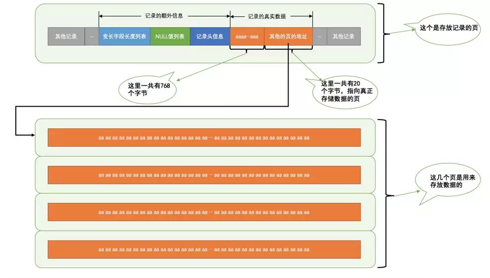

从图中可以看出来，对于`Compact`和`Reduntant`行格式来说，如果某一列中的数据非常多的话，在本记录的真实数据处只会存储该列的前`786`个字节的数据和一个指向其他页的地址，然后把剩下的数据存放到其他页中，这个过程也叫做`行溢出`。画一个简图就是这样：


不只是 ***VARCHAR(M)*** 类型的列，其他的 ***TEXT***、***BLOB*** 类型的列在存储数据非常多的时候也会发生`行溢出`。

---

## 9. 为什么要尽量设定一个主键?——未完

---

## 10. 主键选用什么类型？使用自增ID还是UUID?——未完

---

## 11. 字段为什么要求定义为not null?——未完

---

## 12. 解释一下水平分表和垂直分表,可以分别举一个适合他们的例子吗?——未完

---

# （三）SQL语句方面的问题

## 1. ALTER TABLE 会有什么影响？有没有解决办法？——未完

会导致重建表，有索引时极其耗费性能，先删掉索引，再ALTER操作，再建立索引

---

## 2. 怎么优化 order by 、group by？——未完

---

## 3.  select * from A group by a desc; 这么写对吗？为什么？

首先，题目中这个写法是正确的。但，仅限于 MySQL8.0 版本以下。即 8.0 中这种写法是错的。

**首先看MySQL5.7版本中一个普通的 group by 语句**：


来看一下执行计划：

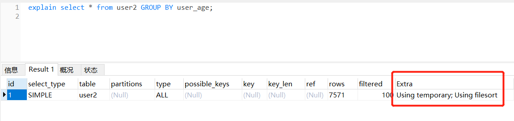

通过 explain 可以发现，Extra 中 Using temporary可以理解，分组需要临时表。但是为什么会有 Using filesort？此时返回去，看第一张图，会发现 user_age 是从小到大排序过的。

原因：MySQL8.0 以下，group by 之后默认会有一个排序的操作（隐式排序），且这个sql没有走索引，所以既需要临时表，又需要文件内排序。由此，可以按照 user_age 降序输出：

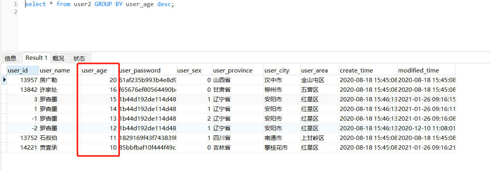

但是很多时候，分组之后并没有排序的需求，则可以这么优化SQL：后边加一个 order by null

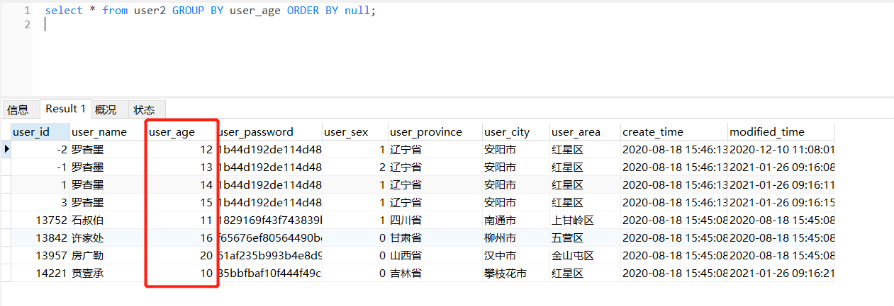

来看看执行计划：没有了文件内排序。故此举可以优化一些性能。

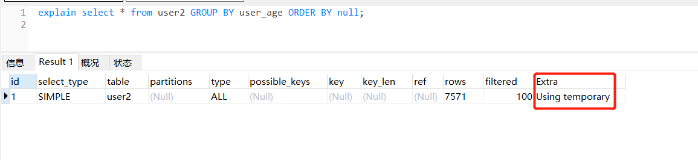


**MySQL8.0中，直接报语法错误。因为 8.0 性能作了提升，去掉了隐式排序**

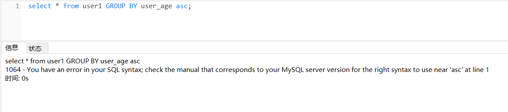

所以，如果你曾经写过这中sql，突然升级到 MySQL8.0 会不支持这个语法。修改方案就是明确写明 order by。

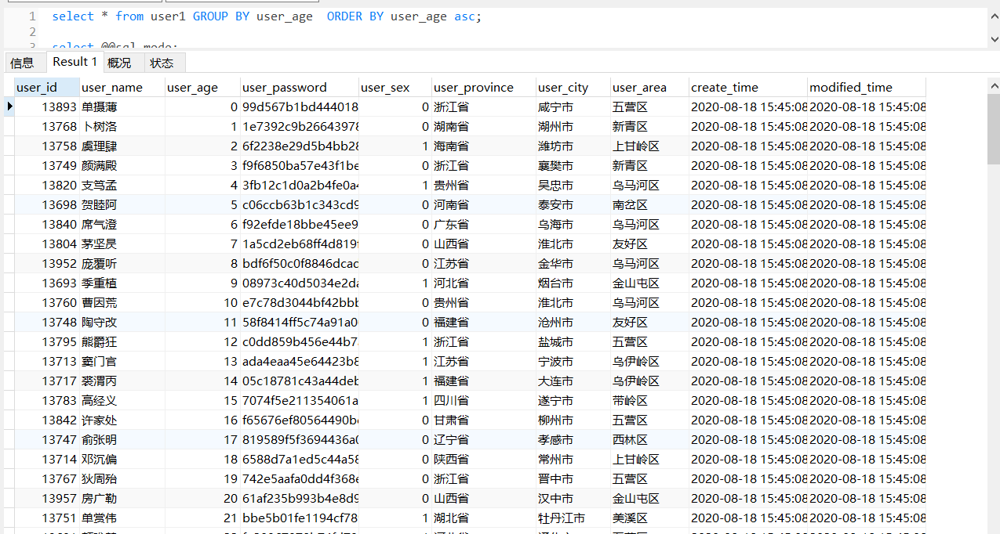

---

## 4. 怎么理解“延迟关联”？（怎么优化limit？）——未完

---

## 5. 超大分页怎么处理?——未完

---

## 6.如何优化子查询？——未完

---

## 7. MySQL是如何如何优化连表查询？——未完

BNL
	BKA
	NLJ

---

## 8. 怎么优化 union 查询？

MySQL在执行union查询的时候，会创建临时表，并往临时表里填充数据，因此很多优化策略在union查询中都没法很好的使用。**经常需要手工的将where、limit、order by等子句下推到各个子查询中，以便优化器可以充分利用这些条件进行优化。**

```sql
(select user_name,user_province,user_sex from user1 where user_age = 12)
union
(select user_name,user_province,user_sex from user2 where user_age = 12) limit 20;
```

例如，以上sql，这个sql会把 user1中 符合条件的所有数据，和 user2 中符合条件的所有数据，存放在一个临时表中，再从临时表中取出前20条。性能可想而知。

优化方案就是将 limit 条件下推到子查询中：

```sql
(select user_name,user_province,user_sex from user1 where user_age = 12 limit 20)
union
(select user_name,user_province,user_sex from user2 where user_age = 12 limit 20) limit 20;
```

这样一来，临时表中就只有40条数据，然后再取前20条。

但是，临时表中的数据是从两个表中获取的，可能取出数据时顺序不一致，此时 在最外层 order by 一下即可(但是又增加了排序的性能问题)。

```sql
(select user_name,user_province,user_sex from user1 where user_age = 12 limit 20)
union
(select user_name,user_province,user_sex from user2 where user_age = 12 limit 20) order by user_name limit 20;
```

> 该题和答案采自《高性能MySQL 第三版》

---

## 9.union 和 union all的区别？

union 和 union all 区别就是union all 中的结果会重复，union的结果不会重复。

union 语句的执行计划如下：

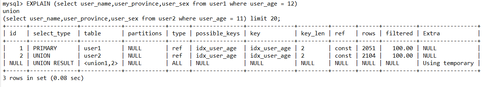

union all 语句的执行计划如下：

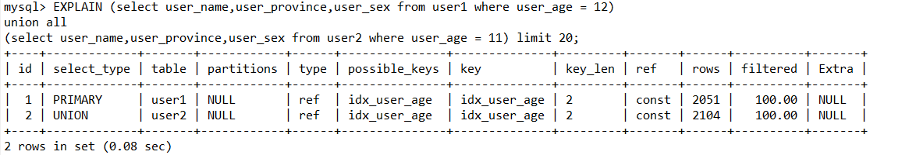

可以很明显的看到，union 查询多了一个对临时表进行去重的过程。

故，除非确实需要服务器消除重复的行，否则一定要使用union all，因此没有all关键字，mysql会在查询的时候给临时表加上distinct的关键字，这个操作的代价很高。

建议使用 union all，可以考虑去程序中去重。

---

## 10.alter table 语句的本质是什么？怎么快速给一个大表加一个列？

[参考这里](https://blog.csdn.net/qq_34275277/article/details/111684122)

---

## 11.一些有趣的问题

### (1) select sid from sc where score < 60 group by sid;  与 select distinct sid from sc where score < 60; 相比性能如何？

id主键，score无索引；
id主键，score有索引，可以走索引；
id主键，score有索引，索引失效；
id非主键无索引，score无索引；
id非主键无索引，score有索引，可以走索引；
id非主键无索引，score有索引，索引失效；
id非主键有索引，score无索引；
id非主键有索引，score有索引，可以走索引；
id非主键有索引，score有索引，索引失效；

---

# （四）索引方面的问题

## 1. 索引有哪些类型？怎么分类呢？

先看分类：(脑图已上传[点击这里](https://github.com/asdbex1078/MySQL/tree/master/mysql-%E9%9D%A2%E8%AF%95%E9%A2%98/%E8%84%91%E5%9B%BE%E9%9B%86%E5%90%88))

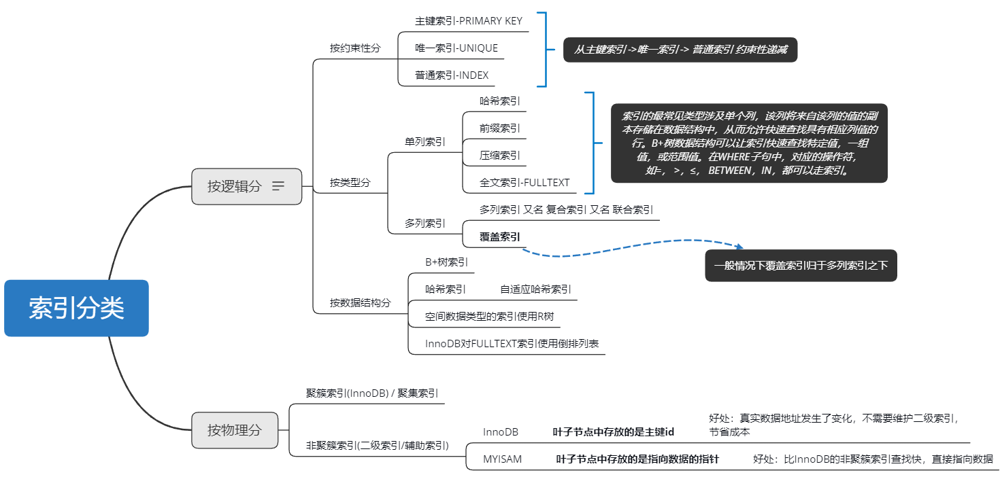

索引的分类涉及到很多角度，站在不同的角度，同一个索引会有不同的称呼。

主键索引：站在逻辑分类下，约束性的角度叫主键索引，但是站在物理分类下，若是InnoDB表，他的名字叫做聚簇索引；若是MYISAM表，他的名字叫做非聚簇索引。

唯一索引 / 普通索引：站在逻辑分类下约束性的角度叫唯一索引或普通索引，但是站在物理分类下，不管是InnoDB表还是MYISAM表，他的名字叫做非聚簇索引。

哈希索引：站在数据结构的角度来看，他叫哈希索引。站在单列或多列的角度上看，他是单列索引。

所以说，一个索引他会有很多的称呼，尽量用词准确。在哪个角度下的称呼，是为了区分同类型下的其他索引。不要一会儿说主键索引，一会儿说聚簇索引，角度跳过来跳过去。

> 关于详细的索引介绍，会在后边面试题中列出来。


---

## 2. 覆盖索引了解过没，有什么优势，怎么使用？考虑以下几个问题，会不会用到索引？——未完

---

## 3. 了解过前缀索引/压缩索引没？工作原理是啥？正序查询和倒叙查询会有什么不同？——未完

---

## 4. 聚簇索引和非聚簇索引有什么区别?

每个InnoDB的表都拥有一个特殊索引，此索引中存储着行记录（称之为聚簇索引Clustered Index），**一般来说，聚簇索引是根据主键生成的**。聚簇索引按照如下规则创建：1、当定义了**主键**后，InnoDB会利用主键来生成其聚簇索引；2、如果没有主键，InnoDB会选择一个**非空的唯一索引**来创建聚簇索引；3、如果这也没有，InnoDB会**隐式的创建一个自增的列(rowid)**来作为聚簇索引。

除了主键索引之外的索引，称为**二级索引**（Secondary Index）。二级索引又名辅助索引。

二级索引可以有多个，二级索引建立在经常查询的列上。与聚簇索引的区别在于二级索引的叶子节点中存放的是除了**这几个列**外用来回表的**主键的值**。

所谓回表：就是在使用二级索引时，因为二级索引只存储了部分数据，如果根据键值查找的数据不能包含全部目标数据，就需要根据二级索引的叶子节点中的主键值，去查聚簇索引的全部数据。然后根据完整数据取出所需要的列。这种在二级索引不能找到全部列的现象称为**“非索引覆盖”**，需要两次B+树查询，反之称为**索引覆盖**。所以索引需要平衡考虑，多建索引有利于查询，但是占用空间大还影响写入性能。即索引要精有用。

这样的优势：1、由于行数据和叶子节点存储在一起，这样主键和行数据是一起被载入内存的，找到叶子节点就可以立刻将行数据返回了，如果按照主键Id来组织数据，获得数据更快。2 、辅助索引使用主键值作为"指针" 而不是使用地址值作为指针的好处是，减少了当出现行移动或者数据页分裂时辅助索引的维护工作，使用主键值当作指针会让辅助索引占用更多的空间，换来的好处是**InnoDB在移动行时无须更新辅助索引中的这个"指针"**。也就是说行的位置（实现中通过16K的Page来定位）会随着数据库里数据的修改而发生变化（包括B+树节点分裂以及Page的分裂），使用主键的值就可以保证不管这个主键B+树的节点如何变化，辅助索引树都不受影响。

故，相对来说，在 MYISAM 中，他的索引全部都是非聚集索引。

在 InnoDB 中二级索引等价于非聚簇索引。在 MYISAM 中，非聚簇索引不等价于二级索引。

InnoDB 的非聚集索引 和 MYISAM 非聚集索引的区别就是：InnoDB 非聚集索引的叶子节点中存放的是**索引列的数据 + 对应的主键值**。而 MYISAM 非聚集索引的叶子节点中存放的是**索引列的数据 + 指向真实数据的指针**。

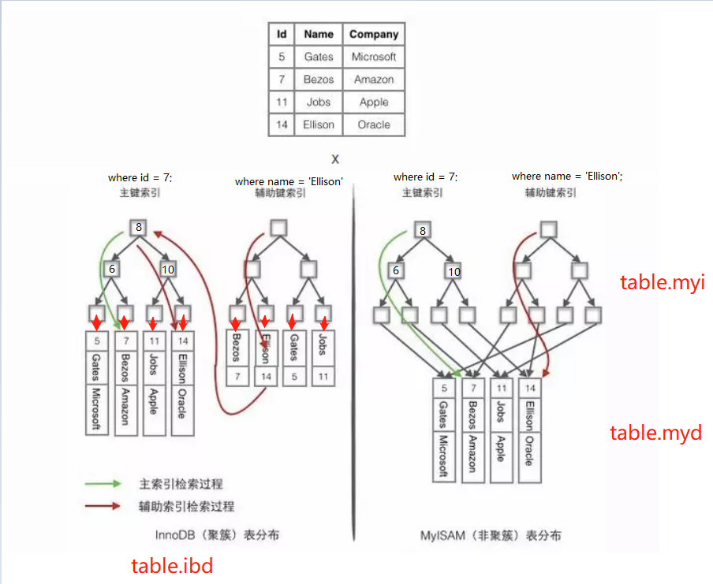

> 延伸阅读：
>
> 1. [聚簇索引和非聚簇索引](https://aafdc5f3.wiz06.com/wapp/pages/view/share/s/2G_snP1IAAKJ2pDKXw2gROYt05A5Bk2Q8Qet2Wi6kD2p5uhc)
> 2. [索引覆盖](https://aafdc5f3.wiz06.com/wapp/pages/view/share/s/2G_snP1IAAKJ2pDKXw2gROYt2RqQk-1bTQKI2ZeT_v3NEVhk)

---

## 5. 为什么使用索引？不使用索引会怎样？——未完

加快搜索效率
避免不必要的加锁
随机IO变顺序IO
成本问题，磁盘寻址

---

## 6. 索引采用了哪些数据结构，分别有什么特征？——未完

---

## 7.哈希索引了解过没，用在那里，解决了什么问题，有什么优势？有什么弊端？——未完

Memory引擎使用的索引，对列进行hash，查询时直接进行比较操作，缺点是不能范围查询，hash值随机

---

## 8. InnoDB自适应哈希索引是什么，怎么工作的，有什么优势？——未完

当某些索引值使用非常频繁时，InnoDB会在B+TREE基础上，将值进行hash，建立哈希索引，自动实现，用户无法干涉。但可以关闭（热词）

---

## 9. 为什么使用B+树作为索引的数据结构，不用二叉树，平衡二叉树，B树？

https://juejin.im/post/6844904193463943175

---

## 10. B+树的插入和删除是怎样进行的？——未完

---

## 11. 根据B+树的插入规则来看，有点浪费空间，MySQL是怎么解决的？——未完

---

## 12. 怎么查看sql是否走了索引？详细解释一下explain？——未完

https://juejin.im/post/6863832433062739981

---

## 13. like查询为什么前面不加%就可以走索引？前面加了%一定不走索引吗？——未完

---

## 14. UUID和SHA、MD5生成的值什么不适合建立索引？有什么影响？有什么解决方案？——未完

容易造成索引碎片和页分裂，解决方案：分布式环境生成唯一id（雪花算法。。）

---

## 15.为什么不建议删除数据，而是添加删除标识？——未完

数据存储的碎片化

---

## 16. 数据存储碎片有哪些？——未完

 行碎片
行间碎片
剩余空间碎片

---

## 17. MySQL是如何构建索引的？——未完

三阶段构建索引 - 归并排序思想

---

## 18. 聊一聊十大经典排序算法？MySQL中使用了哪些排序算法？——未完

---

## 19. 构建好索引后，往索引里插入数据是一条一条的插入吗？有什么解决方案？——未完

Change Buffer中的 Insert Buffer，针对非唯一索引做出的优化，随机IO变为顺序IO，类似 MRR

---

## 20.索引中，对 NULL 值是怎么统计的？分别有什么影响？——未完

每个 NULL 值都互不相同	增大基数，可能导致优化器选择该索引
所有的 NULL 的值当作同一个值	减小基数，可能导致MySQL不选择该索引
忽略 NULL 值	默认选项

---

## 21. 哪些场景会使索引失效？该如何避免索引失效？——未完

1. 30%比例
2. 为什么不建议对列进行函数操作，有什么影响？	会使优化器放弃使用索引，使用全表扫描。对列进行算数运算也会这样
3. 平均值组大小对索引选取的影响
4. 成本的选择，放弃了最优的索引

---

## 22. 多列索引中为什么范围匹配之后，索引失效？——未完

---

## 23. 联合索引是什么?为什么需要注意联合索引中的顺序?——未完

---

## 24. 如何创建/使用高性能索引？——未完

---

## 25. 为什么不建议对性别建立索引？那我非要对性别进行查询（例如：查北京东城的男生），有什么解决方案？

1. 任何字段都可以建立索引，只是，有时候不建议建立索引，比如性别，重复性太高，为百分之50。

   - 性别这个字段的基数为 2，也就是说只有男女两个不同的值；平均值组大小为 (总数据量/2) ，重复比例占到50%，[平均值组基数等概念参考这里](https://github.com/asdbex1078/MySQL/blob/master/mysql-optimization/%E7%B4%A2%E5%BC%95%E2%80%94%E2%80%94%E5%B9%B3%E5%9D%87%E5%80%BC%E7%BB%84%E5%A4%A7%E5%B0%8F%E5%8F%8ASHOW%20INDEX%E4%BF%A1%E6%81%AF.md#%E5%B9%B3%E5%9D%87%E5%80%BC%E7%BB%84%E5%A4%A7%E5%B0%8F)
   - 当MySQL走一个索引，需要扫描的数据量达到全表的百分之30时，就不考虑这个索引了，更何况性别达到了50%。
   - 随着MySQL版本升级，要求的比例远低于百分之30。加入了其他考虑因素，就是MySQL的成本模型，考虑cpu io等

2. 可以强制让MySQL走性别这个索引，比如100w条数据，查询性别为男的数据就有50w条。可以强制走性别这个索引。在底层实现上，50W个性别为男的数据页需要依次放到缓冲池中，在缓冲池中依次找到对应的 50w 个主键ID，再**回表**查50w条最终结果，性能消耗上已经不亚于全表扫描。
   极端情况下，表中全部都是同一性别，则会扫描整棵索引树 + 全部数据。这就是不建议给性别建立单列索引的原因。

3. 解决方案：可以把性别和其他字段建立复合索引，性别放前面，当需要查询其他字段时，对性别in查询，是可以走索引的。这就是选择性极低的放最前面的原理。**这样设计可以巧妙的利用索引，最终设计方案需按业务需求来定。**
   ——方案参考自《高性能MySQL 第3版》

   ```sql
   基础表：
   CREATE TABLE `user1` (
     `user_id` int(11) NOT NULL AUTO_INCREMENT COMMENT '主键id',
     `user_name` varchar(100) DEFAULT NULL COMMENT '用户名',
     `user_age` tinyint(3) DEFAULT NULL COMMENT '用户年龄',
     `user_password` varchar(100) DEFAULT NULL COMMENT '用户密码',
     `user_sex` tinyint(1) DEFAULT NULL COMMENT '性别 1-男，0-女',
     `user_province` varchar(32) DEFAULT NULL COMMENT '用户所在省',
     `user_city` varchar(32) DEFAULT NULL COMMENT '用户所在城市',
     `user_area` varchar(32) DEFAULT NULL COMMENT '用户所在区',
     `create_time` datetime DEFAULT CURRENT_TIMESTAMP COMMENT '创建时间',
     `modified_time` datetime DEFAULT CURRENT_TIMESTAMP ON UPDATE CURRENT_TIMESTAMP COMMENT '修改时间',
     PRIMARY KEY (`user_id`)
   ) ENGINE=InnoDB DEFAULT CHARSET=utf8;
   
   案例一：
   # 查询北京东城区的总人数
   mysql> create index idx_sex_province_city_area on user1 (user_sex,user_province,user_city,user_area);
   mysql> explain select count(1) from user1 where user_sex in ('1','0') and user_province = '北京市' and user_city = '东城区';
   
   案例二：
   # 查询浙江杭州西湖区年龄大于20的女生
   mysql> create index idx_sex_province_city_area_age on user (user_sex,user_province,user_city,user_area,user_age)
   mysql> explain select * from user1 where user_sex = '0' and user_province = '浙江省' and user_city = '杭州市' and user_age > 20;
   ```

   案例一explain情况：可发现 type 是range，rows是29，filtered为100代表走了预先设计的索引

   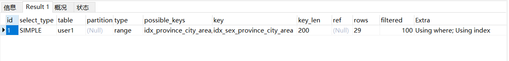

   案例二explain情况：同案例一

   

   **其中，体会一下案例二中，age放最后的好处。age放最后，可以进行范围查询，那么问题又来了：为什么放最后？因为范围查询之后会索引失效。那为什么范围查询之后，会索引失效？且听之后分解~**

   > 另外，idx_sex_province_city_area_age一个索引，可以实现以下多种功能
   >
   > 1. 查某个省的总人数 / 某个省某个性别的人数
   > 2. 查某个省市的总人数 / 某个省市某个性别的人数
   > 3. 查某个省市区的总人数 / 某个省市区某个性别的人数
   > 4. 查某个省市区某个年龄段的总人数 / 某个省市区某个年龄的某个性别的人数
   > 5. 其实不仅能查总人数，符合条件的这些人的信息都可以通过索引查出来

---

## 26.假设一个索引中，字段是varchar类型，输入值是int类型，会走索引吗？

不会 https://www.jb51.net/article/93919.htm
## 27. 假设一个索引中，字段是int类型，输入值是varchar类型，会走索引吗？

​	会

---

## 28. 假设我没有索引，该怎么优化SQL？

首先需要明确，这里的没有索引，是指全表没有索引，还是查询条件中的那一列没有索引。这有着很大的区别。

以下几点，适用于全表无索引，或查询条件中的列无索引：

1. 减少不必要的内存，如不使用select *。
2. 减少返回行数，有时候不需要返回全部行，则使用limit
3. 给innodb很大的缓冲池，将服务器的5%内存交给MySQL。甚至加大mysql所在服务器内存。
4. 视情况强行改变读表顺序，先查小表后查大表，配合limit使用，可最终的减少扫描行数
5. 调整sql写法，避免与其他事务发生死锁或造成其他事物锁等待

以下适用于查询条件中的列无索引，但有其他索引的情况

1. 如果能够利用其他有业务关联的索引卡条件也可以，比如某一张表的创建时间有索引，则可以根据大概的创建时间范围卡数据。
2. 若条件有多个则考虑创建联合索引，利用最佳左前缀原则，且，选择性极低的放前面，可以巧妙的利用到索引（这一点前面面试题提到过）
3. 条件只有单个列，并允许创建索引，则建一个索引
4. 常规性优化，比如子查询优化，group by优化啦，union 优化，count优化等，既然这一列无索引，那就把其他方面优化好

---

# （五）算法类问题

## 1.InnoDB的缓冲池有缓存页，他是怎么淘汰缓存的？跟传统的LRU相比有何优势？

参考这里：[InnoDB缓冲池中的 LRU list](https://github.com/asdbex1078/MySQL/blob/master/mysql-storage-engines/innodb/1.2.0.InnoDB%E5%86%85%E5%AD%98%E7%BB%93%E6%9E%84%E2%80%94%E2%80%94%E7%BC%93%E5%86%B2%E6%B1%A0.md#lru-list)。另外Redis的缓存淘汰策略也有 LRU 算法，后期再整理。

---

## 2. order by排序有哪两种算法？——未完

排序两种算法，两次传输排序和单次传输排序。order by时，尽量使用第一张表的字段进行排序，性能不一样，explain不一样，不是第一张表的会多一个使用临时表。


---

## 3. 构建索引时用到了什么算法？聊一聊其他同类型算法？

---

# （六）事务类问题

## 1. 事务的隔离级别有哪些，各隔离级别下会出现什么问题？——未完

​	读未提交		脏读
​	读已提交		不可重复读
​	可重复读   且是MYSQL默认隔离级别		幻读（InnoDB的MVCC解决了幻读吗？）
​	序列化

---

## 2. RC 和 RR 有什么区别？——未完

---

## 3. 事务的特性？——未完

---

## 4. 事务是怎么实现的？——未完

---

## 5. 谈一谈InnoDB的MVCC，他是怎么运行的，解决了什么问题？——未完

多版本并发控制，类似于git/svn版本控制，每一个数据行都有额外的列来控制

---

## 6. 分布式事务解决方案？——未完

TCC

门面模式

---

# （七）日志类问题

## 1. redo log 和 bin log有什么区别？

[参考这里](https://github.com/asdbex1078/MySQL/blob/master/mysql-storage-engines/innodb/1.4.6.Mysql%E6%96%87%E4%BB%B6%E2%80%94%E2%80%94bin%20log%E5%92%8Credo%20log%E7%9A%84%E5%8C%BA%E5%88%AB.md#%E4%BA%8C%E8%BF%9B%E5%88%B6%E6%97%A5%E5%BF%97%E6%96%87%E4%BB%B6-%E5%92%8C-%E9%87%8D%E5%81%9A%E6%97%A5%E5%BF%97-%E4%B9%8B%E9%97%B4%E7%9A%84%E5%8C%BA%E5%88%AB)

---

## 2.事务提交时，redo log和binlog的写入顺序是怎样的？

这道题重点是考 **两阶段提交**。

事务开始之后就产生redo log，redo log的落盘并不是随着事务的提交才写入的，而是在事务的执行过程中，便不断写入redo log文件中。一般情况下，innodb_flush_log_at_trx_commit 设置为1，代表每次事务commit时，必须调用 fsync 操作，将重做日志缓冲同步写到磁盘。另外，bin log中 sync_binlog参数设为1，每次事务提交时同步写到磁盘bin log中。 

那么就有了一个谁先谁后的问题：redo log 先，bin log 后。

两阶段提交的内容：**事务提交时，redo log处于 pre状态  -> 写入bin log  -> 事务真正提交。  **

当发生崩溃恢复时，查看的是bin log是否完整，如果bin log完整，则代表事务已经提交。

如果在两阶段提交过程中，bin log写入失败，则事务无法终止提交，崩溃恢复时就不需要重做。如果bin log写完的一瞬间，服务器宕机了，事务都来不及提交，此时bin log并不是完整的，缺少了最终的commit标记。因此也是提交失败。

简单说，redo log和bin log都可以用于表示事务的提交状态，而两阶段提交就是让这两个状态保持逻辑上的一致。

## 3.redo log什么时候释放？undo log什么时候释放？——未完
## 4.什么是write-Ahead Log策略？——未完

## 5.bin log记录日志有哪些方式？常用哪种？为什么？各有什么优劣势？——未完

## 6.关心过业务系统里面的sql耗时吗?统计过慢查询吗?对慢查询都怎么优化过?——未完

## 7.总结一下 bin-log 和 redo-log 的刷脏参数？——未完

## 8.聊一下 WAL 策略？——未完


---

# （八）锁问题

## 1. 数据库中有哪些锁，有什么作用，有什么弊端？——未完

## 2.latch 和 lock 有什么区别——未完
## 3.RC 和 RR 在加锁方面有什么不同？——未完
## 4.什么是死锁，怎么避免死锁？有没有遇到死锁？——未完
## 5.如何查看死锁信息？——未完
## 6.发生死锁怎么办？怎么处理？——未完
## 7.MYISAM 和 InnoDB 是怎么支持并发插入的？——未完
## 8.怎么理解latch中的自旋锁？比较下Java中的自旋锁——未完

## 9. InnoDB对于聚簇索引和非聚簇索引，采用了不同的锁机制，为什么？——未完

## 10.什么是间隙锁，有什么好处和坏处？——未完

## 11. 多个事务插入数据时，会造成死锁。分析一下过程？

[参考这里](https://github.com/asdbex1078/MySQL/blob/master/mysql-optimization/MySQL%E9%94%81%E2%80%94%E2%80%94%E6%8F%92%E5%85%A5%E6%95%B0%E6%8D%AE%E6%AD%BB%E9%94%81%E5%88%86%E6%9E%90.md)

---

# （九）InnoDB类问题

## 1.什么是缓冲池？有什么用？

一句话概述，就是磁盘IO太慢，放到内存中，极大提升性能。

详细介绍，查看这里：[缓冲池](https://github.com/asdbex1078/MySQL/blob/master/mysql-storage-engines/innodb/1.2.0.InnoDB%E5%86%85%E5%AD%98%E7%BB%93%E6%9E%84%E2%80%94%E2%80%94%E7%BC%93%E5%86%B2%E6%B1%A0.md#%E7%BC%93%E5%86%B2%E6%B1%A0)

## 2.聊一聊LRU算法，InnoDB是怎么实现 LRU 的？

按照英文的直接原义就是Least Recently Used,最近最久未使用。

它是按照一个非常著名的计算机操作系统基础理论得来的：**最近使用的页面数据会在未来一段时期内仍然被使用,已经很久没有使用的页面很有可能在未来较长的一段时间内仍然不会被使用**。基于这个思想,会存在一种缓存淘汰机制，每次从内存中找到**最久未使用的数据然后置换出来**，从而存入新的数据！

InnoDB中，新增了midPoint位置。新读取到的页并没有直接放在LRU列的首部，而是放在距离尾部37%的位置( 3/8的位置 )。这个算法称之为**midpoint insertion stategy**。并且该位置是可以调整的！

> 常见的算法类面试题：手写一个 LRU ?

详细介绍在缓冲池这里已经介绍过。[LRU list](https://github.com/asdbex1078/MySQL/blob/master/mysql-storage-engines/innodb/1.2.0.InnoDB%E5%86%85%E5%AD%98%E7%BB%93%E6%9E%84%E2%80%94%E2%80%94%E7%BC%93%E5%86%B2%E6%B1%A0.md#lru-list)

## 3.聊一聊InnoDB架构，各组成部分有什么用？

[InnoDB架构参考这里](https://github.com/asdbex1078/MySQL/blob/master/mysql-storage-engines/innodb/1.0.MySQL%E6%9E%B6%E6%9E%84%E5%88%B0innoDB%E6%9E%B6%E6%9E%84.md#innodb)

[InnoDB的关键特性](https://github.com/asdbex1078/MySQL/blob/master/mysql-storage-engines/innodb/1.1.1.InnoDB%E2%80%94%E2%80%94%E5%85%B3%E9%94%AE%E7%89%B9%E6%80%A7.md#innodb%E7%9A%84%E5%85%B3%E9%94%AE%E7%89%B9%E6%80%A7)

## 4.脏页刷盘机制是什么？脏页刷盘过程中，服务器或MySQL宕机了怎么办？——未完


## 5.什么是页？怎么理解页？

**（1）什么是页？**

页是Innodb存储的**最基本结构**，也是Innodb磁盘管理的最小单位，与数据库相关的所有内容都存储在页结构里。

**（2）页的分类**

页分为几种类型：**数据页（B-Tree Node），Undo页（Undo Log Page），系统页（System Page），事务数据页（Transaction System Page）**等；每个数据页的大小为16kb，每个页使用一个32位（一位表示的就是0或1）的int值来表示，正好对应Innodb最大64TB的存储容量(16kb * 2^32=64tib)，故innodb最大可存64TB数据。

**（3）举例**

拿一颗三阶 B+树 解释什么是数据页：**每一个节点都是一个页**。

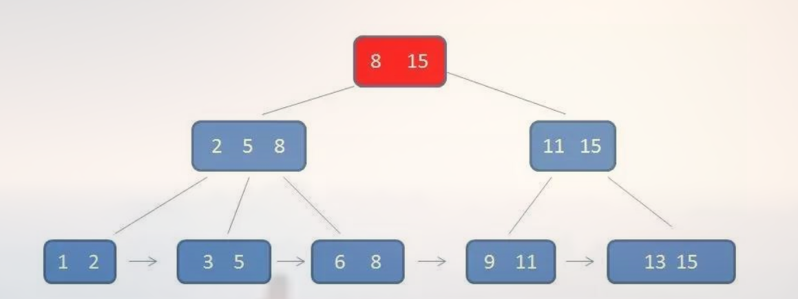

即 如下图所示：

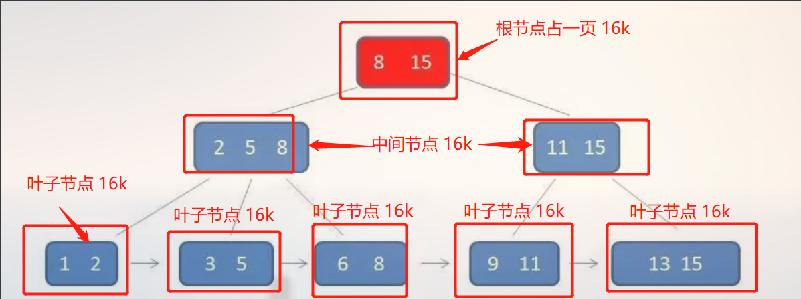

每次读取数据时，都会抓取一页放到内存中！

> 页内结构详细参考这篇文章，建议看懂：[InnoDB逻辑存储结构](https://github.com/asdbex1078/MySQL/blob/master/mysql-storage-engines/innodb/1.3.0.InnoDB%E7%A3%81%E7%9B%98%E7%BB%93%E6%9E%84%E2%80%94%E2%80%94%E9%80%BB%E8%BE%91%E5%AD%98%E5%82%A8%E7%BB%93%E6%9E%84.md#innodb%E9%A1%B5%E9%80%BB%E8%BE%91%E5%AD%98%E5%82%A8%E7%BB%93%E6%9E%84)
>
> 关于 InnoDB缓冲池 的介绍中也涉及到了“页”：[InnoDB缓冲池](https://github.com/asdbex1078/MySQL/blob/master/mysql-storage-engines/innodb/1.2.0.InnoDB%E5%86%85%E5%AD%98%E7%BB%93%E6%9E%84%E2%80%94%E2%80%94%E7%BC%93%E5%86%B2%E6%B1%A0.md#%E7%BC%93%E5%86%B2%E6%B1%A0)

**（4）额外知识点**

- 默认情况下，页的大小为16K，但是压缩页可以达到2K、4K、8K。关于压缩页，参考[官网InnoDB页面压缩](https://dev.mysql.com/doc/refman/5.7/en/innodb-page-compression.html)
- 为什么一个页中，至少要有 1/32 的剩余空间？
  答案：按照一般情况来说，一页为16K，16 * 1024 / 32 = 512 B。从磁盘的物理结构来看存取信息的最小单位是扇区，一个扇区大小为 512 B.
- InnoDB每次将数据所在的页16K，加载到缓冲池中，怎么从数据页中获取到最终结果？循环遍历16K？
  答案：循环遍历16K的数据肯定性能很差。数据存入页中时，会将数据分组，抽出关键的几个数值，放到槽里。当此16k的数据页加载到缓冲池中时，对槽进行二分查找便可快速找到最终需要的数据。详细解释点击这里：[InnoDB逻辑存储结构](https://github.com/asdbex1078/MySQL/blob/master/mysql-storage-engines/innodb/1.3.0.InnoDB%E7%A3%81%E7%9B%98%E7%BB%93%E6%9E%84%E2%80%94%E2%80%94%E9%80%BB%E8%BE%91%E5%AD%98%E5%82%A8%E7%BB%93%E6%9E%84.md#%E9%A1%B5%E7%9A%84%E7%BB%93%E6%9E%84)

## 6.怎么查看 InnoDB 状态？能看到什么信息？

```properties
=====================================
2022-02-02 08:15:59 0x1b34 INNODB MONITOR OUTPUT
=====================================
Per second averages calculated from the last 31 seconds
-----------------
BACKGROUND THREAD
-----------------
srv_master_thread loops: 187 srv_active, 0 srv_shutdown, 426130 srv_idle
srv_master_thread log flush and writes: 426317
----------
SEMAPHORES
----------
OS WAIT ARRAY INFO: reservation count 127
OS WAIT ARRAY INFO: signal count 121
RW-shared spins 0, rounds 1701, OS waits 98
RW-excl spins 0, rounds 34, OS waits 0
RW-sx spins 1, rounds 22, OS waits 0
Spin rounds per wait: 1701.00 RW-shared, 34.00 RW-excl, 22.00 RW-sx
------------------------
LATEST FOREIGN KEY ERROR
------------------------
2021-01-20 13:43:51 0x2d9c Error in foreign key constraint of table testmybatis/emp:
foreign key (deptno) references dept (deptno)
 ):
Cannot resolve table name close to:
 (deptno)
 )
------------
TRANSACTIONS
------------
Trx id counter 1567714
Purge done for trx's n:o < 1567713 undo n:o < 0 state: running but idle
History list length 13
LIST OF TRANSACTIONS FOR EACH SESSION:
---TRANSACTION 284004297169560, not started
0 lock struct(s), heap size 1136, 0 row lock(s)
---TRANSACTION 284004297168688, not started
0 lock struct(s), heap size 1136, 0 row lock(s)
--------
FILE I/O
--------
I/O thread 0 state: wait Windows aio (insert buffer thread)
I/O thread 1 state: wait Windows aio (log thread)
I/O thread 2 state: wait Windows aio (read thread)
I/O thread 3 state: wait Windows aio (read thread)
I/O thread 4 state: wait Windows aio (read thread)
I/O thread 5 state: wait Windows aio (read thread)
I/O thread 6 state: wait Windows aio (write thread)
I/O thread 7 state: wait Windows aio (write thread)
I/O thread 8 state: wait Windows aio (write thread)
I/O thread 9 state: wait Windows aio (write thread)
Pending normal aio reads: [0, 0, 0, 0] , aio writes: [0, 0, 0, 0] ,
 ibuf aio reads:, log i/o's:, sync i/o's:
Pending flushes (fsync) log: 0; buffer pool: 0
87062 OS file reads, 2454 OS file writes, 577 OS fsyncs
0.00 reads/s, 0 avg bytes/read, 0.84 writes/s, 0.00 fsyncs/s
-------------------------------------
INSERT BUFFER AND ADAPTIVE HASH INDEX
-------------------------------------
Ibuf: size 1, free list len 203, seg size 205, 0 merges
merged operations:
 insert 0, delete mark 0, delete 0
discarded operations:
 insert 0, delete mark 0, delete 0
Hash table size 2267, node heap has 0 buffer(s)
Hash table size 2267, node heap has 0 buffer(s)
Hash table size 2267, node heap has 0 buffer(s)
Hash table size 2267, node heap has 0 buffer(s)
Hash table size 2267, node heap has 0 buffer(s)
Hash table size 2267, node heap has 0 buffer(s)
Hash table size 2267, node heap has 0 buffer(s)
Hash table size 2267, node heap has 1 buffer(s)
0.00 hash searches/s, 0.00 non-hash searches/s
---
LOG
---
Log sequence number 2461771042
Log flushed up to   2461771042
Pages flushed up to 2461771042
Last checkpoint at  2461771033
0 pending log flushes, 0 pending chkp writes
271 log i/o's done, 0.00 log i/o's/second
----------------------
BUFFER POOL AND MEMORY
----------------------
Total large memory allocated 8585216
Dictionary memory allocated 495865
Buffer pool size   512
Free buffers       255
Database pages     256
Old database pages 0
Modified db pages  0
Pending reads      0
Pending writes: LRU 0, flush list 0, single page 0
Pages made young 0, not young 0
0.00 youngs/s, 0.00 non-youngs/s
Pages read 86714, created 726, written 1927
0.00 reads/s, 0.74 creates/s, 0.84 writes/s
Buffer pool hit rate 1000 / 1000, young-making rate 0 / 1000 not 0 / 1000
Pages read ahead 0.00/s, evicted without access 0.00/s, Random read ahead 0.00/s
LRU len: 256, unzip_LRU len: 0
I/O sum[26]:cur[0], unzip sum[0]:cur[0]
--------------
ROW OPERATIONS
--------------
0 queries inside InnoDB, 0 queries in queue
0 read views open inside InnoDB
Process ID=4616, Main thread ID=7112, state: sleeping
Number of rows inserted 27238, updated 15, deleted 22, read 41698497
26.45 inserts/s, 0.00 updates/s, 0.00 deletes/s, 36.58 reads/s
----------------------------
END OF INNODB MONITOR OUTPUT
============================
```


**第一种方式：show engine innodb status**

- Status：显示时间戳、监视器名称和平均每秒所基于的秒数。秒数是指从当前时间到InnoDB监视器输出最后一次打印之间经过的时间。

- BACKGROUND THREAD：srv_master_thread行显示了主后台线程所完成的工作。

- SEMAPHORES：等待信号量的线程，以及关于线程需要旋转或等待互斥锁或rwlock信号量的统计数据。大量等待信号量的线程可能是由于磁盘I/O或InnoDB内部的争用问题造成的。争用可能是由于查询的高度并行性或操作系统线程调度中的问题。在这种情况下，将innodb_thread_concurrency系统变量设置为小于默认值可能会有所帮助。每个等待行的自旋轮数显示了每个操作系统等待互斥的自旋锁轮数。
  Mutex信息由 SHOW ENGINE INNODB MUTEX; 查看。

- LATEST FOREIGN KEY ERROR：提供关于最近的外键约束错误的信息。如果没有这样的错误发生就没有这一项。内容包括失败的语句，以及关于失败的约束以及被引用和正在引用的表的信息。

- **LATEST DETECTED DEADLOCK：提供关于最近死锁的信息。如果没有死锁发生，它就不存在。内容显示了涉及哪些事务，每个事务都试图执行的语句，它们拥有和需要的锁，以及InnoDB决定回滚哪个事务来打破死锁。**

- **TRANSACTIONS：如果这部分报告锁等待,您的应用程序可能会锁争用。输出还可以帮助跟踪事务死锁的原因。**

- FILE I/O：本节提供有关InnoDB用于执行各种I / O的线程的信息 。其中的前几个专用于常规 InnoDB处理。内容还显示有关挂起的I / O操作的信息和有关I / O性能的统计信息。
  这些线程的数量由innodb_read_io_threads和 innodb_write_io_threads 参数控制 。

  1. insert buffer thread
  2. log thread
  3. read thread
  4. write thread

- INSERT BUFFER AND ADAPTIVE HASH INDEX：本节显示了 InnoDB插入缓冲区（也称为更改缓冲区）和自适应哈希索引的状态。

  - Ibuf：
    1. seg size：当前Insert Buffer大小，205 x 16KB
    2. free list len： 空闲列表长度
    3. size ：已经合并页的数量

  - merged operations：
    1. insert：Insert Buffer
    2. delete mark：Delete Buffer
    3. delete：purge Buffer

  - discarded operations：表示Change Buffer发生改变时，表已被删除，因此无需将记录合并到辅助索引

- **LOG：本部分显示有关InnoDB日志的信息 。内容包括当前日志序号，已将日志刷新到磁盘的“距离”以及InnoDB上次执行检查点的位置 。**（请参见 第14.12.3节“ InnoDB检查点”。）本节还显示有关挂起写入和写入性能统计信息。

- BUFFER POOL AND MEMORY：本节为您提供有关已读和已写页面的统计信息。您可以从这些数字中计算出查询当前正在执行多少个数据文件I / O操作。

  - buffer pool size：512（缓冲池大小）512代表512个页，大小为512 * 16KB
  - Free buffers： 370（Free list大小）
  - Database pages：138（LRU list大小）可以看到Free list + LRU list 不等于 缓冲池大小，因为缓冲池中还有其他区域需要占用页
  - Modified db pages：0 （Flush list大小）
  - Pages made young：LRU列表中数据页移动到前端的次数
  - **Buffer pool hit rate：缓冲池的命中率**
  - LRU len: 138：LRU列表页数量
  - unzip_LRU len: 0：压缩页数量
    注意：LRU包含了unzip_LRU的数量

- ROW OPERATIONS：本节显示了主线程在做什么，包括每种行操作的数量和性能比率。

**第二种方式：infomation_schema库下**

- INNODB_BUFFER_POOL_STATS：缓冲池状态，包含LRU list、Free list、Flush list大小，频率、缓冲命中率等
- INNODB_BUFFER_PAGE_LRU：查看LRU列表中每个页的具体信息
- INNODB_BUFFER_PAGE    

---

## 7.聊一下伙伴内存分配系统——未完

## 8.聊一下InnoDB的关键特性

- change Buffer
- Double Write
- AIO
- 刷新临近页
- AHI-自适应哈希索引
- 预读

详细的介绍，查看这里：[InnoDB的关键特性](https://github.com/asdbex1078/MySQL/blob/master/mysql-storage-engines/innodb/1.1.1.InnoDB%E2%80%94%E2%80%94%E5%85%B3%E9%94%AE%E7%89%B9%E6%80%A7.md#innodb%E7%9A%84%E5%85%B3%E9%94%AE%E7%89%B9%E6%80%A7)

---

# （十）超级大问题

## 1. 怎么优化MySQL？——未完待续

1. 硬件级别：
   	- **CPU、磁盘IO读写速度、服务器内存大小、带宽都是影响MySQL效率的因素。其中最重要的是CPU、IO、内存大小。**
      	- 尽量采用SSD固态硬盘
       - 加大服务器内存，采用高端的CPU
       - 磁盘RAID架构下，锂电池的定时充放电会引起数据库性能抖动
2. 选择合适的存储引擎
   - MYISAM：使用于读多写少，甚至不需要写的情况
   - InnoDB：主流储存引擎，默认存储引擎。
3. MySQL配置方面：
   - 给innodb足够大的内存，因为InnoDB有缓冲池，所有的操作都会经过内存。内存足够大，减少LRU频率，使操作都在内存中完成
   - 视情况关闭一部分特性可加速sql执行，有得有失。例如：视情况关闭物化子查询、半连接子查询，MySQL对于子查询的优化性能较差；视情况关闭合并索引功能，虽然成本低，但sql执行速度慢。
4. sql方面：
   - 表的schema要反复推敲，适当使用范式和反范式，比如字段类型、字段长度，字段设计都会对sql执行效率造成影响
   - 建立合适的索引，理解索引的数据结构，不同的数据结构适合不同的场景。一个索引基本上能够对一个慢sql巨大提升。
   - 怎么避免索引失效，哪些类型不适合建立索引。
   - 索引信息不准确怎么办？
   - 没有索引时，怎么办？
   - order by / group by / limit /distinct有哪些注意点
   - 子查询优化，多表关联优化，索引合并的缺点
5. 慢sql怎么处理
   - 慢日志分析
   - explain
   - 优化器追踪信息查看，调整使用的索引，调整sql编写
6. 锁机制
   - 索引不仅用于快速查询，也用来避免不必要的加锁，不合适的sql不加索引会锁全表数据
   - 尽量按顺序编写sql，避免死锁，避免锁等待
7. 主从复制
8. 分库分表
9. 故障转移


---

## 2. MYISAM 和 InnoDB 有什么区别？——未完

InnoDB为什么在 count(1) 方面不如 MYISAM


---

# （十一）笔试题

## 1. 有下面两张表，user(用户表)和thread(帖子表)，假设50W用户，500W帖子，写一条SQL，显示 前10名发帖最多的用户的名字及帖子数量，并针对该语句支出如何设计合理的索引字段。如何确认你写的sql会用到哪个索引，另外请说明你写的sql是否是最优解。

| 表名   | 字段                                  |
| ------ | ------------------------------------- |
| user   | uid，username，password，create_time  |
| thread | tid，uid，title，content，create_time |

```sql
// 先从thread表中查出10条数据，在内连接user表
// 这里认为 uid 是user表的主键，tid是thread的主键
SELECT
 u.username,
 b.count 
FROM
USER as u
inner join ( SELECT count(uid) AS count,uid FROM thread GROUP BY uid ORDER BY count DESC LIMIT 10 ) as b
WHERE
 u.uid = b.uid
 limit 10;
```

建立索引方面，由于主键不明，所以不好定论，如果user表中uid是主键，并且thread表中tid是主键，则只需要给user表加username索引，给thread表中uid加索引即可；

若uid不是user表的主键，tid不是thread表的主键则，给user表中uid和username设立联合索引，thread中tid 和 uid设立索引 。

如何确认sql用到了那个索引，从理论上，

1. group by中用到了uid，给thread表uid建立索引可以用到；
2. 连表查询时，需要给后一张表的字段加索引。所以thread表建uid是对的
3. 要从user表中查username，若uid不是主键，则需要建立uid + username联合索引，只需要扫描辅助索引树即可。不需要回表
4. 如果要确认，需要实际操作，explain查看执行计划

是不是最优解：

需要看目前这个sql执行时间多久，200毫秒以内绝对没问题。肯定有其他写法，需要通过验证才能知道是不是最优。

> 这里面涉及到的知识点：
>
> 1. 聚簇索引，非聚簇索引，联合索引的选取，explain的了解，group by的优化，limit，子查询，联表查询等。
> 2. 并不是一看名字叫 某某id 就把他定性为主键，一定要注意这一个坑，这道题里的坑就是user表的uid 和 thread 表的tid
>
> 若有更优sql解法，欢迎联系我~


---

> 本文主要参考书籍、地址：
>
> 1. MySQL官方网站
>
> 2. 阿里数据库月报
>
>    - [InnoDB undo log漫游](http://mysql.taobao.org/monthly/2015/04/01/)
>    - [MySQL · 引擎特性 · Innodb 表空间](http://mysql.taobao.org/monthly/2019/10/01/)
>    - [MySQL · 引擎特性 · Latch 持有分析](http://mysql.taobao.org/monthly/2020/03/07/)
>    - [MySQL · 引擎特性 · InnoDB 数据文件简述](http://mysql.taobao.org/monthly/2020/08/06/)
>
> 3. 阿里云开发者社区
>
>    - [InnoDB的read view，回滚段和purge过程简介](https://developer.aliyun.com/article/560506)
> 4. 《高性能MySQL 第3版》
>
> 5. 《MySQL技术内幕 InnoDB存储引擎》
>
> 6. 简书博客
>
>    - [MySQL中InnoDB引擎中页的概念](https://www.jianshu.com/p/e5e3f8a823c3)
>
> 7. CSDN博客
>
>    - [InnoDB引擎--存储结构与文件](https://blog.csdn.net/john_lw/article/details/80306122)
>    - [详细分析MySQL事务日志(redo log和undo log)](https://www.cnblogs.com/f-ck-need-u/p/9010872.html)
>    - [InnoDB引擎--存储结构与文件](https://blog.csdn.net/john_lw/article/details/80306122)
>    - [MySQL学习总结](https://blog.csdn.net/howinfun/category_9704174.html)
>    - [InnoDB锁分析](https://www.cnblogs.com/crazylqy/p/7611069.html)
>
> 8. 知乎
>
>    - [redo log检查点](https://zhuanlan.zhihu.com/p/148414574)
>    - [深入理解InnoDB](https://zhuanlan.zhihu.com/p/161737133)
>
> 9. 其他博客
>
>    - [详解redo log 和 undo log](https://www.cnblogs.com/f-ck-need-u/p/9010872.html)
>    - [MySQL中一条更新语句是如何执行的](https://www.cnblogs.com/wangchunli-blogs/p/10393139.html)
>    - [InnoDB存储引擎关键特性](https://www.it610.com/article/5037373.htm)